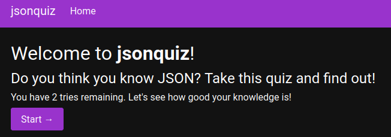
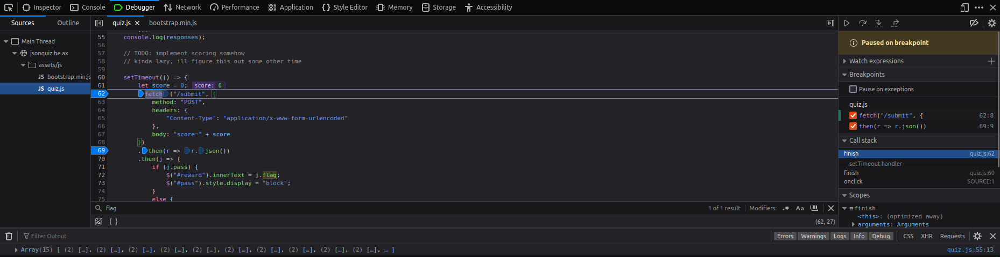
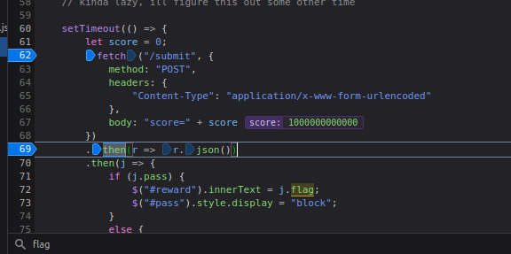
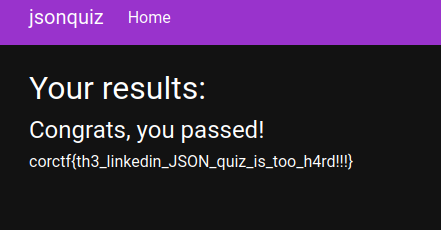

# Jsonquiz

  

Empezas el Quiz, seteas algun breakpoint antes de la comprobacion del score, y elegis cualquier respuesta.

  

Ponemos en consola `score = 1000000000000 `

  

Finalmente, al continuar el breakpoint obtenemos

  

