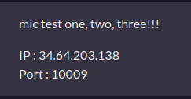
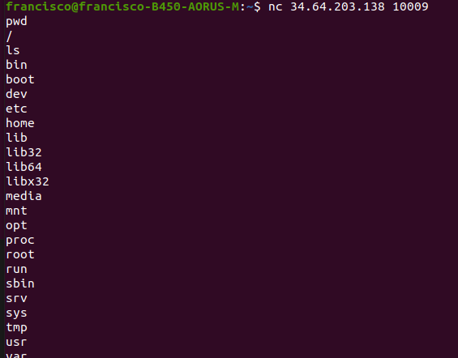
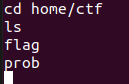
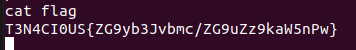

# Check Check Check

El desafio es el siguiente:

  

Nos conectamos entonces usando NC y listamos el path y los contenidos.

  

Despues de revisar las carpetas un rato, encontre una carpeta con el nombre de ctf

  

y finalmente, haciendo `cat flag` obtenemos la flag

  

```
Flag: T3N4CI0US{ZG9yb3Jvbmc/ZG9uZz9kaW5nPw}
```