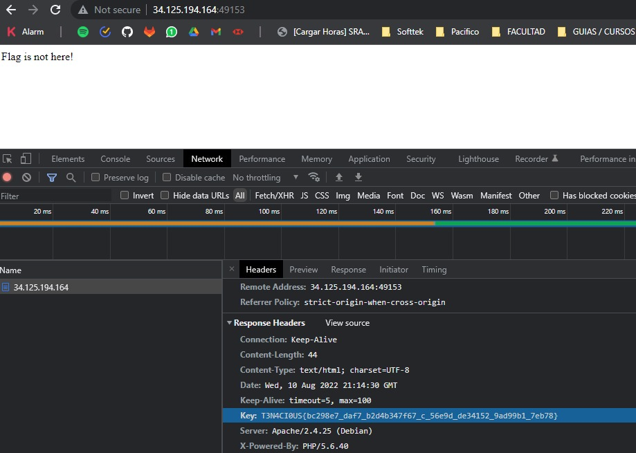

# Cigarrete

Se nos otorga una IP y un Puerto

  

Al acceder nos aparece un mensaje de que la flag no se encuentra aqui. 
Buscando en los headers, se obtiene

  

Si bien parece que el valor entre llaves `bc298e7_daf7_b2d4b347f67_c_56e9d_de34152_9ad99b1_7eb78` esta encriptado (y despues de haberme pasado unas horas probando con ROT, analizando, cambiando de Base XX a Base ZZ, intercalando bases, etc) la realidad es que no, y que la flag estaba simplemente en los headers

```
Flag: T3N4CI0US{bc298e7_daf7_b2d4b347f67_c_56e9d_de34152_9ad99b1_7eb78}
```