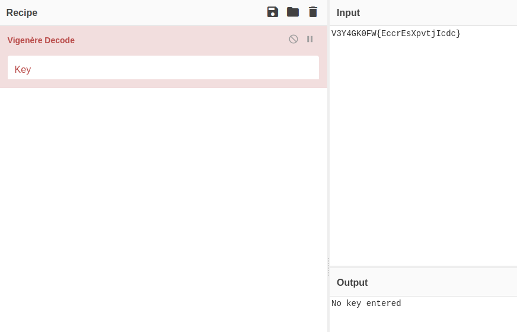
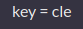
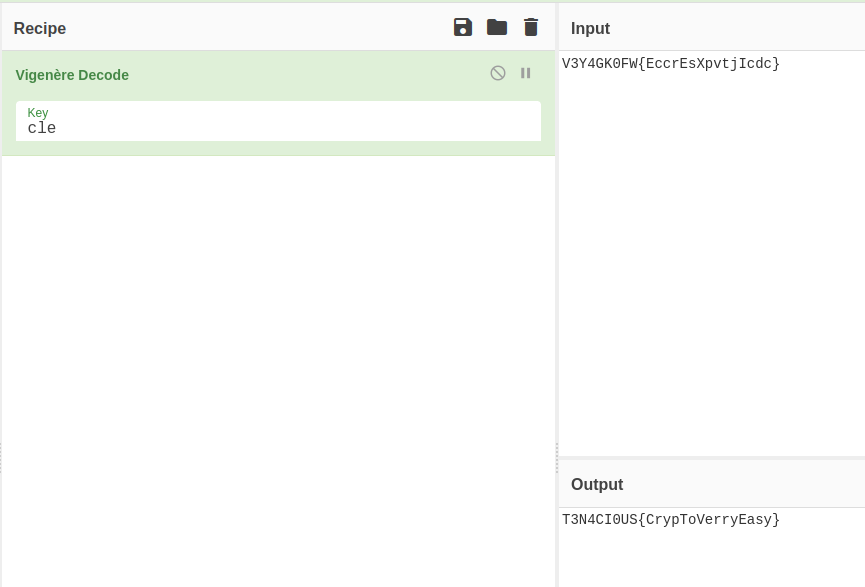

# French Cypher

Si buscamos cuales Cypher son de origen frances, nos encontramos con **Vigenere**

Pero si queremos hacer el Decode, nos pide una clave

  

Al no saber cual es el tamaño de la clave, no voy a gastar tiempo intentando bruteforcearla. Si se que la clave es solo alfabetica. <br>
No obstante, el CTF solo ofrece el valor 'V3Y4GK0FW{EccrEsXpvtjIcdc}' y la pista de que es un Cypher Frances.

Luego de intentar varias claves aleatorias (para ver si con un poco de suerte nos salia la flag), fui a otros retos. Unos de ellos tenia

  

Al hacer la prueba con esa clave, obtuve la flag

  

```
Flag: T3N4CI0US{CrypToVerryEasy}
```