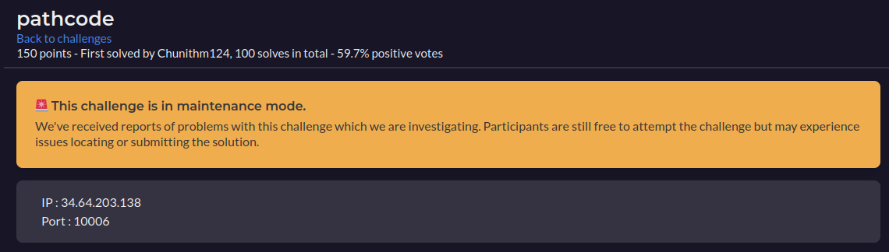
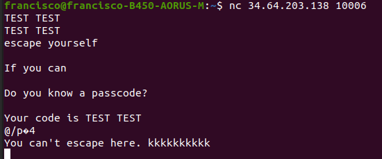
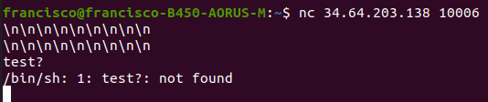
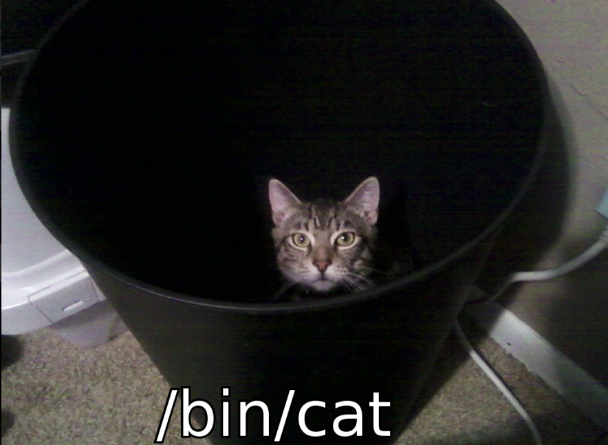
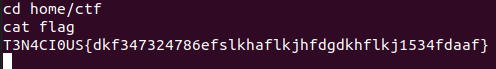

# Pathcode

  

Nos dan una IP y Puerto para conectarnos al desafio

  

El desafio nos deja ingresar 2 veces un string, luego repite el codigo y al parecer lo encripta de alguna forma. No se nos proporciono el codigo fuente, ni un archivo al cual poder hacer un `objdump -t ` asi que se podria asumir que la solucion no es demasiado compleja. <br>
Como el desafio dice mucho "escape", voy a probar escapar con \n todo lo posible

  

Al escapar, se escapo literalmente a la consola del desafio. Por ende, buscamos la flag (que luego de buscarla, sabemos que esta en /home/ctf/flag)

  

  

```
Flag: T3N4CI0US{dkf347324786efslkhaflkjhfdgdkhflkj1534fdaaf}
```