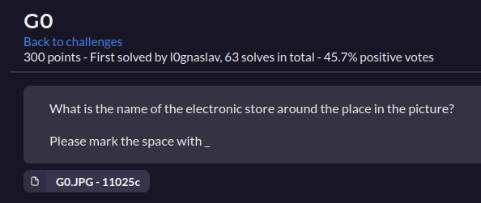
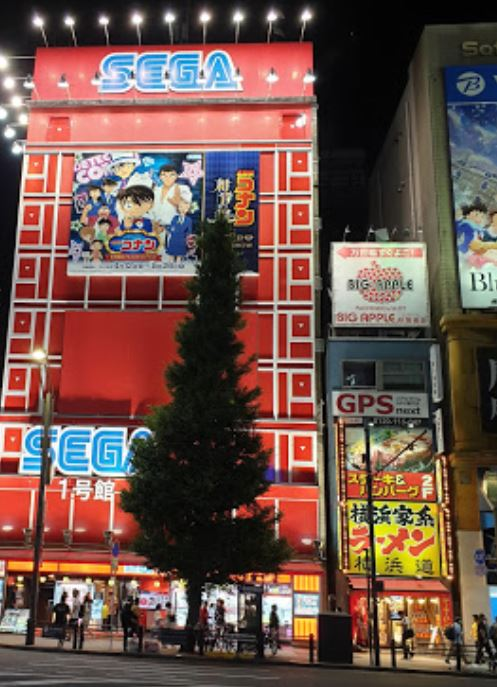
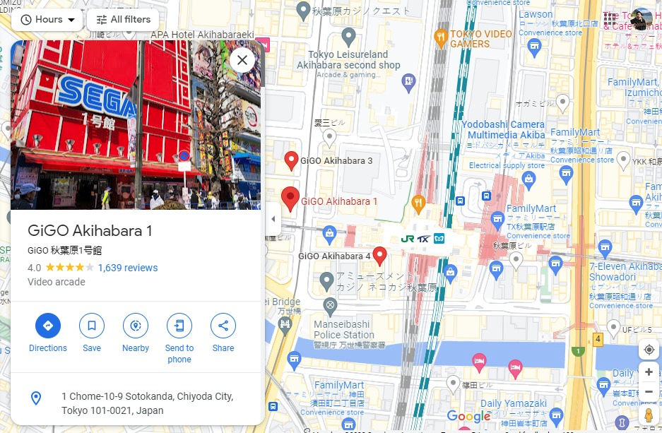
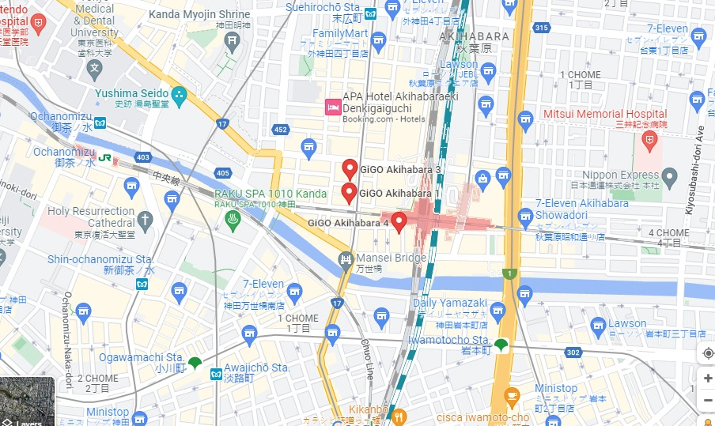

# SEGA

Este desafio fue un poco raro. Se nos pedia el nombre de la "electronic Store" que esta en el lugar cerca de la foto. Ademas, nos pedia separar los espacios con un _ para respetar el formato de la flag

  

La foto era la siguiente:

 

Al hacer una busqueda de la foto, encontre que era el Sega ubicado en Akihabara (En Japon). <br>
De ahi, fui a google maps y encontre un lugar muy parecido a la foto. (A diferencia de que el arbol carece de unas cuantas hojas)

  


Bueno, al parecer SEGA vendio su tienda de Arcade y ahora es propiedad de GiGO. Ahora que tenemos el lugar, solo queda buscar la "Electronic Store", no? <br>

Por suerte Akihabara no es conocido por ser uno de los mas grandes centros de Japon...

  


Bueno, esta es la lista de todo lo que probe:

**Place: Old SEGA Video Arcade in Akihabara**

Claramente primero intente: 

- SEGA_Akihabara_1
- GiGO_Akihabara_1

Luego, todas las "Electronic Stores" (Porque asi aparecian en Google)

- ONODEN
- Edion
- PC_World
- Wire_shop
- Akizuki_electronic_commerce_Akihabara
- Mybyte_store
- Honoka_Akihabara
- Bic_Camera
- Akihabara_jimmy
- sushi-wifi.com_Akihabara_Pick_Up_Area
- Akihabara_Pick_Up_Area
- Akihabara_Pick_Up
- Future_Gadget_Lab
- MyByte_International
- Kotobuki_Radio
- Sengoku_Densyo_Akihabara_3rd_Store
- Eisan_Duty_Free

Llegado a este punto, empece a intentar con todo lo que tuviese la mas ligera pinta de ser algo "tecnologico"

- SMART_EXCHANGE_Akihabara
- SEGA_no_Taiyaki_Akihabara
- IOSYS_Akiba_Roji-omote
- Seven_Bank_ATM
- HEY_(Hirose_Entertainment_Yard)_Taito
- TOKYO_PC
- GALLERIA_esports_Lounge
- Akizuki_electronic_commerce_Akihabara
- Nishikawa_Electric_Parts
- Tsukumo_PC_Honten
- Mouse_Computer_Akihabara_Direct_Shop
- Sofmap_Akiba_Ekimae

Y despues de que me timeutearon 3 veces del CTF (por ingresar varias Flags consecutivas) encontre la flag, que hacia referencia a:
- Tokyo_Radio_Department_Store_Shops 

```
Flag: T3N4CI0US{Tokyo_Radio_Department_Store_Shops}
```

