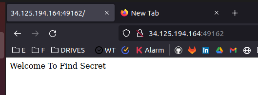
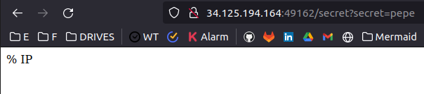
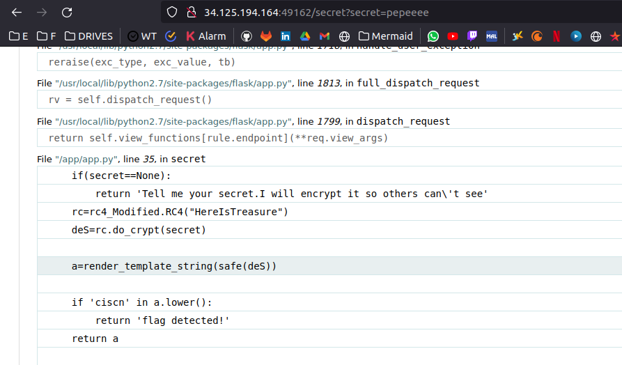
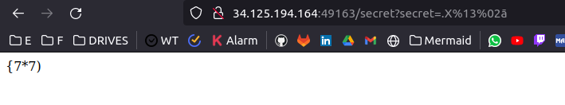
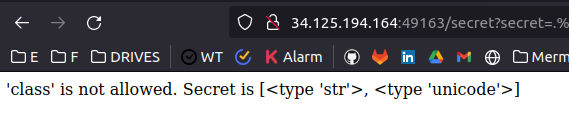
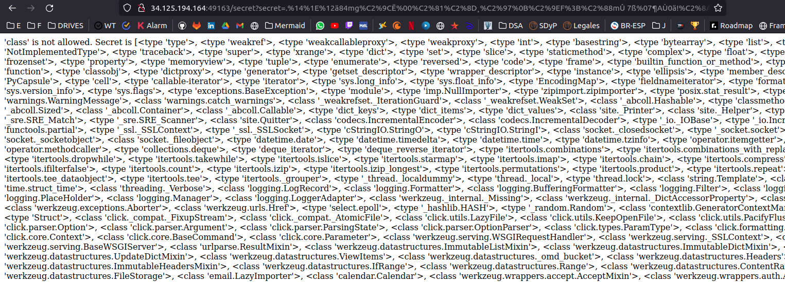
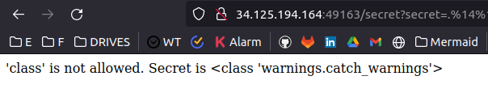
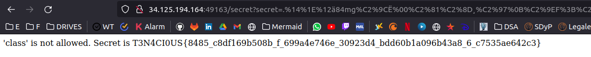

# World

Vamos a la URL indicada y nos pide encontrar el secreto

  

Entonces vamos a /secret?secret=pepe

  

Y como vemos se esconde nuestro secreto...

Pero, si mandamos muchos caracteres, nos va a devolver un error. Y ese error nos da el codigo que encodea.

  

Como se puede ver, se utiliza el encoding en RC4 con la frase "HereIsTreasure". Como nota, si aplicamos RC4 a una string, y luego volvemos a aplicar RC4 a la misma string, obtenemos el string original. Vamos a provecharnos de esto.

Como se ve, la pagina hace render_template_string(safe(deS)), asi que podemos injectar algo encodeado con RC4.

Buscando encontre un script de Python que hace el Encode en RC4, y de ahi lo modificamos para que haga `str(base64.b64decode(enc_base64),'utf-8')` ya que el script tambien encodeaba a base64. <br>
Al probarlo me devolvio la siguiente URL que imprime en pantalla el texto directamente. A partir de ahora, toda injeccion ira encryptada en RC4. 

  

Ahi fue cuando pensamos que no ibamos a poder ejecutar nada, pero volviendo a un CTF que habiamos resuelto anteriormente, utilizamos 
`{{''.__class__.__mro__[1].__subclasses__()}}` lo que devuelve:

  

Entonces, esto es un Server Side Template Injection.
Lo cual, con un poco de ayuda de google encontramos que podemos ir a 
`{{''.__class__.__mro__[2].__subclasses__()}}` 

  

Si bien esta clase no tiene fopen, si tiene una clase llamada `<class 'warnings.catch_warnings'>` la cual vamos a aprovechar.

  

Mediante esta clase, importamos 'os' y con esto popen para abrir el archivo flag.txt

`{{''.__class__.__mro__[2].__subclasses__()[59].__init__.__globals__.__builtins__.__import__('os').popen('cat /flag.txt').read()}}`

  

```
- FLAG
T3N4CI0US{8485_c8df169b508b_f_699a4e746e_30923d4_bdd60b1a096b43a8_6_c7535ae642c3} 
```