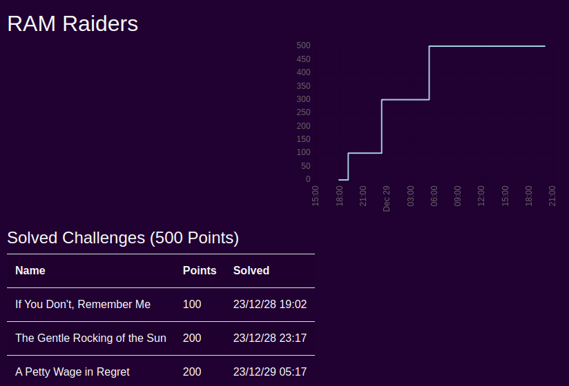

# Pointer Overflow CTF - 2023
Los writeups de esta carpeta corresponden al evento **Pointer Overflow CTF - 2023**, organizado por **University of Wisconsin - Stevens Point - Department of Computing and New Media Technologies**, desarrollado entre el 17/09/2023 y el 21/01/2024.

## Datos del evento
- CTFtime event URL: https://ctftime.org/event/2026  
- Event URL: https://pointeroverflowctf.com/

## Datos del alumno
- Nombre y apellido: Julián Casaburi  
- Asignatura cursada: Introducción a la Forensia Digital - Segundo Semestre 2023 (Universidad Nacional de La Plata - Facultad de Informática)
- IFD CTFd team: https://ctf2023.forensia.linti.unlp.edu.ar/teams/54  

---

Fueron resueltos **3** challenges de la categoría **forensics** y **1** de **cracking**:

| Challenge | Categoría |
| --- | :---:
| ✅ If You Don't, Remember Me | forensics |
| ✅ A Petty Wage in Regret | forensics |
| ✅ Better to Burn in the Light | forensics |
| ✅ The Gentle Rocking of the Sun | cracking |

URL del team: https://pointeroverflowctf.com/teams/1659

