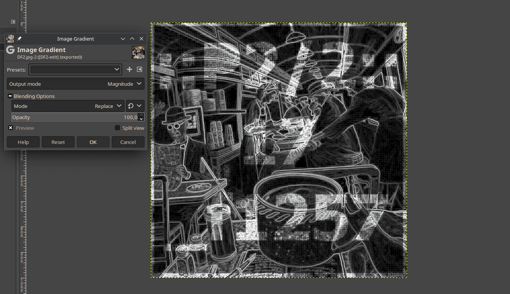
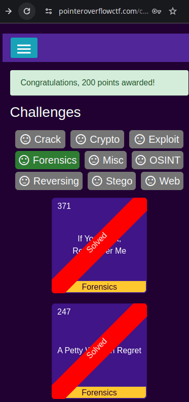
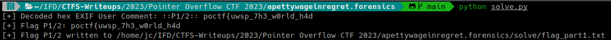

# A Petty Wage in Regret (Pointer Overflow CTF 2023 - Forensics)

## Challenge
Here is a very interesting image. The flag has been broken up into several parts and embedded within it, so it will take a variety of skills to assemble it.

### Resource
[Download DF2.jpg](https://uwspedu-my.sharepoint.com/:i:/g/personal/cjohnson_uwsp_edu/EUU6XEnKsk1BopS8Iz0JAD8B1yHWrVJZXYnmbCqhIPYVHw?e=sLK92J)

## Solve manual
### Parte 1
Utilizando la tool exif para ver los datos EXIF de la imagen:

```bash
exif ./recurso/DF2.jpg --width=100
```

En el tag `User Comment` hay un dato en formato hexadecimal: `3A3A50312F323A3A20706F6374667B757773705F3768335F7730726C645F683464`  
Se puede decodificar utilizando xxd con las flags -r -p:

```bash
echo -n "3A3A50312F323A3A20706F6374667B757773705F3768335F7730726C645F683464" | xxd -r -p
```


Obteniendo como resultado `::P1/2:: poctf{uwsp_7h3_w0rld_h4d`.  
La descripción del challenge menciona que la flag fue dividida en varias partes. Esto coincide con lo hallado en el User Comment `::P1/2::` (parte 1 de 2).

### Parte 2
Al visualizar la imagen descargada se aprecia que hay caracteres. Estos no son fácilmente legibles.


Para mejorar la legibilidad de los mismos, se procede a abrir la imagen con el editor GIMP y aplicar el filtro Image Gradient:



Ahora es posible distinguir los caracteres:

```
::P2/2::
17
_f1257
```

Por lo tanto, concatenando la primera parte de la flag con `_17_f1257`, se obtiene la flag.

### Flag
Flag: `poctf{uwsp_7h3_w0rld_h4d_17_f1257}`



## Solve utilizando solve.py
El script requiere el package Pillow. La instalación de requerimientos se realiza con el siguiente comando:

```bash
pip install -r requirements.txt
```

El script resolverá el primer paso para obtener la flag, luego se deberá obtener la segunda parte visualizando la imagen.  

Se deberá ejecutar el siguiente comando:

```bash
python solve.py
```

Mostrará en el output el User Comment EXIF que incluye la primera parte de la flag y abrirá el recurso DF2.jpg en el visualizador de imágenes por defecto.

