# Better to Burn in the Light (Pointer Overflow CTF 2023 - Forensics)

## Challenge
This is an image of a disk that once contained several files. They were deleted prior to imaging, unfortunately. To find the flag, we're going to need to bring some of them back from the dead. The flag is actually broken up between two of them. Carve the files out of the image and restore any missing file headers to find the pieces to reassemble.

### Resource
[Download DF3.001](https://uwspedu-my.sharepoint.com/:u:/g/personal/cjohnson_uwsp_edu/Efkglq1V9PtAqZxOU5IEoFABx3eLJ2x383ume8dllMiSqQ?e=LOhNdP)

## Solve manual
El recurso es una imagen de disco según la descripción del challenge. Lo verificamos con el comando file:

```bash
file DF3.001
```

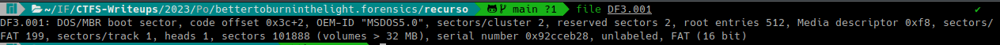

Cargamos la imagen del disco en Autopsy. Para ello creamos un caso:

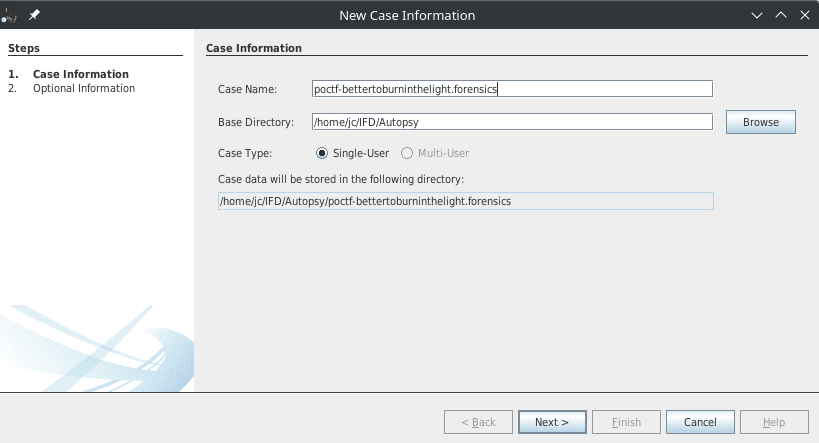

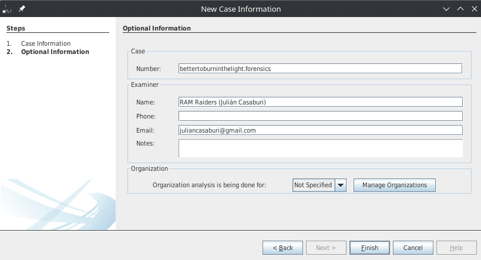

Dado que nos indica que *we're going to need to bring some of them back from the dead*, inspeccionamos los archivos mediante la funcionalidad File Browser de Autopsy y revisamos el directorio $RECYCLE.BIN (papelera de reciclaje de windows)

Revisando el contenido hexadecimal de los archivos, se encuentra el siguiente archivo en el cual se observa la palabra CLUE en los metadatos EXIF.
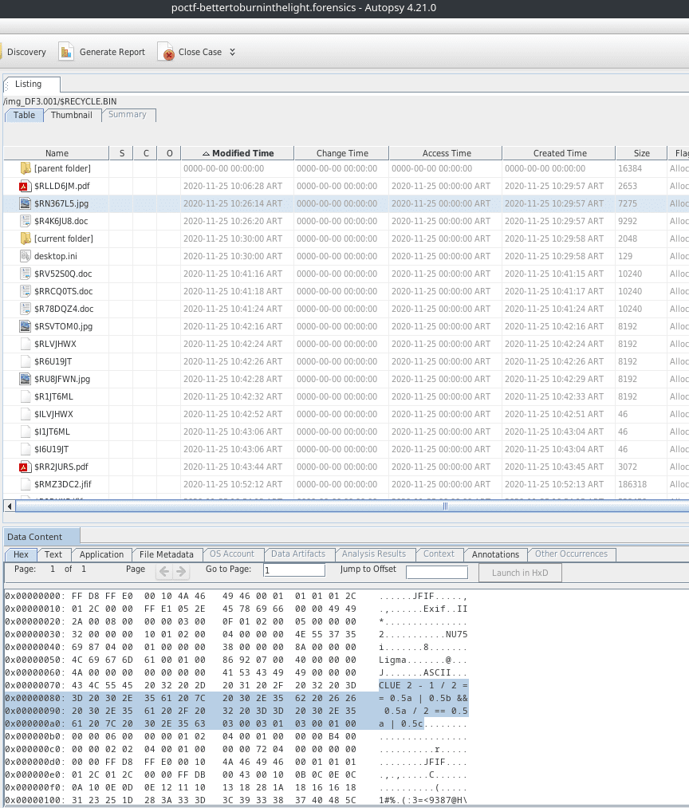

El archivo presenta dos Start of Image (SOI) marker, es decir `FF D8 FF E0`. Por lo tanto, eliminaremos el primero. Lo haremos utilizando el editor hexadecimal [hexed.it](https://hexed.it/)

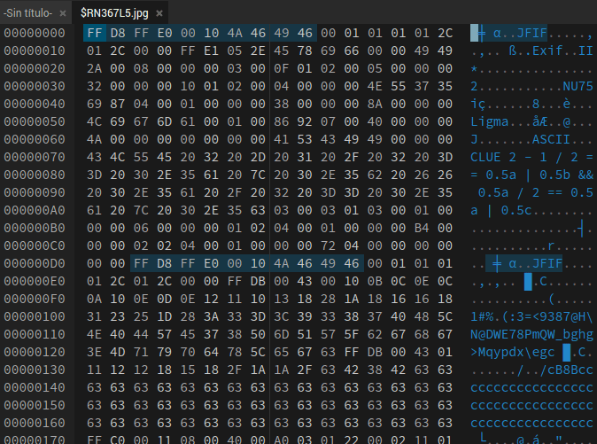

Guardamos el archivo, quedando de la siguiente forma:

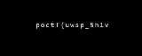

Contiene una parte de la flag: `poctf{uwsp_5h1v`

Continuando con la inspección de los archivos, se encuentra el siguiente en el cual también se observa la palabra CLUE en los metadatos EXIF.
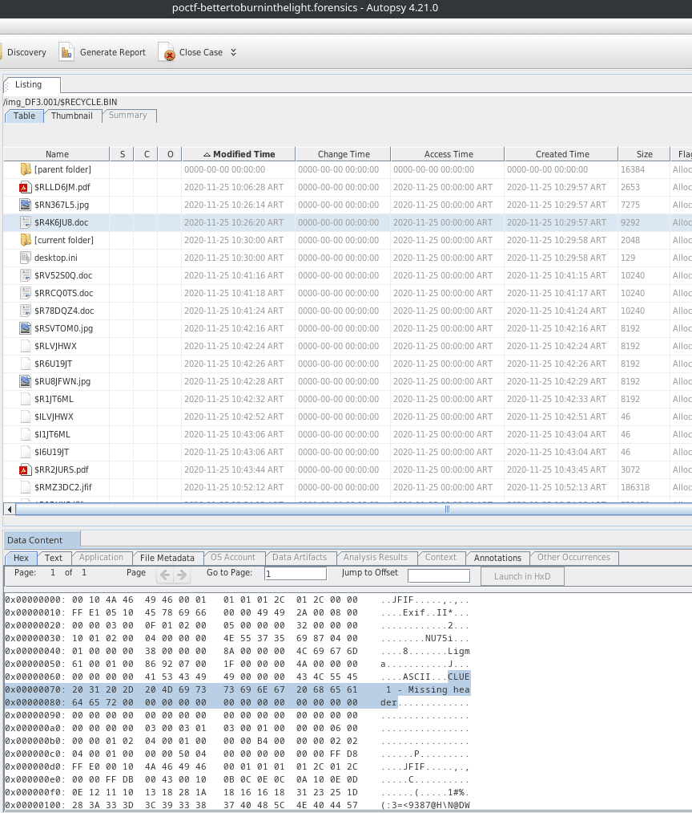

La pista es "missing header". El header está incompleto. Utilizando [hexed.it](https://hexed.it/) se agregarán 4 bytes al comienzo `FF D8 FF E0`

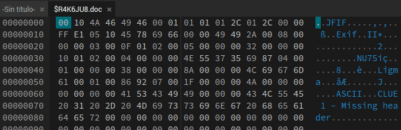

Quedando de la siguiente forma:

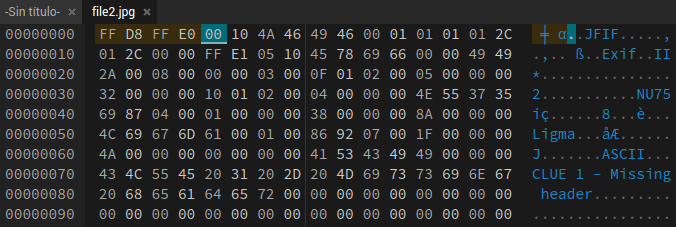

Guardamos el archivo y vemos que contiene la segunda parte de la flag: `3r_m3_71mb3r5}`


Flag: `poctf{uwsp_5h1v3r_m3_71mb3r5}`

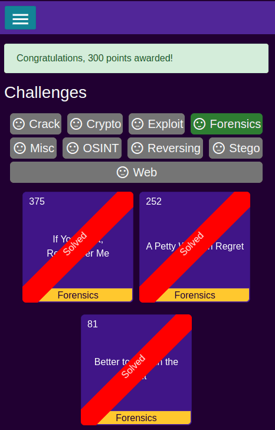

## Solve utilizando solve.py
El script requiere el package pyfatfs. La instalación de requerimientos se realiza con el siguiente comando:

```bash
pip install -r requirements.txt
```

Se deberá ejecutar el siguiente comando:

```bash
python solve.py
```

El script creará 2 imágenes en el directorio relativo `./solve/fixed-files`, las cuales deberán ser visualizadas para obtener la flag.

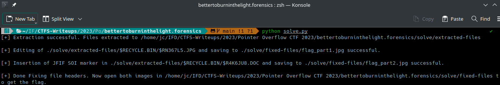