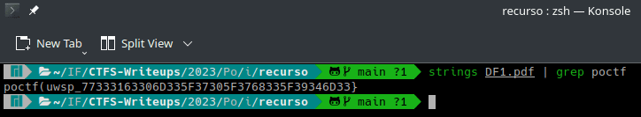
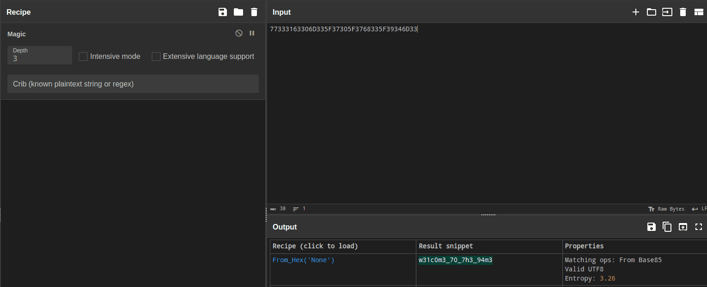
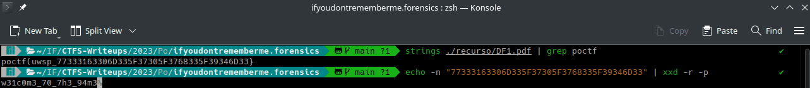
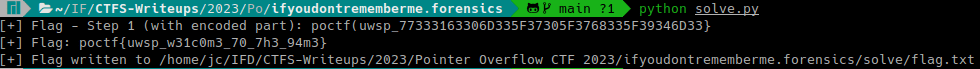

# If You Don't, Remember Me (Pointer Overflow CTF 2023 - Forensics)

## Challenge
Here is a PDF file that seems to have some problems. I'm not sure what it used to be, but that's not important. I know it contains the flag, but I'm sure you can find it and drag it out of the file somehow. This is a two-step flag as you will find it partially encoded.

### Resource
[Download DF1.pdf](https://uwspedu-my.sharepoint.com/:b:/g/personal/cjohnson_uwsp_edu/EdhtgZup9QFLkuc2N5IzwpgBV4VRkYZoVLBuonJJ0qfpsg?e=alTbB0)

## Solve manual
- El recurso es un archivo PDF que parece tener algunos problemas.
- Se aclara que el contenido del archivo no es relevante.
- Se aclara que se deben realizar dos pasos para obtener la flag, dado que deberá ser decodificada una vez obtenida.

### Primer paso
Conociendo el formato de la flag, el cual se indica en las [reglas del evento](https://pointeroverflowctf.com/rules), como primer paso se procede a buscar la flag mediante la utilidad `strings`:

```bash
strings ./recurso/DF1.pdf | grep poctf
```



Obteniendo como resultado `poctf(uwsp_77333163306D335F37305F3768335F39346D33}`

### Segundo paso
La parte `77333163306D335F37305F3768335F39346D33` está en formato hexadecimal, tal como lo sugiere la operation `Magic` de la tool `CyberChef` al utilizar tal input:

https://gchq.github.io/CyberChef/#recipe=Magic(3,false,false,'')&input=NzczMzMxNjMzMDZEMzM1RjM3MzA1RjM3NjgzMzVGMzkzNDZEMzM



Por lo tanto, se decodificará con la utilidad `xxd`




### Flag
Flag: `poctf{uwsp_w31c0m3_70_7h3_94m3}`


## Solve utilizando solve.py
Se deberá ejecutar el siguiente comando:

```bash
python solve.py
```

Mostrará en el output la flag y escribirá la misma en el directorio relativo ./solve

