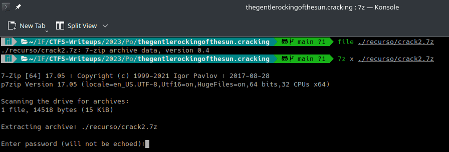
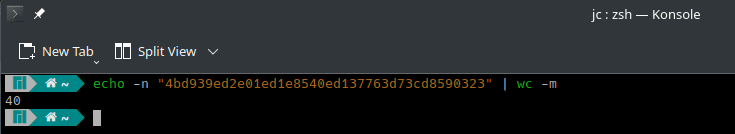
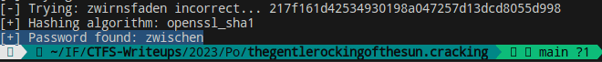
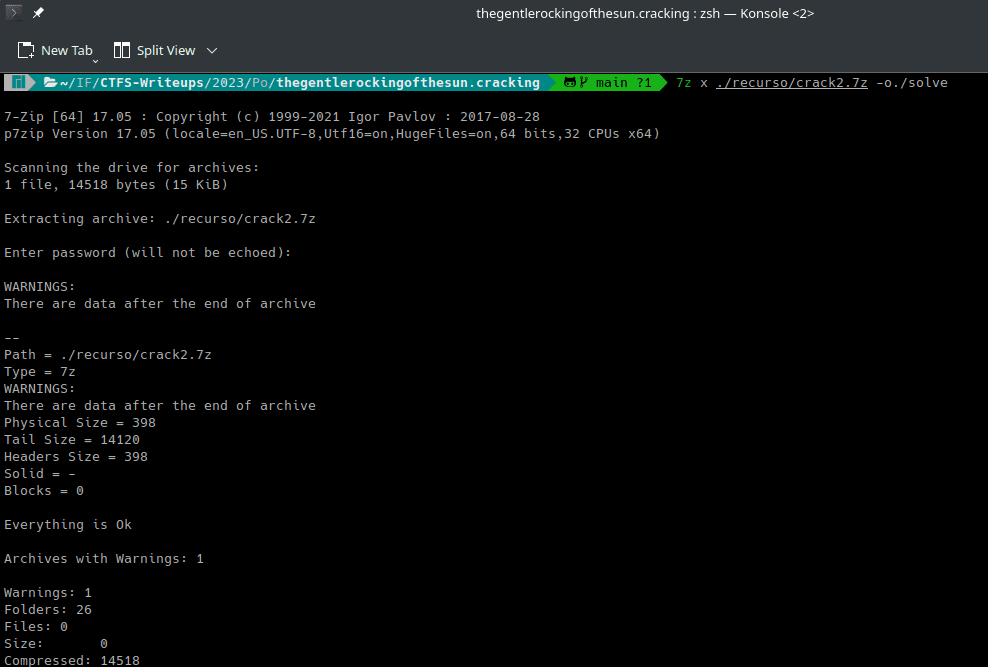
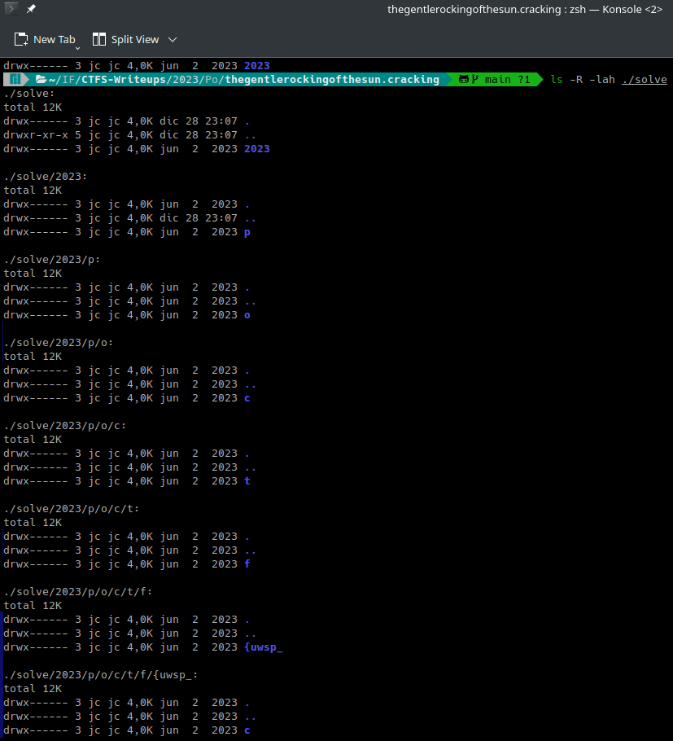
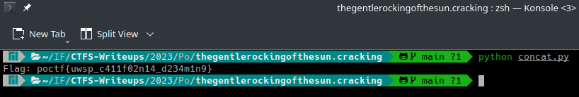
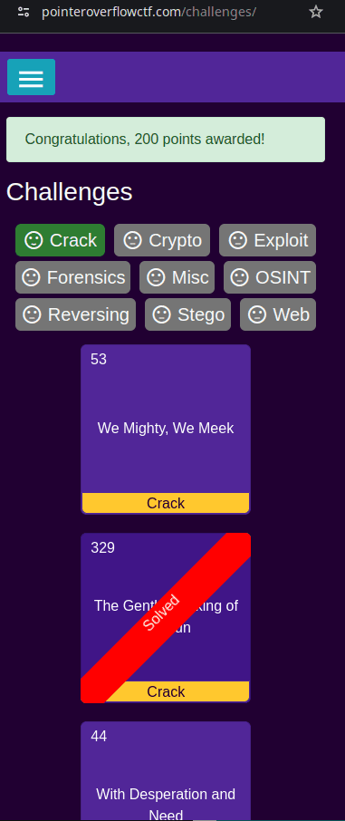
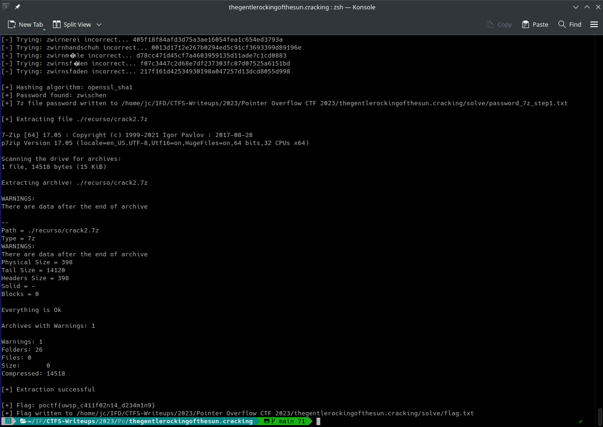

# The Gentle Rocking of the Sun (Pointer Overflow CTF 2023 - Cracking)

## Challenge
Here's a password protected archive. Problem is that I seem to have forgotten das Passwort. All I have is this post-it note on my monitor that says "crack2 = 4bd939ed2e01ed1e8540ed137763d73cd8590323"

### Resource
[Download crack2.7z](https://uwspedu-my.sharepoint.com/:u:/g/personal/cjohnson_uwsp_edu/EbUR8q9AHldHmMVkZq1pTEwBH8iSbnckZzYyoOGHSY131A?e=Z8xgFP)

## Solve manual
Como primer paso se verifica el tipo de archivo:
```bash
file ./recurso/crack2.7z
```

El recurso es un archivo comprimido en formato 7-zip.  
Se intenta extraer el archivo, pero se encuentra protegido por contraseña:

```bash
7z x ./recurso/crack2.7z 
```



En la descripción del challenge se otorga el hash `4bd939ed2e01ed1e8540ed137763d73cd8590323`. Para determinar el tipo de hash, se comprueba su longitud mediante la utilidad wc:

```bash
echo -n "4bd939ed2e01ed1e8540ed137763d73cd8590323" | wc -m
```



La longitud es 40. El tipo de hash es SHA-1.

Dado que en la descripción del challenge utiliza palabras en el idioma Alemán: `das Passwort`, se procede a buscar y descargar un diccionario que contenga palabras alemanas. 

Se prueba con el siguiente diccionario https://github.com/CSL-LABS/CrackingWordLists/blob/master/dics/lang/german_de_DE.dic, utilizando un script que hashea y compara las palabras del diccionario con el hash dado en el challenge.

```python
import hashlib

HASH = '4bd939ed2e01ed1e8540ed137763d73cd8590323'
WORDLIST_PATH = './german_de_DE.dic'

def detect_hash_type(hash_value):
    hash_algorithms = {
        32: hashlib.md5,
        40: hashlib.sha1,
        64: hashlib.sha256,
        128: hashlib.sha512,
    }

    hash_length = len(hash_value)
    if hash_length in hash_algorithms:
        return hash_algorithms[hash_length]
    else:
        return None

try:
    hash_algorithm = detect_hash_type(HASH)
    if hash_algorithm is None:
        print(f'[-] Error: Unknown hash type for hash {HASH}')
        exit

    with open(WORDLIST_PATH, 'r', encoding='utf-8', errors='ignore') as wordlist_file:
        for word in wordlist_file:
            word = word.strip()
            guess = hash_algorithm(word.encode('utf-8')).hexdigest()
            if guess.upper() == HASH or guess.lower() == HASH:
                print("[+] Hashing algorithm:", hash_algorithm.__name__)
                print(f'[+] Password found: {word}')
                exit(0)
            else:
                print(f'[-] Trying: {word} incorrect... {guess}')
    print(f'[-] Password not found in wordlist...')
except FileNotFoundError:
    print(f'[-] Error: Wordlist not found at {WORDLIST_PATH}')
```

Se encontró la password: `zwischen`



Se procede a extraer el archivo crack2.7z:

```bash
7z x ./recurso/crack2.7z -o./solve
```



Al inspeccionar el contenido extraido se encuentran una gran cantidad de directorios anidados:

```bash
ls -R -lah ./solve
```



Se puede observar que la flag está conformada por la concatenación de los nombres de los directorios.  

Utilizando el siguiente script python, se podrá obtener la flag a partir de la concatenación de los directorios:

```python
import os
import re

def concatenate_subdirectories(directory_path):
    # Check if the provided path is a directory
    if not os.path.isdir(directory_path):
        print(f"The specified path '{directory_path}' is not a directory.")
        return

    # Initialize an empty list to store all subdirectory names
    all_subdirectories = []

    # Walk through the directory and its subdirectories
    for root, dirs, files in os.walk(directory_path):
        # Add the names of subdirectories to the list
        all_subdirectories.extend(dirs)

    # Concatenate subdirectory names into a string
    result_string = ''.join(all_subdirectories)

    return result_string

# Directory path
directory_path = './solve'

# Call the function concatenate_subdirectories
concatenated_string = concatenate_subdirectories(directory_path)

# Regex - Pointer Overflow CTF flag format
pattern = re.compile(r'poctf.*?}', re.DOTALL)

# Find matches in the concatenated string using the regex pattern
matches = pattern.findall(concatenated_string)

# Print the matches
for match in matches:
    print(f"Flag: {match}")
```




### Flag
Flag: `poctf{uwsp_c411f02n14_d234m1n9}`



## Solve utilizando solve.py
El script requiere los packages:
- py7zr para extraer el recurso .7z
- tqdm para mostrar barras de progreso.

La instalación de requerimientos se realiza con el siguiente comando:

```bash
pip install -r requirements.txt
```

Se deberá ejecutar el siguiente comando:

```bash
python solve.py
```

Mostrará en el output la password del recurso, la flag y escribirá las mismas en el directorio relativo ./solve

> NOTA: En caso de no contar con el diccionario, el script lo descargará desde https://github.com/CSL-LABS/CrackingWordLists/raw/master/dics/lang/german_de_DE.dic

