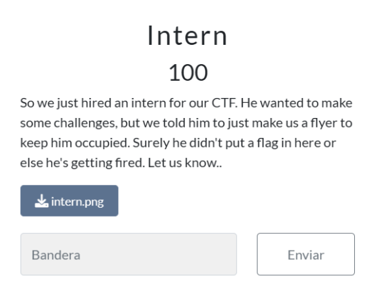
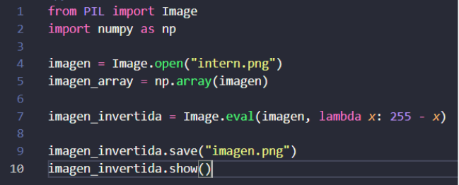
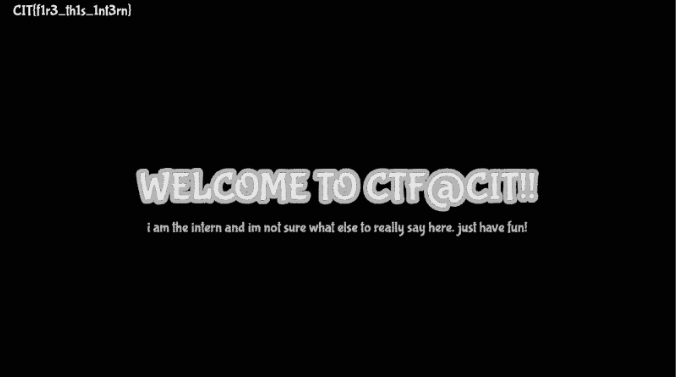

# Informe Reto 2

## Integrantes
- Bértoli Rafael
- Rojas Manuel
- Lombardo Larrain Tobías
- Soler Santiago

## Grupo
CHEDICHI

## Descripción del Reto

Para el segundo CTF decidimos realizar **“Intern”** de la categoría **“Steganography”**.

## Solución del Reto

El CTF en cuestión contenía un archivo .png que al descargarlo mostraba lo siguiente:

Al ver una imagen tan blanca se nos ocurrió hacer un script en Python el cual invierte los colores de la misma:

  
Al ejecutar dicho script, se nos abrió la siguiente imagen, donde en una esquina se puede observar la flag: CIT{f1r3_th1s_1nt3rn}

