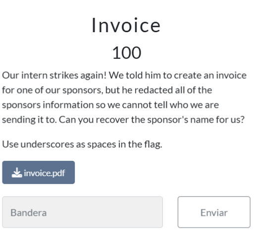
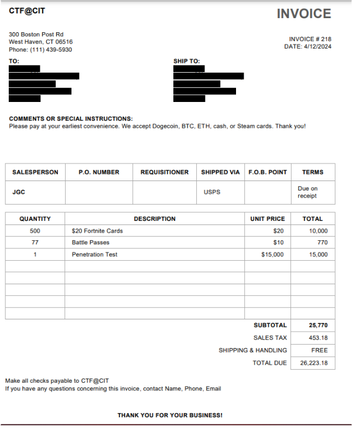
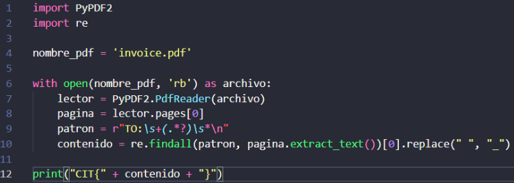
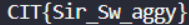

# Informe Reto 3

## Integrantes
- Bértoli Rafael
- Rojas Manuel
- Lombardo Larrain Tobías
- Soler Santiago

## Grupo
CHEDICHI

## Descripción del Reto

Por último para este CTF optamos por hacer el denominado **“Invoice”** de la categoría **“Forensics”**.

Dicho CTF también incluía un archivo aunque este era un pdf que contenía la siguiente información:

## Solución del Reto

Básicamente, lo que se solicitaba de este reto, era recuperar la información del sponsor que parecía que se había perdido, ya que al abrir el archivo, la información del mismo aparecía tachada. Para esto, a pesar de que no se pueda ver a simple vista, podemos seleccionar el texto que se encuentra detrás de las líneas tachadas, copiarlo y pegarlo a continuación:

  

Sir Swaggy

1337 Information Security

22 Beehive Drive

Freeport, Maine 040

Phone: N/A

  

Luego, el reto nos pide específicamente que recuperemos el nombre del sponsor, que en este caso es “Sir Swaggy”, y que en donde haya espacios en blanco, utilicemos un guión bajo. A esto, le sumamos el formato de la flag y nos quedaría de la siguiente manera: CIT{Sir_Swaggy}

  

Al igual que en los otros retos, hicimos un script el cual lee el pdf y devuelve el nombre del sponsor, pero que además tiene la particularidad de que tuvimos que adaptarlo para que dicho nombre se combine con texto introducido por nosotros y reemplace los espacios por guiones bajos para que cumpla con el formato de la flag:

Si bien la flag correcta es CIT{Sir_Swaggy}, al ejecutar el script parece que detecta un espacio donde no lo hay y agrega otro guión bajo. Decimos esto ya que copiando y pegándolo directamente desde el pdf ese espacio no aparece, y así fue como nosotros ingresamos la flag mencionada anteriormente.
