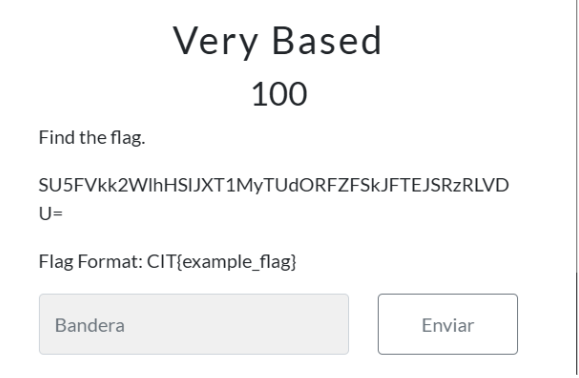
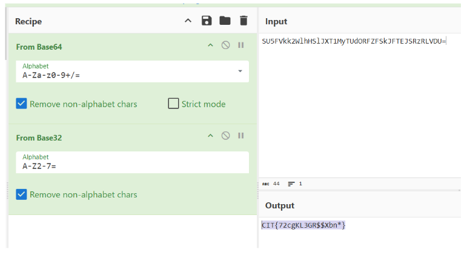
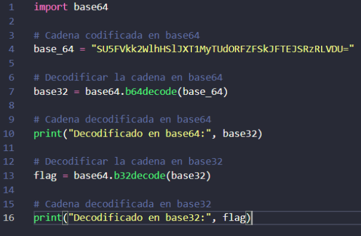
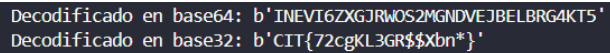

# Informe Reto 1

## Integrantes
- Bértoli Rafael
- Rojas Manuel
- Lombardo Larrain Tobías
- Soler Santiago

## Grupo
CHEDICHI

## Descripción del Reto

Para el primer CTF elegimos el reto **“Very Based”** de la categoría **“Crypto”**.

## Solución del Reto

Para este CTF nosotros utilizamos **“CyberChef”**, el cual nos ayudó a decodificar la flag codificada `SU5FVkk2WlhHSlJXT1MyTUdORFZFSkJFTEJSRzRLVDU=` que nos brindó el reto. 

1. En primer lugar, realizamos una decodificación con **Base64**.
2. Luego, agregamos una decodificación en **Base32**, lo cual dio como resultado la flag: `CIT{72cgKL3GR$$Xbn*}`.

Esto también se puede ver reflejado en el siguiente código de Python donde:

- Guardamos la cadena en la variable `base_64`.
- Luego la decodificamos en Base64 y la guardamos en la variable `base32`.
- Imprimimos el valor de `base32`.
- Volvemos a decodificarla, pero esta vez en Base32, la guardamos en la variable `flag`.
- Finalmente, imprimimos dicha flag.

