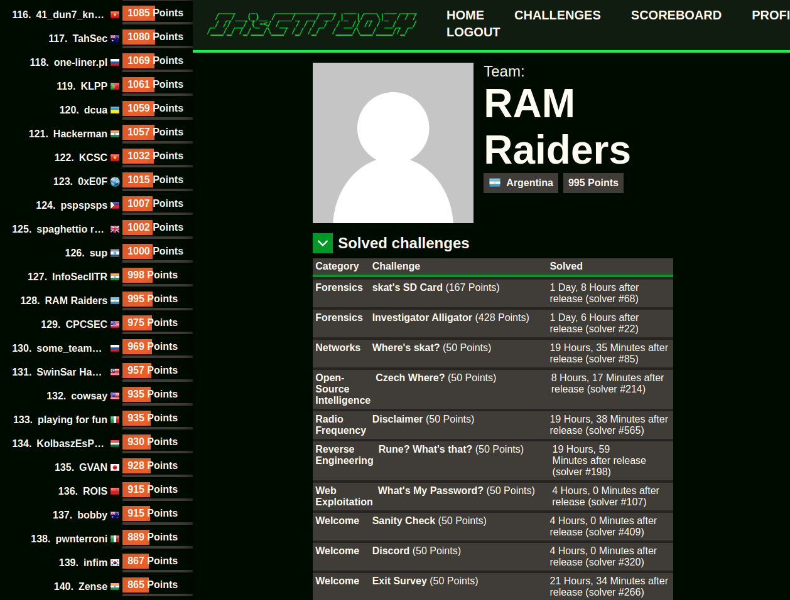

# Iris CTF 2024
Los writeups de esta carpeta corresponden al evento **Iris CTF 2024**, organizado por [IrisSec](https://irissec.xyz/), desarrollado entre el 06/01/2024 y el 08/01/2024.

## Datos del evento
- CTFtime event URL: https://ctftime.org/event/2085
- Event URL: https://2024.irisc.tf/home

## Datos del alumno
- Nombre y apellido: Julián Casaburi  
- Asignatura cursada: Introducción a la Forensia Digital - Segundo Semestre 2023 (Universidad Nacional de La Plata - Facultad de Informática)
- IFD CTFd team: https://ctf2023.forensia.linti.unlp.edu.ar/teams/54  

---

Fueron resueltos los siguientes challenges:

| Challenge | Categoría |
| --- | :---:
| ✅ skat's SD Card | forensics |
| ✅ Investigator Alligator | forensics |
| ✅ Where's skat? | networks |
| ✅ Czech Where? | Open-Source Intelligence |
| ✅ Rune? What's that? | Reverse Engineering |
| ✅ What's My Password? | Web Exploitation |

URL del team: https://2024.irisc.tf/user?id=92

