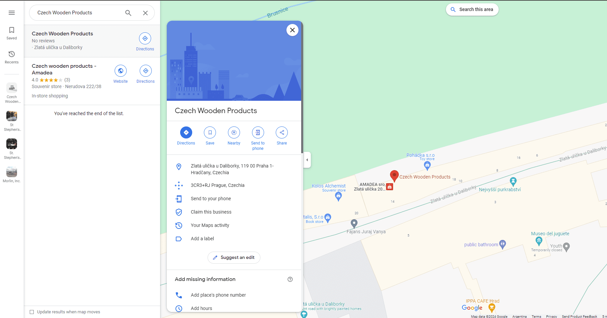
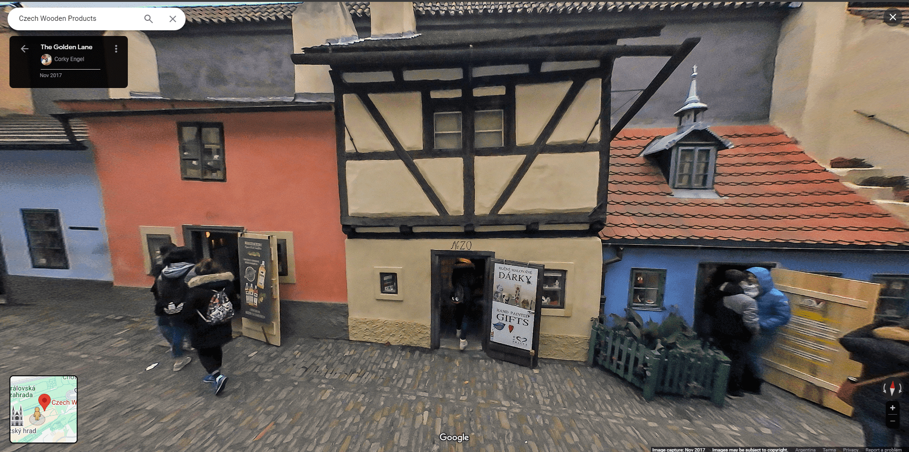
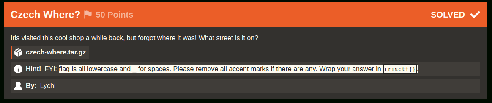
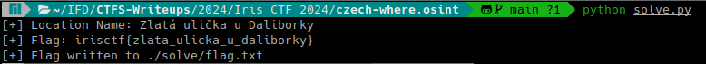

# Czech Where? (Iris CTF 2024 - Open-Source Intelligence)

## Challenge
Iris visited this cool shop a while back, but forgot where it was! What street is it on?

### Resource
[Download czech-where.tar.gz](https://cdn.2024.irisc.tf/czech-where.tar.gz)

## Solve manual

Extraemos el archivo czech-where.tar.gz:

```bash
7z x ./recurso/czech-where.tar.gz -o./recurso/
```

```bash
7z x ./recurso/czech-where.tar -o./recurso/
```

Abrimos image.png en ./recurso/czech-where/


Vemos que la tienda tiene escrito "Czech wooden products". La buscamos en google maps y el primer resultado es:



La tienda del resultado se ve muy similar a la imagen del recurso.



Por lo tanto la ubicación es Zlatá ulička u Daliborky, 119 00 Praha 1-Hradčany, Czechia y la calle es Zlatá ulička u Daliborky.

Dado que el challenge indica el formato de la flag:
> flag is all lowercase and _ for spaces. Please remove all accent marks if there are any. Wrap your answer in irisctf{}.

Podemos arreglar el formato con el siguiente script en python:

```py
import unicodedata

location_name = "Zlatá ulička u Daliborky"

# Convert to lowercase
location_name = location_name.lower()

# Replace whitespace with underscores
location_name = location_name.replace(" ", "_")

# Remove accent marks
location_name = ''.join(c for c in unicodedata.normalize('NFD', location_name) if unicodedata.category(c) != 'Mn')
print("[+] Flag: irisctf{{{}}}".format(location_name))
```

### Flag
Flag: `irisctf{zlata_ulicka_u_daliborky}`



## Solve utilizando solve.py

**NOTA**: dado que el script utiliza web scraping, es posible que deje de funcionar correctamente ante una actualización de Google Maps. Una alternativa es hacer un script que utilice una API Key.

Se deberá ejecutar el siguiente comando:

```bash
python solve.py
```

Mostrará en el output la flag y escribirá la misma en el archivo flag.txt dentro del directorio relativo ./solve

