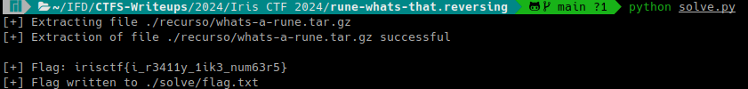

# Rune? What's that? (Iris CTF 2024 - Reverse Engineering)

## Challenge
Rune? Like the ancient alphabet?

### Resource
[Download whats-a-rune.tar.gz](https://cdn.2024.irisc.tf/whats-a-rune.tar.gz)

## Solve manual

Extraemos el archivo whats-a-rune.tar.gz:

```bash
7z x ./recurso/whats-a-rune.tar.gz -o./recurso/
```

```bash
7z x ./recurso/whats-a-rune.tar -o./recurso/
```

Abrimos /recurso/whats-a-rune/

Inspeccionamos el codigo de main.go:

```go
package main

import (
	"fmt"
	"os"
	"strings"
)

var flag = "irisctf{this_is_not_the_real_flag}"

func init() {
	runed := []string{}
	z := rune(0)

	for _, v := range flag {
		runed = append(runed, string(v+z))
		z = v
	}

	flag = strings.Join(runed, "")
}

func main() {
	file, err := os.OpenFile("the", os.O_RDWR|os.O_CREATE, 0644)
	if err != nil {
		fmt.Println(err)
		return
	}

	defer file.Close()
	if _, err := file.Write([]byte(flag)); err != nil {
		fmt.Println(err)
		return
	}
}
```

El archivo the, contiene la flag a la cual se le ha aplicado la función init(). Para recuperar la flag se deberá realizar la inversa de init().

Escribimos el script [solve.py](solve.py)

La inversa es:

```py
z = 0

for v in flag:
    runed.append(chr(ord(v) - z))
    z = ord(v) - z
```



### Flag
Flag: `irisctf{i_r3411y_1ik3_num63r5}`


## Solve utilizando solve.py
El script requiere múltiples packages. La instalación de requerimientos se realiza con el siguiente comando:

```bash
pip install -r requirements.txt
```

Se deberá ejecutar el siguiente comando:

```bash
python solve.py
```

Mostrará en el output la flag y escribirá la misma en el archivo flag.txt dentro del directorio relativo ./solve

> Nota: el script descargará el recurso en caso de no estar en ./recurso.

