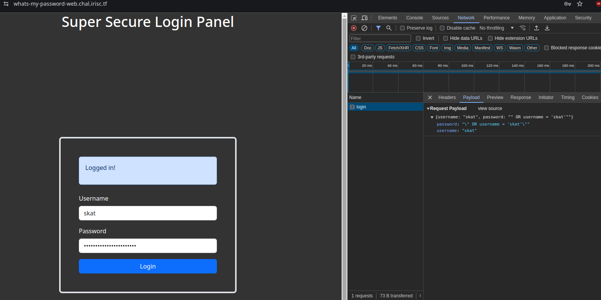
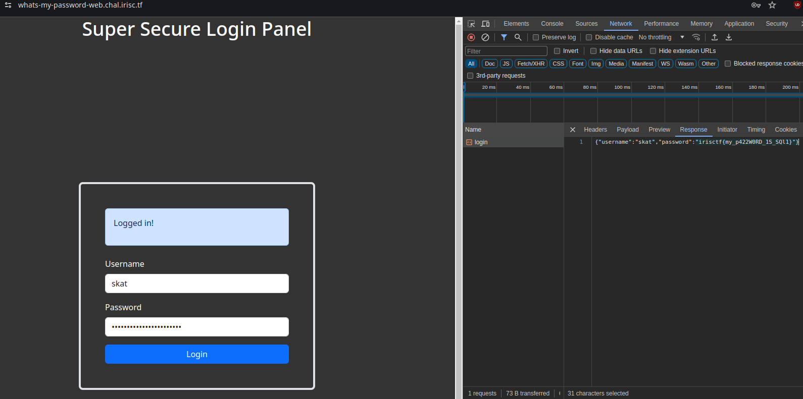
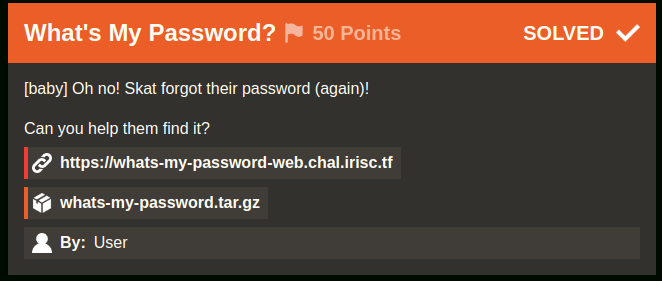
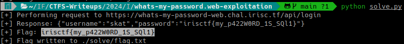

# What's My Password? (Iris CTF 2024 - Web Exploitation)

## Challenge
[baby] Oh no! Skat forgot their password (again)!

Can you help them find it?

https://whats-my-password-web.chal.irisc.tf

### Resource
[Download whats-my-password.tar.gz](https://cdn.2024.irisc.tf/whats-my-password.tar.gz)

## Solve manual

Extraemos el archivo whats-my-password.tar.gz:

```bash
7z x ./recurso/whats-my-password.tar.gz -o./recurso/
```

```bash
7z x ./recurso/whats-my-password.tar -o./recurso/
```

Abrimos ./recurso/whats-my-password/

En primer lugar vemos las queries Data Manipulation Language (DML) y Data Control Language (DCL) de la db en setup.sql:

```sql
CREATE DATABASE uwu;
use uwu;

CREATE TABLE IF NOT EXISTS users ( username text, password text );
INSERT INTO users ( username, password ) VALUES ( "root", "IamAvEryC0olRootUsr");
INSERT INTO users ( username, password ) VALUES ( "skat", "fakeflg{fake_flag}");
INSERT INTO users ( username, password ) VALUES ( "coded", "ilovegolang42");

CREATE USER 'readonly_user'@'%' IDENTIFIED BY 'password';
GRANT SELECT ON uwu.users TO 'readonly_user'@'%';
FLUSH PRIVILEGES;
```

Obtenemos como dato que la columna de la contraseña es password y el user de Skat (que olvidó su password) es skat.

En ./recurso/whats-my-password/src/main.go vemos el código del backend.

Obtenemos como dato que sanitiza el usuario pero no la password:

```go
matched, err := regexp.MatchString(UsernameRegex, input.Username)
if err != nil {
    w.WriteHeader(http.StatusInternalServerError)
    return
}

if matched {
    w.WriteHeader(http.StatusBadRequest)
    w.Write([]byte("Username can only contain lowercase letters and numbers."))
    return
}

qstring := fmt.Sprintf("SELECT * FROM users WHERE username = \"%s\" AND password = \"%s\"", input.Username, input.Password)

query, err := DB.Query(qstring)
```

Por lo tanto, la query es vulnerable a SQL Injection.

La password a ingresar será `" OR username = 'skat'"`

Payload (visto en la network request de la consola de desarrollador de google chrome):



Response (visto en la network request de la consola de desarrollador de google chrome):




### Flag
Flag: `irisctf{my_p422W0RD_1S_SQl1}`



## Solve utilizando solve.py

Se deberá ejecutar el siguiente comando:

```bash
python solve.py
```

Mostrará en el output la flag y escribirá la misma en el archivo flag.txt dentro del directorio relativo ./solve

