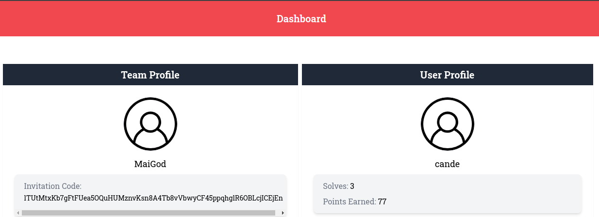

# Introducción a la forencia digital
En esta carpeta se encuentran los retos resueltos para el trabajo final de la materia **Introducción a la Forensia Digital** cursada en el año 2020 por la alumna Candela Mariel Rouaux Servat.

## MAPNA CTF - 2024
Los writeups de esta carpeta corresponden al evento **[MAPNA CTF](https://mapnactf.com/)** ([ctftime](https://ctftime.org/event/2205)) que estuvo abierto 24hs: desde 20 de enero de 2024, 15:00 UTC hasta 21 de 2024, 15:00 UTC. El equipo y usuario creados son los siguientes:

### Retos
Durante el evento se resolvieron 3 retos:
- PLC I (Forensics)
- Tampered (Forensics)
- What next? (Cryptography)

Todas las flags, a no ser que se especifique lo contrario, tienen el formato **MAPNA{[0-9a-zA-Z_-]+.!?|}**. Por ejemplo: MAPNA{_some_l33t_string_l1k3_7hi5_}