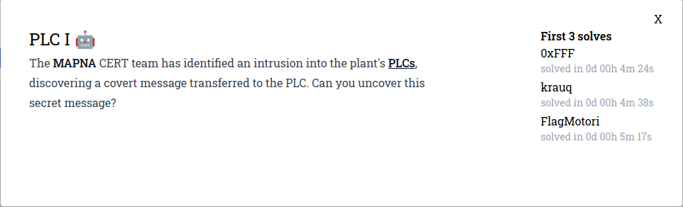
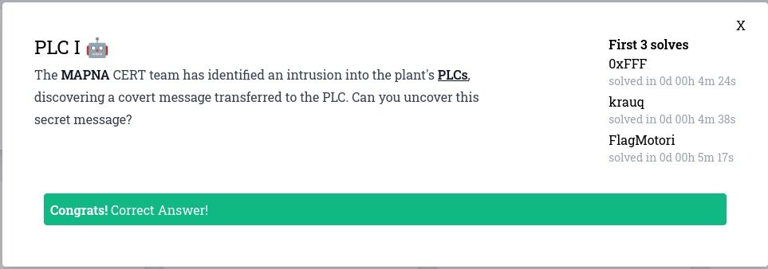

# PLC I



El enunciado dice que el equipo de MAPNA CERT identificó una intrusión al PLC de la planta y descubrió un mensaje secreto. El recurso adjunto es un archivo pcap.

## Resolución

Al ejecutar el comando strings sobre el recurso obtuve lo siguiente:
```
strings plc.pcap
4-"@
(-#@
>-$@
A-%@
/-&@
I-'@
/-(@
I-)@
/-*@
I-+@
/-,@
I--@
3:Ld_4lW4
6ES7 151-8AB01-0AB0 
/-.@
E-/@
/-0@
I-1@
/-2@
I-3@
IM151-8 PN/DP CPU
/-4@
5:3__PaAD
E-5@
/-6@
1:MAPNA{y
E-7@
/-8@
4:yS__CaR
O-9@
 #	!
/-:@
E-;@
/-<@
6:d1n9!!}
E-=@
Y3td
/->@
2:0U_sHOu
(-?@
```

A simple vista veo el formato de la flag dividido en varias líneas. 6ES7 151-8AB01-0AB0 y IM151-8 PN/DP CPU parece ser el código de un PLC de Siemens y la CPU del mismo.

Si tomamos todas las líneas que tienen el formato **nro:texto** y las ordenamos por el número que llevan obtenemos la flag.



### Flag
MAPNA{y0U_sHOuLd_4lW4yS__CaR3__PaADd1n9!!}