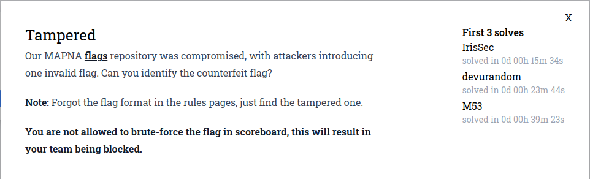
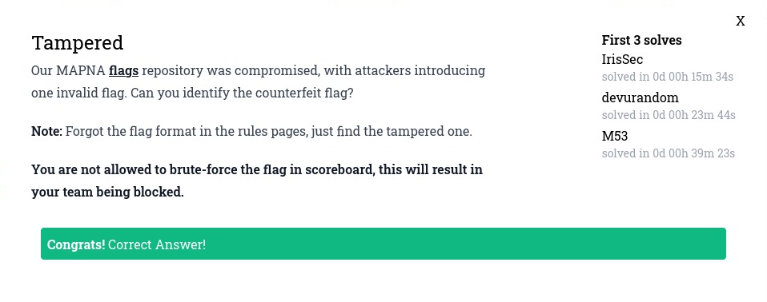

# Tampered


Parece que el repositorio de flags fue comprometido y los atacantes introdujeron una flag inválida. La idea es poder identificar que flag no era parte del archivo inicialmente. Durante el transcurso del evento agregaron una nota aclarando que este ejercicio no respeta el formato de flag descripto en las reglas.

## Resolución
Lo primero que hice fue abrir el archivo flags.txt para ver si a simple vista podía identificar la flag que no era parte pero es un archivo muy grande y hacer grep de palabras que podrían estar contenidas en una flag falsa (fake, flag, wrong, etc) no sirvió de mucho.

Ejecute el comando file para ver si quizas el archivo era algo más que texto plano y note algo extraño:

```bash
file flags.txt 
flags.txt: ASCII text, with CRLF, CR line terminators
```

El archivo esta separado por dos tipos distintos de line-endings: CR/LF (Windows) y CR (Macintosh). Esto podría significar que el atacante utilizó un sistema operativo diferente al usado para generar el archivo de flags y su salto de línea es diferente al los del resto del archivo.

Si usamos el comando cat -A sobre el archivo de texto el carriage return (CR) aparece representado como ^M, y el line feed (LF) aparece como $. Entonces podemos buscar la linea que esta usando CRLF de la siguiente forma: 

```bash
cat -A flags.txt | grep 'MAPNA{.*}\^M\$'
MAPNA{Tx,D51otN\eUf7qQ7>ToSYQ\;5P6jTIHH#6TL+uv}^M$
```

### Flag
MAPNA{Tx,D51otN\eUf7qQ7>ToSYQ\;5P6jTIHH#6TL+uv}



