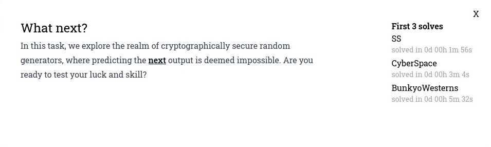
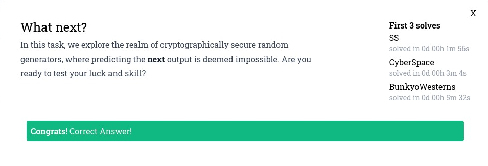

# What next?



Este reto nos da un script (what_next.py) que genera valores random y el output de la ejecución de este script (output.txt). La idea es poder obtener la flag que se utiliza para generar la variable enc resultante. 

## Resolución

Analizando el código del recurso what_next.py pareciera que el generador crea la variable enc realizando un XOR a nivel de bits (^ = bitwise XOR) entre la key y la flag convertida a long.

```python
#!/usr/bin/env python3

from random import *
from Crypto.Util.number import *
from flag import flag

def encrypt(msg, KEY):
	m = bytes_to_long(msg)
	c = KEY ^ m
	return c

n = 80
TMP = [getrandbits(256) * _ ** 2 for _ in range(n)]
KEY = sum([getrandbits(256 >> _) for _ in range(8)]) 

enc = encrypt(flag, KEY)

print(f'TMP = {TMP}')
print(f'KEY = {KEY}')
print(f'enc = {enc}')
```

Para resolver este ejercicio parece que no vamos a tener que usar los valores de TMP porque no influyen en la función de encrypt. 

Una de las propiedades de XOR a nivel de bits es que **si a ^ b = c entonces a ^ c = b**. Por lo tanto, **enc ^ KEY = bytes_to_long(msg)**. Después, lo único que nos quedaría es utilizar la función long_to_bytes (para convertir la flag nuevamente a bytes).

```python
long_to_bytes(KEY ^ enc)
```

### Flag
MAPNA{R_U_MT19937_PRNG_Predictor?}


