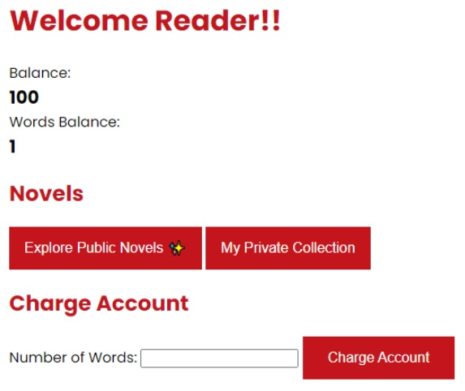
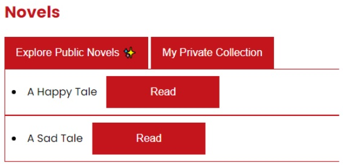
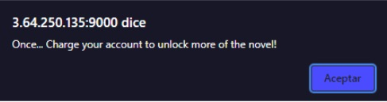
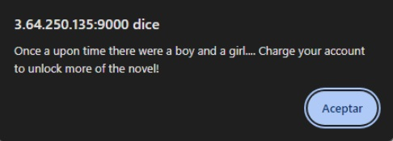
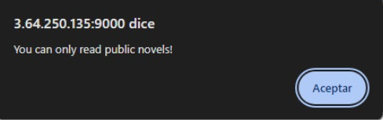
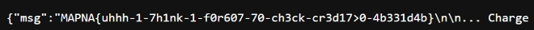

# Novel Reader 1
## URL
https://mapnactf.com/challenges 

## Writeup
Al ingresar a la página web: `http://3.64.250.135:9000/` vemos lo siguiente:
  

Es un sitio donde tenemos una determinada cantidad de dinero y palabras. Con el dinero podemos comprar palabras (10 de dinero equivale a 1 palabra, por lo tanto con el balance que tenemos podremos comprar 10, llegando así a 11 si contamos la palabra que ya teníamos desde un principio).
La cantidad de palabras con la que contamos equivale a las que vamos a poder leer de cada novela:  
  

Por ejemplo, al leer con 1 palabra en nuestro balance vemos lo siguiente:  
  

Mientras que al comprar 10 palabras más veremos:  
  
Necesitamos más palabras para poder leer el mensaje completo.  

Si queremos leer la novela privada no nos deja, indicando que solo podemos leer novelas públicas.  
  

El desafío nos provee un docker environment, donde podemos ver el código fuente de la aplicación web y su árbol de directorios.  

Gracias a esto podemos ver que para el endpoint de **leer una novela** vemos que existe la siguiente función, la cual solamente chequea que el path que le enviamos por parametro comience con `"public/"`  
  

Viendo la forma en la que hace la lectura en la **línea 48**, no hay ningún tipo de chequeo sobre **name**, por lo tanto podemos intentar enviar un path tal que nos permita movernos en los directorios de la aplicación para acceder a la novela deseada (partiendo desde `/public` para pasar el **if**). Hay caracteres que no se pueden utilizar directamente en las url y deben ser codificados, por lo que hay que buscar una forma de enviar nuestro path.  

Para esto usamos la técnica llamada **"double URL encoding"** o **"layering of URL encoding"**. La función unquote (**línea 45**) decodifica los caracteres especiales de la url recibida como parámetro, por ejemplo si recibe un `‘%20’` lo decodificará como un espacio. Por lo tanto la técnica de doble encoding consiste en evitar esta decodificación, codificando una vez más los caracteres, por ejemplo `‘%2e’` se codifica como punto (**.**), pero si lo codificamos nuevamente obtenemos `‘%252e’`.
Entonces, la función unquote, al decodificar `‘%252e’` obtendrá nuevamente `‘%2e’`, el cual es un caracter válido para una url. De esta forma podemos enviar un path válido para ser leído por la función readFile (**linea 48**) y acceder a la novela deseada.  

En este caso el path al que queremos acceder es:  
`/public/../../flag.txt`  
Codificando los puntos (.) quedaría:  
`/public/%2e%2e/%2e%2e/flag.txt`  
Y codificando nuevamente los puntos como explicamos, quedaría:  
`/public/%252e%252e/%252e%252e/flag.txt`  

Por lo tanto, haciendo un curl a la siguiente dirección, podemos movernos entre los directorios, hasta llegar al directorio raíz y leer el archivo que contiene la flag: `http://3.64.250.135:9000/api/read/public/%252e%252e/%252e%252e/flag.txt`  
  

## Flag
MAPNA{uhhh-1-7h1nk-1-f0r607-70-ch3ck-cr3d17>0-4b331d4b}
