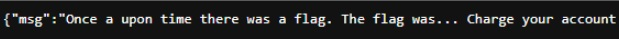
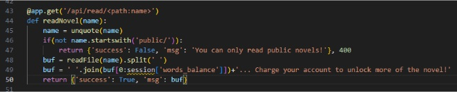
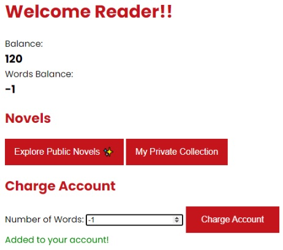
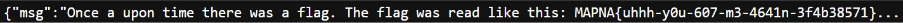

# Novel Reader 2
## URL
https://mapnactf.com/challenges 

## Writeup
La flag se encuentra al leer la novela privada a la cual no tenemos acceso.
De nuevo la idea acá es usar **"double URL encoding”** para acceder en este caso al directorio `/private`, partiendo desde el directorio `/public` para sortear el **if**, y moviéndonos con el uso del string `'%252e%252e'` y las barras (**/**).  
El problema es que aunque tengamos acceso a la novela las palabras que tenemos disponibles no son suficuientes para leer la flag:  
  

Vemos la función **readNovel** en el código fuente:  
  
En la **línea 49** vemos que hace un *join* de lo que se está leyendo en el archivo (**buf**) desde la posición 0 hasta la cantidad de palabras que dispongamos y luego lo concatena con el mensaje *“Charge your account…”*. Pero esto tiene una vulnerabilidad y es que si nosotros seteamos la variable **words_balance** en -1, el rango pasa a ser *“0:-1”*, el cual Python interpreta como “todos elementos desde el primero hasta el último”.  

Probando en la aplicación, notamos que podemos cargar palabras negativas ya que no hay un control sobre el valor que se envía:  
  

Ahora sí, de esta forma, podemos hacer un curl a la URL:  
http://3.64.250.135:9000/api/read/public/%252e%252e/private/A-Secret-Tale.txt
  
Y obtener la flag.

## Flag
MAPNA{uhhh-y0u-607-m3-4641n-3f4b38571}