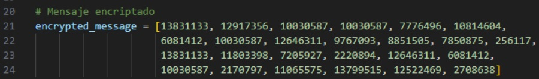
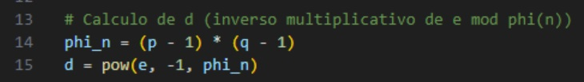
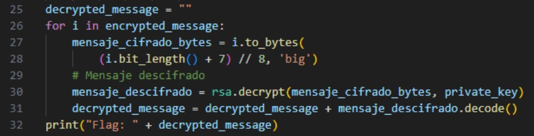

# Prime Decryption
## URL
https://ctf.shaastractf2024.online/challenges#Prime%20Decryption-33

## Requerimientos
El script requiere la librería sympy.  

La instalación de requerimientos se realiza con el siguiente comando:  
```
pip install -r requirements.txt
```

## Writeup
En este desafío se nos proporciona una **clave pública** la cual es: `14537813, 5`
y un **mensaje encriptado** en un archivo txt que tiene una lista de números, donde cada número representa una letra del mensaje.  
  
Por la información que se nos da podemos deducir que se trata del algoritmo de encriptación **RSA**. Para poder desencriptar este mensaje vamos a necesitar encontrar la **clave privada**.  

Para calcular la **clave privada** vamos a necesitar los siguientes datos:  
`n` = *14537813* (clave pública)  
`e` = *5* (exponente de la clave pública)  
`d` = (inverso multiplicativo de `e` *mod phi(*`n`*)*)  
`p` y `q` = números primos que componen a `n`  

Factorizamos `n` para obtener `p` y `q`  
  

Calculamos `d`  
  

Una vez obtenidos estos valores podemos obtener la **clave privada**, la cual utilizaremos para desencriptar el mensaje cifrado y obtener la flag.  
  
Mediante un **for** transformamos cada una de las letras cifradas del mensaje a bytes (ya que es el tipo de dato admitido por la librería) y, utilizando la **clave privada**, la desciframos para luego concatenarla en una variable hasta formar el mensaje desencriptado completo.  

## Flag
ShaastraCTF{RSA24Cracked}
