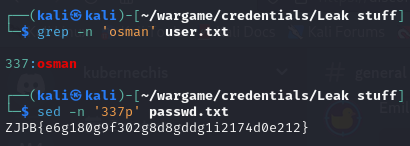
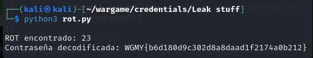
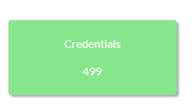

## Desafío

Credentials

We found a leak of a blackmarket website's login credentials. Can you find the password of the user osman and successfully decrypt it?

[Users txt](./user.txt)

[Passwords txt](./passwd.txt)

## Resolución
Primero identificamos qué contraseña pertenecía al usuario osman. Sabíamos que las líneas de ambos archivos (user.txt y passwd.txt) estaban alineadas, así que simplemente buscábamos la línea de osman en user.txt y obteníamos la contraseña correspondiente en passwd.txt.

Comandos utilizados:

```bash
grep -n 'osman' user.txt
```
Esto nos devolvió la línea en la que se encontraba osman en user.txt (línea 337). Usamos esa misma línea para obtener la contraseña correspondiente de passwd.txt:

```bash
sed -n '337p' passwd.txt
```

Al ejecutar ambos comandos obtuvimos que la contraseña era:
_ZJPB{e6g180g9f302g8d8gddg1i2174d0e212}_



Nos dimos cuenta de que la contraseña tenía un formato típico de flag (ZJPB{...}), pero parecía que las letras estaban rotadas. Por eso, pensamos que podía estar cifrada con un ROT. Entonces hicimos un script que probaba todas las rotaciones posibles (de ROT-0 a ROT-25) hasta que las primeras cuatro letras del resultado coincidían con WGMY.

Ejecutando el script _python3 rot.py_ obtuvimos _WGMY{b6d180d9c302d8a8daad1f2174a0b212}_



## Flag 
Flag: _WGMY{b6d180d9c302d8a8daad1f2174a0b212}_


