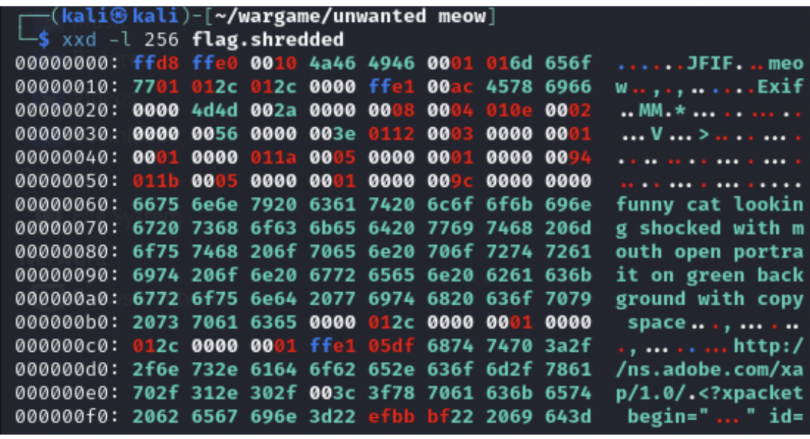
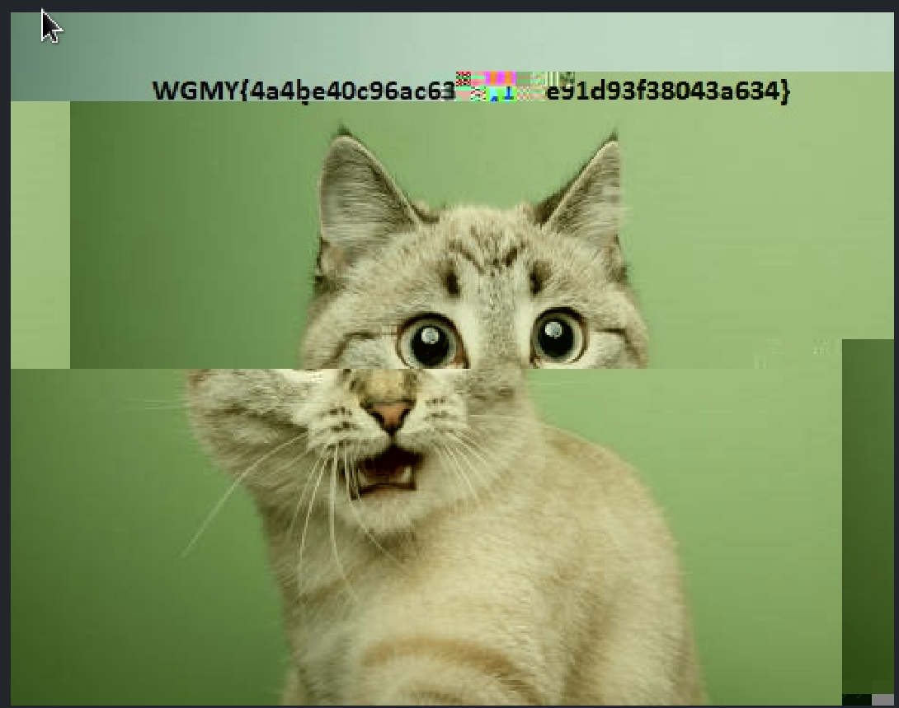
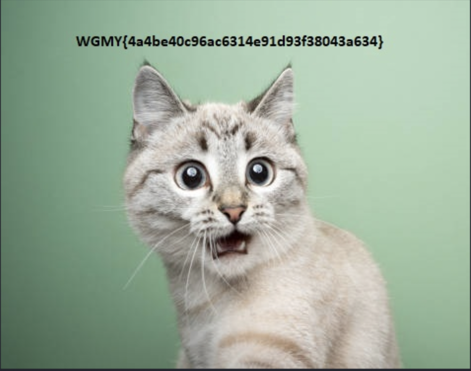
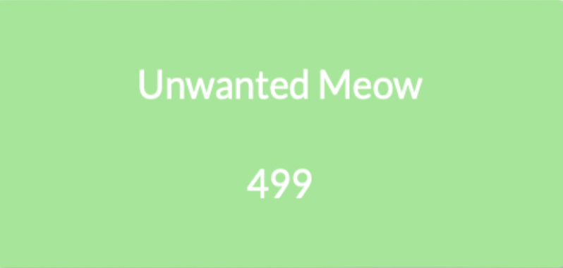

## Desafío

Unwanted Meow

Uh.. Oh.. Help me, I just browsing funny cats memes, when I click download cute cat picture, the file that been download seems little bit wierd. I accidently run the file making my files shredded. Ughh now I hate cat meowing at me.

[flag.shredded](./flag.shredded)

## Resolución

Al intentar abrir la imagen, nos dimos cuenta que la misma presenta una corrupción. Por lo tanto, decidimos ejecutar el siguiente comando para ver los primeros 256 bytes.

_xxd -l 256 flag.shredded_

## xxd.png

Al analizar el resultado, encontramos que en las dos primeras filas aparecía la palabra “meow”.

Corrimos el siguiente comando para ver si se repite en otras partes del archivo:

_xxd -g 1 flag.shredded | grep -A 5 -B 5 "meow"_

Nos dimos cuenta que hay varias ocurrencias de “meow” en el medio del archivo. Creamos el script _meow.py_ que elimina las ocurrencias de “meow” en el archivo, lo corrimos con el comando python3 _meow.py_.

Como resultado, logramos abrir la imagen, y aunque podíamos ver la mayor parte de la misma, la flag aún no era clara.

## meow.png

Volviendo a correr el siguiente comando:

_xxd -g 1 flag_modified.shredded | grep -A 5 -B 5 "meow"_

nos dimos cuenta que al borrar las ocurrencias de “meow”, se generaban algunas nuevas ocurrencias. En consecuencia, decidimos correr el script nuevamente y obtuvimos la imagen en donde la flag se ve de manera clara.

## meow2.png

## Flag

_WGMY{4a4be40c96ac6314e91d93f38043a634}_

## solved.png
