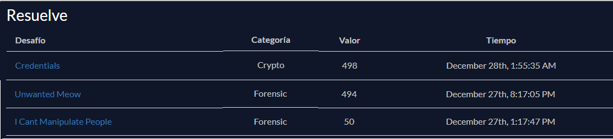

# Wargames.MY CTF - 2024
Los writeups de esta carpeta corresponden al evento Wargames.MY CTF 2024, desarrollado entre el 27/12/2024 y el 28/12/2024.

## Datos del evento
- CTFtime event URL: https://ctftime.org/event/2597
- Event URL: https://ctf2024.wargames.my/ 

## Datos del equipo
- Integrantes: Juan Ignacio Torres y María Emilia Romero
- Introducción a la Forensia Digital - Segundo Semestre 2024 (Universidad Nacional de La Plata - Facultad de Informática)
- IFD CTFd team: https://ctf.forensia.linti.unlp.edu.ar/teams/62   

---

Fueron resueltos 3 challenges, 2 de la categoría forensics y 1 de cripto:

| Challenge | Categoría |
| --- | :---:
| ✅ I Cant Manipulate People | forensia |
| ✅ Unwanted Meow | forensia |
| ✅ Credentials | cripto |

