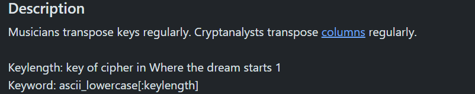
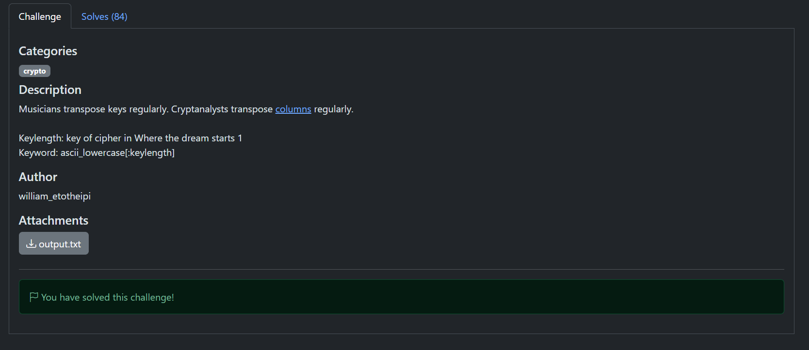

# Transpose — Write-up

- **CTF:** gaslightCTF 2026
- **Reto:** `Transpose`
- **Categoría:** Crypto
- **Puntos:** 427
- **Solves:** 84
- **Autor:** william_etotheipi
- **Adjunto:** `output.txt` (el ciphertext)
- **Relación con la materia:** A04 Cryptographic Failures — criptografía clásica (cifrado por transposición de columnas)
- **Flag:** `gaslightCTF{tr4nsp0s3-2-th3-k3y-0f-g-fl4t!}`

---

## Enunciado

> Musicians transpose keys regularly. Cryptanalysts transpose columns regularly.
>
> - **Keylength:** key of cipher in "Where the dream starts 1"
> - **Keyword:** `ascii_lowercase[:keylength]`



**Ciphertext** (`output.txt`):

```
T aiglhTtn0-t-yf-4}hfgsaitFrss2hk--fteel  sgC{4p3-330gl!o
```

---

## Análisis

La descripción apunta directo a una **transposición por columnas** ("transpose
columns"). Dos observaciones cierran el reto:

1. **El keyword es `ascii_lowercase[:keylength]`**, es decir `abc...` en orden
   alfabético. Como la clave ya está ordenada, la permutación de columnas es la
   **identidad**: no hay que adivinar ningún orden, es una transposición pura
   (reescribir la grilla leyéndola por el otro eje).

2. **El largo del ciphertext es 57 = 3 × 19**, así que la grilla es de 3 o 19
   columnas. Ambos factores son duales (leer una en un sentido equivale a leer
   la otra en el sentido contrario).

El acertijo del keylength ("key of cipher in Where the dream starts", con el
guiño musical de "Musicians transpose keys") resuelve a **3**, lo cual la propia
flag confirma: *transpose to the key of G-flat*. La tonalidad de **Sol bemol
mayor (G♭)** tiene **3 bemoles** en su armadura → keylength = 3.

---

## Solución

Se reconstruye la grilla: el ciphertext se llenó por columnas y se lee por filas,
con 3 columnas × 19 filas.

```python
ct = 'T aiglhTtn0-t-yf-4}hfgsaitFrss2hk--fteel  sgC{4p3-330gl!o'
n = len(ct)          # 57
cols = 3
rows = n // cols     # 19

# El ciphertext se llenó por columnas; se lee por filas
grid = [[''] * cols for _ in range(rows)]
idx = 0
for c in range(cols):
    for r in range(rows):
        grid[r][c] = ct[idx]
        idx += 1

plaintext = ''.join(''.join(row) for row in grid)
print(plaintext)
```

Salida:

```
The flag is gaslightCTF{tr4nsp0s3-2-th3-k3y-0f-g-fl4t!}eo
```

(El `eo` final es padding sobrante de la grilla; la flag termina en `}`.)



---

## Flag

```
gaslightCTF{tr4nsp0s3-2-th3-k3y-0f-g-fl4t!}
```

---

## Lección

- Un keyword en **orden alfabético** en una transposición columnar equivale a la
  permutación identidad → el cifrado se reduce a reescribir la grilla, sin
  fuerza bruta sobre el orden de columnas.
- El **largo del texto** factoriza directamente el número de columnas posibles.
- Toda la dificultad estaba en el acertijo temático (música ↔ criptografía):
  "transponer a la tonalidad de G♭" = 3 bemoles = keylength 3.
