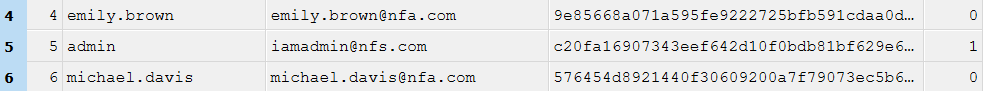
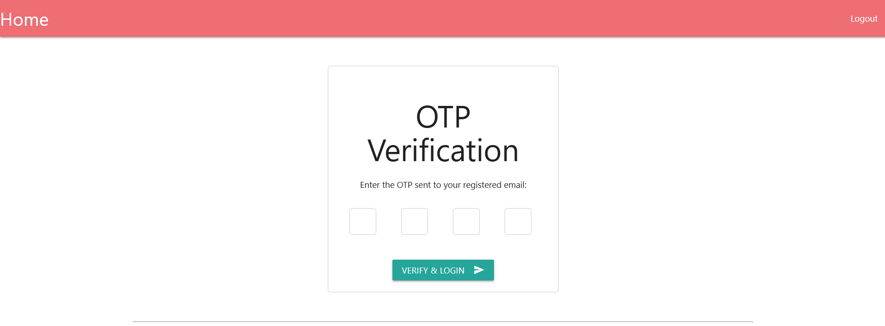
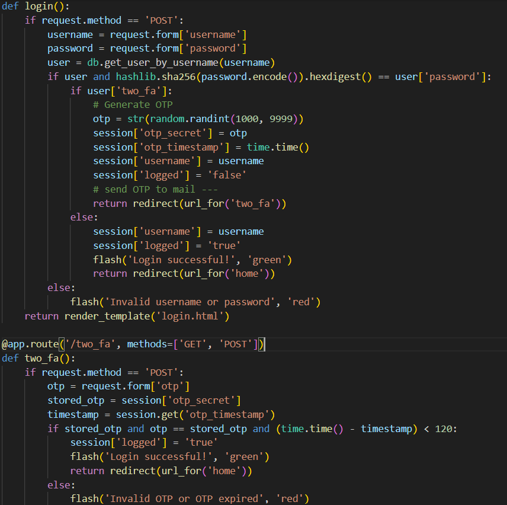
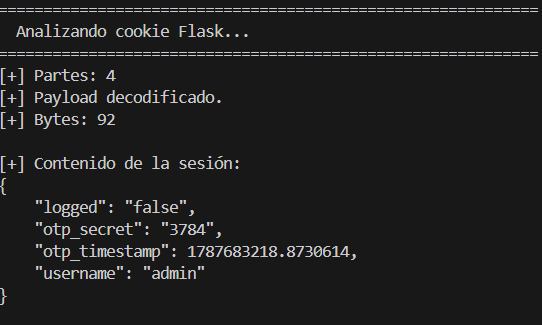
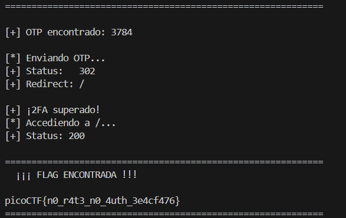

# No FA - Writeup

## 1. Información del desafío

- **CTF:** picoCTF 2026
- **Challenge:** No FA
- **Categoría:** Web Exploitation
- **Dificultad:** Medium
- **Autor:** Darkraicg492

El objetivo del desafío es obtener acceso al usuario `admin` de una aplicación web y recuperar la flag.

El desafío proporciona el código fuente de la aplicación (`app.py`) y una base de datos (`users.db`) con información de los usuarios.

---

## 2. Reconocimiento

Al acceder a la aplicación se presenta una pantalla de inicio de sesión que solicita:

- Usuario
- Contraseña

El objetivo inicial es obtener credenciales válidas para acceder a la aplicación.

Además de la instancia web, el desafío proporciona el código fuente y una base de datos, por lo que se comienza analizando estos archivos para identificar posibles vulnerabilidades.

---

## 3. Análisis de la base de datos

El archivo `users.db` contiene información de los usuarios registrados.

Entre los registros se encuentra el usuario `admin`:

    admin
    iamadmin@nfs.com
    c20fa16907343eef642d10f0bdb81bf629e6aaf6c906f26eabda079ca9e5ab67
    1

El tercer campo corresponde al hash de la contraseña:

    c20fa16907343eef642d10f0bdb81bf629e6aaf6c906f26eabda079ca9e5ab67

El último campo indica que el usuario tiene habilitado el segundo factor de autenticación.

Por lo tanto, para acceder como `admin` es necesario obtener primero su contraseña y posteriormente superar el mecanismo 2FA.

---

## 4. Análisis del almacenamiento de contraseñas

Al revisar el código fuente de `app.py`, se encuentra la siguiente comparación durante el proceso de login:

    if user and hashlib.sha256(password.encode()).hexdigest() == user['password']:

Esto permite determinar que las contraseñas son procesadas mediante SHA-256.

No se utiliza un salt individual para cada contraseña ni un algoritmo diseñado específicamente para el almacenamiento seguro de contraseñas.

Esto hace posible realizar un ataque de diccionario contra los hashes obtenidos de la base de datos.

---

## 5. Obtención de la contraseña de `admin`

Para recuperar la contraseña se utilizó la lista de contraseñas `rockyou.txt`.

Se desarrolló un pequeño script en Python que recorre la lista, calcula el SHA-256 de cada contraseña y compara el resultado con el hash del usuario `admin`.

El procedimiento utilizado fue:

    import hashlib

    HASH = "c20fa16907343eef642d10f0bdb81bf629e6aaf6c906f26eabda079ca9e5ab67"

    with open("rockyou.txt", "r", encoding="latin-1") as f:
        for i, line in enumerate(f, 1):
            password = line.rstrip("\r\n")
            digest = hashlib.sha256(password.encode()).hexdigest()

            if digest == HASH:
                print(f"[+] MATCH en la línea {i}: {password}")
                break

El script encontró una coincidencia:

    apple@123

Por lo tanto, se obtuvieron las siguientes credenciales:

    Usuario: admin
    Contraseña: apple@123

---

## 6. Análisis del mecanismo de autenticación

Con las credenciales obtenidas se realizó un login en la aplicación.

El login es exitoso, pero no se obtiene acceso directamente a la página principal. La aplicación redirige al endpoint:

    /two_fa

Esto ocurre porque el usuario `admin` tiene activado el segundo factor.

El código encargado de generar el OTP es:

    otp = str(random.randint(1000, 9999))
    session['otp_secret'] = otp
    session['otp_timestamp'] = time.time()
    session['username'] = username
    session['logged'] = 'false'

El servidor genera un código numérico de cuatro dígitos y lo almacena dentro de la sesión.

La aplicación posteriormente solicita ese código mediante el formulario de `/two_fa`.

---

## 7. Análisis de la validación del OTP

El endpoint `/two_fa` valida el código recibido mediante:

    otp = request.form['otp']
    stored_otp = session['otp_secret']
    timestamp = session.get('otp_timestamp')

    if stored_otp and otp == stored_otp and (time.time() - timestamp) < 120:
        session['logged'] = 'true'
        flash('Login successful!', 'green')
        return redirect(url_for('home'))

De este código se desprenden dos características importantes.

### Espacio de búsqueda reducido

El OTP solamente tiene cuatro dígitos:

    1000 - 9999

Por lo tanto, existen solamente 9000 valores posibles.

### Ausencia de protección contra intentos

El endpoint `/two_fa` no implementa un contador de intentos ni un mecanismo de bloqueo después de múltiples intentos incorrectos.

Por lo tanto, el mecanismo sería susceptible a un ataque de fuerza bruta.

Sin embargo, se puede realizar un análisis adicional de la sesión para encontrar una forma más directa de obtener el código.

---

## 8. Análisis de la sesión Flask

La aplicación utiliza sesiones de Flask:

    app.secret_key = os.getenv('SECRET_KEY')

Durante el login, la aplicación almacena en la sesión:

    session['otp_secret'] = otp
    session['otp_timestamp'] = time.time()
    session['username'] = username
    session['logged'] = 'false'

Esto resulta especialmente relevante porque el OTP generado por el servidor se almacena directamente como parte de la información de sesión.

Después de realizar el login, el servidor devuelve una cookie llamada:

    session

La cookie utiliza el formato de las sesiones de Flask y contiene los datos de la sesión serializados y firmados.

Al analizar la cookie obtenida después del login como admin, fue posible decodificar su contenido y observar los datos almacenados en la sesión. 
Si bien la cookie se encuentra firmada para evitar modificaciones no autorizadas, la aplicación almacena información sensible dentro de ella, incluyendo el OTP.

---

## 9. Obtención del OTP desde la sesión

Después de decodificar la cookie de sesión obtenida tras iniciar sesión como `admin`, se encontró la siguiente información:

    {
        "logged": "false",
        "otp_secret": "3784",
        "otp_timestamp": 1787674986.1874032,
        "username": "admin"
    }

El dato relevante es:

    otp_secret: 3784

Por lo tanto, el código OTP correspondiente a esa sesión era:

    3784

Esto permite evitar la fuerza bruta de los posibles códigos.

---

## 10. Validación del OTP

Se envió el código obtenido al endpoint:

    /two_fa

utilizando la misma sesión creada durante el login.

El valor enviado fue:

    3784

La aplicación respondió con una redirección:

    302 -> /

Esto indica que la validación fue exitosa.

El código de la aplicación establece entonces:

    session['logged'] = 'true'

y permite continuar hacia la página principal.

---

## 11. Acceso como administrador

Una vez superado el segundo factor, la sesión contiene:

    username = admin
    logged = true

Al acceder a `/`, la aplicación comprueba el usuario:

    if session.get('username') == 'admin':
        flag = os.getenv('FLAG')

Debido a que la sesión corresponde al usuario `admin`, la aplicación muestra el valor de la variable de entorno que contiene la flag.

---

## 12. Flag obtenida

La flag obtenida fue:

    picoCTF{n0_r4t3_n0_4uth_3e4cf476}

---

## 13. Vulnerabilidades identificadas

Durante el análisis se identificaron varias vulnerabilidades en el sistema.

### 13.1. Almacenamiento inseguro de contraseñas

Las contraseñas son comparadas utilizando SHA-256 directamente:

    hashlib.sha256(password.encode()).hexdigest()

No se utiliza un salt individual ni un algoritmo de derivación de contraseñas.

Esto permite realizar ataques de diccionario de forma eficiente.

Una implementación adecuada debería utilizar mecanismos como Argon2, bcrypt o scrypt.

---

### 13.2. OTP con pocos valores posibles

El OTP se genera mediante:

    random.randint(1000, 9999)

Esto genera únicamente 9000 valores posibles.

El espacio de búsqueda es reducido para un mecanismo de autenticación de segundo factor.

---

### 13.3. Ausencia de protección contra fuerza bruta

El endpoint `/two_fa` no implementa:

- Límite de intentos.
- Bloqueo temporal.
- Rate limiting.
- Incremento progresivo del tiempo de espera.

Por lo tanto, un atacante podría realizar múltiples intentos durante el período de validez del OTP.

---

### 13.4. Exposición del OTP en la sesión

La vulnerabilidad principal utilizada para completar el desafío es que el OTP se almacena directamente en la sesión:

    session['otp_secret'] = otp

Esto provoca que el secreto utilizado como segundo factor forme parte de los datos asociados a la sesión del cliente.

En consecuencia, el mecanismo 2FA pierde su propósito: el código que debería ser enviado exclusivamente al usuario termina estando disponible dentro de la información de sesión.

---

## 14. Automatización

La resolución se automatizó mediante un script de Python.

El script realiza las siguientes acciones:

1. Inicia sesión utilizando las credenciales obtenidas.
2. Obtiene la cookie de sesión.
3. Decodifica la información contenida en la sesión.
4. Extrae el valor de `otp_secret`.
5. Envía el OTP al endpoint `/two_fa`.
6. Accede a la página principal.
7. Recupera la flag.

El script utilizado se encuentra en:

    solve.py

---

## 15. Resumen de la resolución

El procedimiento completo fue:

    users.db
        │
        ▼
    Obtener hash de admin
        │
        ▼
    Analizar app.py
        │
        ▼
    Detectar SHA-256 sin salt
        │
        ▼
    Ataque de diccionario
    con rockyou.txt
        │
        ▼
    Contraseña encontrada
    apple@123
        │
        ▼
    Login como admin
        │
        ▼
    Redirección a /two_fa
        │
        ▼
    Analizar cookie de sesión
        │
        ▼
    Extraer otp_secret
    3784
        │
        ▼
    Enviar OTP correcto
        │
        ▼
    Autenticación exitosa
        │
        ▼
    Acceder a /
        │
        ▼
    FLAG

---

## 16. Conclusión

El desafío pudo resolverse mediante el análisis conjunto del código fuente, la base de datos filtrada y el comportamiento de la aplicación.

El primer acceso se consiguió recuperando la contraseña de `admin` mediante un ataque de diccionario contra un hash SHA-256 sin salt.

Posteriormente, el análisis del mecanismo 2FA permitió identificar que el OTP era almacenado directamente dentro de la sesión Flask. Al inspeccionar la sesión correspondiente al usuario `admin`, fue posible obtener el OTP y completar la autenticación sin necesidad de conocer el código enviado al usuario.

La combinación de estas vulnerabilidades permitió obtener acceso administrativo y recuperar la flag:

    picoCTF{n0_r4t3_n0_4uth_3e4cf476}