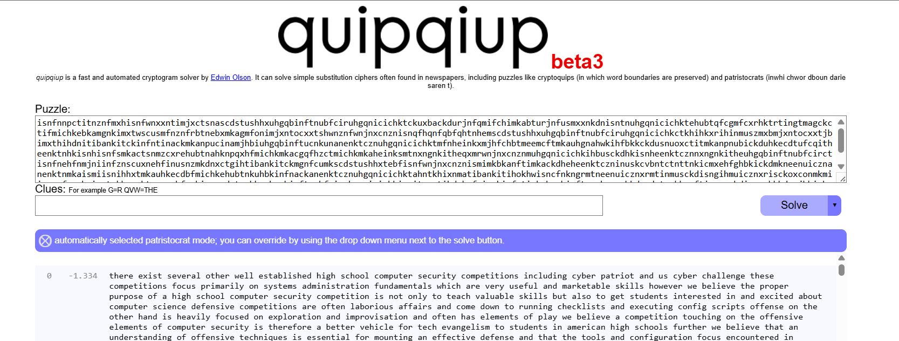

# substitution2 - Writeup

## 1. Información del desafío
- **CTF:** picoCTF 2022
- **Challenge:** substitution2
- **Categoría:** Cryptography
- **Dificultad:** Medium
- **Autor:** Will Hong

El objetivo del desafío es descifrar un mensaje interceptado que fue procesado mediante un cifrado de sustitución monoalfabética.

A diferencia de otros retos similares que vimos en la practica, el texto original fue cifrado eliminando previamente todos los espacios y signos de puntuación.

El desafío proporciona un único archivo de texto: `message.txt`.

---

## 2. Reconocimiento
Al abrir `message.txt`, encontramos una única cadena continua de caracteres que termina con lo que parece ser una flag:

    isnfnnpctitnznfmxhisnfwnxxntimjxctsnascdstushhxuhgqbinftnubfciruhgqnicichk...cuhUIE{K6F4G_4K41R515_15_73A10B5_702E03EU}

Esto confirma que se trata de un cifrado por sustitución monoalfabética:
1. Cada letra original siempre se reemplaza por la misma letra cifrada.
2. Se quitaron los espacios y signos de puntuación.
3. Como el mensaje está en inglés, la estructura estadística del idioma se mantiene, lo que nos permite descifrarlo analizando frecuencias y patrones.

---

## 3. Estrategia de resolución
El proceso de resolución se dividió en tres pasos:

### Paso 1: Deducción del prefijo de la flag (Known Plaintext Attack)
Analizando el final del mensaje cifrado:

    ...cuhUIE{K6F4G_4K41R515_15_73A10B5_702E03EU}

Sabemos que en picoCTF las flags siempre empiezan con `picoCTF{`. De ahí obtenemos directamente las primeras equivalencias:
- `c` → `p`
- `u` → `i`
- `h` → `c`
- `U` → `C`
- `I` → `T`
- `E` → `F`

### Paso 2: Criptoanálisis automático con quipqiup
Con estas primeras letras confirmadas, ingresamos el mensaje completo en la herramienta **quipqiup** usando el modo *Patristocrat* (especial para textos sin espacios).

La herramienta utiliza algoritmos de optimización basados en secuencias de 4 letras comunes en inglés (quadgrams). En pocos segundos descifró casi todo el texto:



Sin embargo, la herramienta no pudo descifrar correctamente la parte interna de la flag porque contiene leetspeak (números y letras mezcladas), lo que rompe las reglas del inglés normal.

### Paso 3: Ajuste manual del Leetspeak
Al revisar la flag obtenida por quipqiup, notamos errores en algunas palabras:

    picoCTF{N6R4M_4N41R515_15_73A10B5_702E03EU}  <-- Incompleta / con errores

Analizamos el texto manualmente para deducir las palabras originales en inglés mezcladas con leetspeak:
- `4N41R515` corresponde a **ANALYSIS** (`4N41Y515`), por lo que `r` debía cambiarse por `y`.
- `73A10B5` corresponde a **TEDIOUS** (`73D10U5`), corrigiendo `A`→`D` y `B`→`U`.
- `702E03EU` en la parte final corresponde a **TEDIOUS/C** (`702F03FC`).
- `N6R4M` corresponde a **N-GRAM** (`N6R4M`).

---

## 4. Tabla de sustitución final

La clave de sustitución obtenida es la siguiente:

| Cifrado | Plano | Cifrado | Plano |
| :---: | :---: | :---: | :---: |
| `a` | `d` | `n` | `e` |
| `b` | `u` | `o` | `k` |
| `c` | `i` | `p` | `x` |
| `d` | `g` | `q` | `p` |
| `e` | `f` | `r` | `y` |
| `f` | `r` | `s` | `h` |
| `g` | `m` | `t` | `s` |
| `h` | `o` | `u` | `c` |
| `i` | `t` | `v` | `q` |
| `j` | `b` | `w` | `w` |
| `k` | `n` | `x` | `l` |
| `l` | `z` | `y` | `j` |
| `m` | `a` | `z` | `v` |

---

## 5. Obtención de la flag

Aplicando la tabla de sustitución corregida al texto cifrado final:

    Texto Cifrado: cuhUIE{K6F4G_4K41R515_15_73A10B5_702E03EU}

Obtenemos la flag definitiva:

    picoCTF{N6R4M_4N41Y515_15_73D10U5_702F03FC}

---

## 6. Automatización
Se creó el script `solve.py` en Python para descifrar el mensaje localmente. 

El script lee `message.txt`, aplica la tabla de sustitución (tanto para minúsculas como para mayúsculas) y muestra en pantalla el texto descifrado junto con la flag.

El archivo se encuentra disponible en:

    solve.py

---

## 7. Vulnerabilidades identificadas

### 7.1. Cifrado por sustitución monoalfabética
Usar una clave de sustitución fija permite que la frecuencia de las letras del idioma original se mantenga en el texto cifrado, permitiendo romperlo mediante análisis estadístico.

### 7.2. Ineficacia de eliminar espacios (Seguridad por oscuridad)
Quitar los espacios hace que el texto sea más difícil de leer a simple vista, pero no añade seguridad real. Las herramientas basadas en n-gramas pueden reconstruir el mensaje de forma casi inmediata.

---

## 8. Resumen de la resolución

```
             message.txt
                  │
                  ▼
   Identificación del prefijo de flag
      cuhUIE{...} ➔ picoCTF{...}
                  │
                  ▼
   Criptoanálisis automático
     (quipqiup / Quadgrams)
                  │
                  ▼
  Ajuste manual del leetspeak en la flag
   (Corrección de caracteres incoherentes)
                  │
                  ▼
      Ejecución de solve.py
                  │
                  ▼
picoCTF{N6R4M_4N41Y515_15_73D10U5_702F03FC}
```

---

## 9. Conclusión
El desafío se resolvió combinando el reconocimiento de patrones conocidos (`picoCTF{`), el uso de herramientas automáticas de criptoanálisis (`quipqiup`) y la corrección manual del leetspeak en la flag. Esto demuestra que la automatización ayuda a procesar rápidamente el texto principal, pero se requiere análisis humano para resolver partes específicas donde no aplican las reglas del idioma natural.