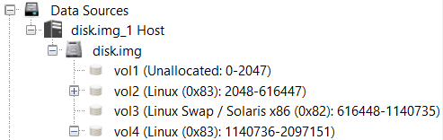
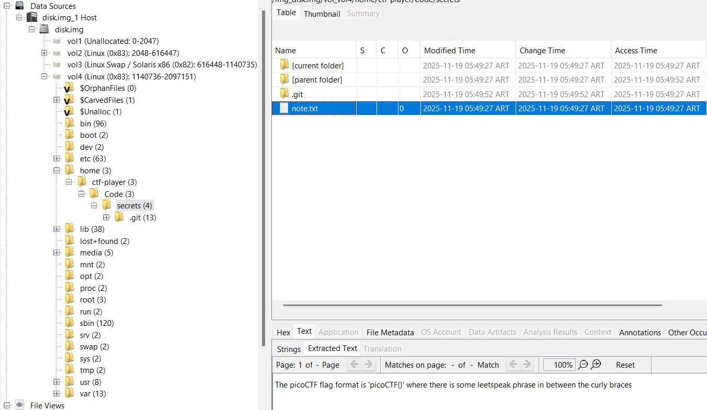
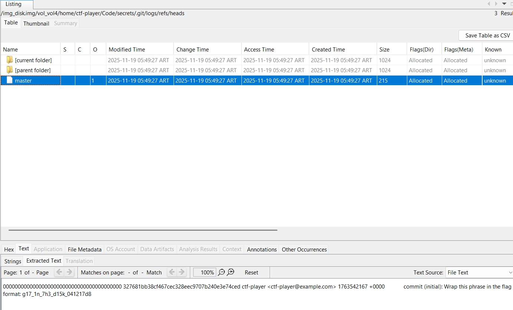
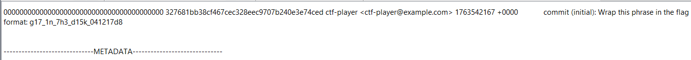

# Enhancing Disk Image Analysis - Writeup

## 1. Información del desafío
- **CTF:** picoCTF 2026
- **Challenge:** Enhancing Disk Image Analysis (o equivalente de imagen de disco)
- **Categoría:** Forensics
- **Dificultad:** Medium
- **Autor:** Will Hong / picoCTF

El objetivo del desafío es analizar una imagen de disco proporcionada (`disk.img`), explorar su sistema de archivos y recuperar la flag oculta.

El desafío proporciona únicamente un archivo comprimido que al extraerse entrega la imagen de disco `disk.img`.

---

## 2. Reconocimiento
Se comenzó inspeccionando el archivo de imagen de disco `disk.img` mediante la herramienta de análisis forense **Autopsy**.

Al cargar el origen de datos en Autopsy, se identificaron cuatro volúmenes principales dentro de la tabla de particiones del disco:

- `vol1`: Espacio no asignado (Unallocated).
- `vol2`: Partición primaria Linux (`0x83`).
- `vol3`: Partición Linux Swap (`0x82`).
- `vol4`: Segunda partición de datos Linux (`0x83`).



Se procedió a explorar el sistema de archivos presente en la partición de datos `vol4`, navegando a través del directorio de usuario principal:

    /home/ctf-player/Code/secrets

---

## 3. Análisis de artefactos
Dentro de la carpeta `secrets`, se encontraron los siguientes archivos y directorios:

- `note.txt`: Archivo de texto plano.
- `.git/`: Directorio oculto de control de versiones de Git.

Al abrir `note.txt`, el archivo únicamente contenía un texto informativo sobre el formato general de las flags de picoCTF:

    The picoCTF flag format is 'picoCTF{}' where there is some leetspeak phrase in between the curly braces

La presencia del directorio oculto `.git` indicó que la carpeta `secrets` correspondía a un repositorio de Git local. En escenarios forenses, esto indica la posibilidad de que información sensible o flags hayan sido registradas en commits anteriores del historial.



---

## 4. Inspección del historial de Git
Para revisar el historial de cambios sin necesidad de extraer la imagen completa, se navegó directamente la estructura del directorio `.git` a través de Autopsy:

    /home/ctf-player/Code/secrets/.git/logs/refs/heads/master

Al inspeccionar el contenido del log de la rama `master`, se obtuvo el registro del commit inicial (*initial commit*):

    0000000000000000000000000000000000000000 327681bb38cf467cec328eec9707b240e3e74ced ctf-player <ctf-player@example.com> 1763542167 +0000 commit (initial): Wrap this phrase in the flag format: g17_1n_7h3_d15k_041217d8

El mensaje guardado en el commit reveló la frase clave antes de que el archivo `note.txt` fuera modificado o sobrescrito.



---

## 5. Obtención de la flag
El mensaje del commit instruía explícitamente formatear la frase obtenida dentro de la estructura estándar del CTF:

    Frase en claro: g17_1n_7h3_d15k_041217d8

Insertando la cadena dentro del formato `picoCTF{...}`, se obtuvo la flag definitiva:

    picoCTF{g17_1n_7h3_d15k_041217d8}



---

## 6. Vulnerabilidades y malas prácticas identificadas

### 6.1. Persistencia de datos sensibles en el historial de Git
El desarrollador eliminó o modificó la flag en el archivo de trabajo principal, pero no limpió el historial de commits del repositorio `.git`. Los metadatos de Git preservan todos los estados anteriores de los archivos.

### 6.2. Almacenamiento no cifrado en disco
El sistema de archivos de la imagen de disco no contaba con cifrado de volumen (como LUKS). Esto permitió que cualquier analista forense con acceso a la imagen pudiera inspeccionar los archivos del usuario y las estructuras del sistema sin restricciones.

---

## 7. Resumen de la resolución

```
               disk.img
                  │
                  ▼
        Análisis con Autopsy
                  │
                  ▼
     Navegación en el volumen 4
  /home/ctf-player/Code/secrets
                  │
                  ▼
 Detección del repositorio oculto
               .git/
                  │
                  ▼
      Lectura de logs de Git
 (.git/logs/refs/heads/master)
                  │
                  ▼
   Extracción del mensaje de commit
    g17_1n_7h3_d15k_041217d8
                  │
                  ▼
picoCTF{g17_1n_7h3_d15k_041217d8}
```

---

## 8. Conclusión
El desafío se resolvió aplicando técnicas estándar de análisis forense digital sobre imágenes de disco. La identificación de artefactos del sistema de archivos permitió localizar un repositorio Git expuesto. El análisis de los metadatos y registros de commits del repositorio reveló la presencia de información sensible que había sido eliminada del entorno de trabajo visible, permitiendo la reconstrucción exitosa de la flag.