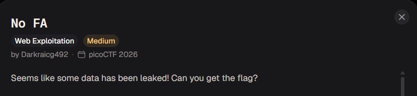
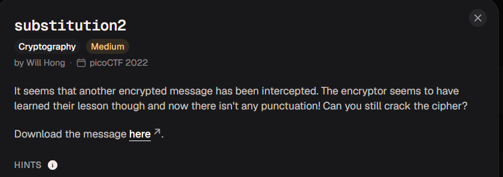
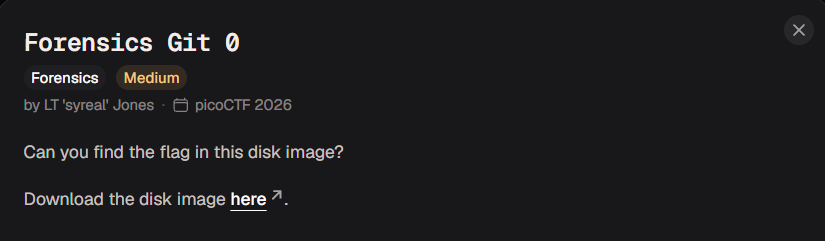

# Trabajo Final - Desarrollo Seguro de Aplicaciones (2026)
**Universidad Nacional de La Plata (UNLP)**  
**Facultad de Informática**

Este repositorio contiene la resolución de los retos de Capture The Flag (CTF) internacionales seleccionados para la entrega final de la materia.

> **Nota sobre la plataforma empleada:** Todos los desafíos presentados pertenecen al ecosistema de **picoCTF** (Carnegie Mellon University), actualmente integrado en [CyLab Academy](https://learn.cylabacademy.org/).

---

## Resumen de Retos Resueltos

| Reto | CTF | Categoría | Dificultad | Tipo de Requisito |
| :--- | :--- | :--- | :--- | :--- |
| **No FA** | picoCTF 2026 | Web Exploitation | Medium | Relacionado con la materia |
| **substitution2** | picoCTF 2022 | Cryptography | Medium | Relacionado con la materia |
| **Enhancing Disk Image Analysis** | picoCTF 2026 | Forensics | Medium | Adicional (Categoría libre) |

---

## 📑 Detalle de Desafíos

### 1: No FA


- **Categoría:** Web Exploitation
- **Técnicas / Vulnerabilidades:**
  - Crackeo de hashes SHA-256 sin salt mediante ataque de diccionario (`rockyou.txt`).
  - Bypass de 2FA por exposición de `otp_secret` dentro de la cookie de sesión de Flask.

---

### 2: substitution2


- **Categoría:** Cryptography
- **Técnicas / Vulnerabilidades:**
  - Cifrado por sustitución monoalfabética sin delimitadores (*Patristocrat*).
  - Known Plaintext Attack parcial identificando la firma `picoCTF{`.

---

### 3: Enhancing Disk Image Analysis


- **Categoría:** Forensics
- **Técnicas / Vulnerabilidades:**
  - Análisis de imágenes de disco (`disk.img`) con la herramienta forense Autopsy.
  - Inspección del árbol de directorios en particiones Linux (`vol4`).
  - Identificación de repositorio oculto `.git` y extracción de información sensible persistida en los logs de commits (`/logs/refs/heads/master`).

---
```