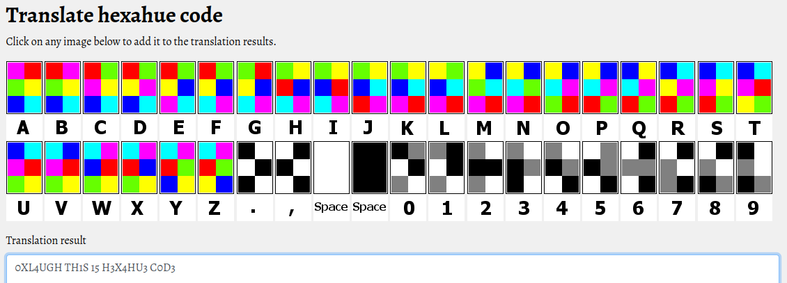

# Colorful

### This is really colorful but what does that mean ?

### Flag Format: 0xL4ugh{word1_word2}

### Author: xElessaway

### [Colorful.zip](../attachments/Colorful.zip)
---

El zip contiene el siguiente .png:

Es un "código" hexahue, decodificamos usando: https://www.boxentriq.com/code-breaking/hexahue

Flag: 0xL4ugh{TH1S_15_H3X4HU3_C0D3}