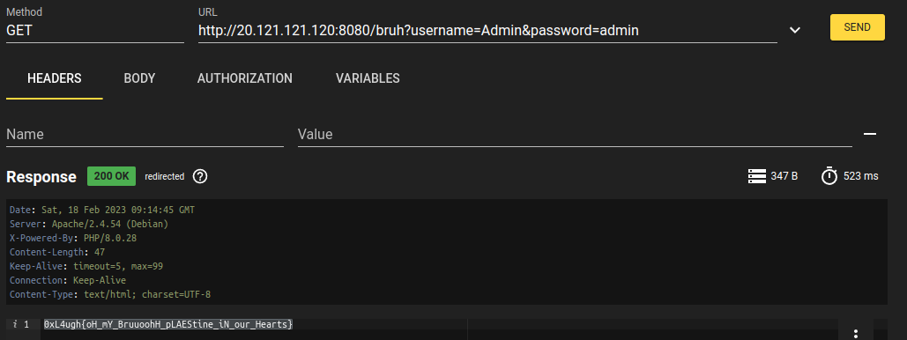

# Bruh (Basic)

### he is my brother , can he go instead of me ?

### http://20.121.121.120:8080/bruh

### Author : abdoghazy

### [index.php](../attachments/index.php)
---

Analicemos index.php:

```php
<?php

$servername = "127.0.0.1";
$username = "ctf";
$dbname = "login";
$password = "ctf123";

// Create connection
$conn = new mysqli($servername, $username, $password,$dbname);

// Check connection
if ($conn->connect_error) {
    die("Connection failed: " . $conn->connect_error);
}

if(!empty($_GET['username']) && !empty($_GET['password']))
{
    $username=mysqli_real_escape_string($conn,$_GET['username']);
    $password=mysqli_real_escape_string($conn,$_GET['password']);
    if ($username=="admin" && $_SERVER['REMOTE_ADDR']!=="127.0.0.1")
    {
        die("Admins login are allowed locally only");
    }
    else
    {
        $res=$conn->query("select * from users where username='$username' and password='$password'"); # admin admin
        if($res->num_rows > 0)
        {
            $user=$res->fetch_assoc();
            echo ($user['username']==="admin")?"0xL4ugh{test_flag}":"sorry u r not admin";
        }
        else
        {
            echo "Error : Wrong Creds";
        }
    }
}
else
{
    echo "Please Fill All Fields";
}
?>
```
Se puede ver que hay que enviar vía GET username y password, y que los valores de estas son admin, pero si vamos a http://20.121.121.120:8080/bruh?username=admin&password=admin vamos a obtener el mensaje: `Admins login are allowed locally only`. 

Hay que conseguir que `$username=="admin"` sea falso pero que `$username` valga admin para que la consulta en la bse de datos funcione, sabemos que php es case sensitive `"admin" == "Admin"` es falso, pero no sabemos nada de la base de datos... probemos con http://20.121.121.120:8080/bruh?username=Admin&password=admin 



Flag: 0xL4ugh{oH_mY_BruuoohH_pLAEStine_iN_our_Hearts}

Vulnerabilidad y fix: Por lo que entiendo, solo se querria permitir hacer login a un admin, desde la red local, por lo tanto el error está en el orden de los chequeos, este fragmento: 
```php
if ($user['username']==="admin" && $_SERVER['REMOTE_ADDR']!=="127.0.0.1")
{
    die("Admins login are allowed locally only");
}
```
Deberia estar después de que se autenticó al usuario.