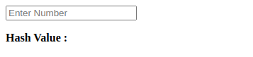
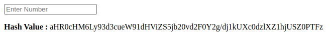
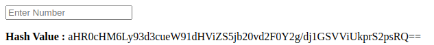
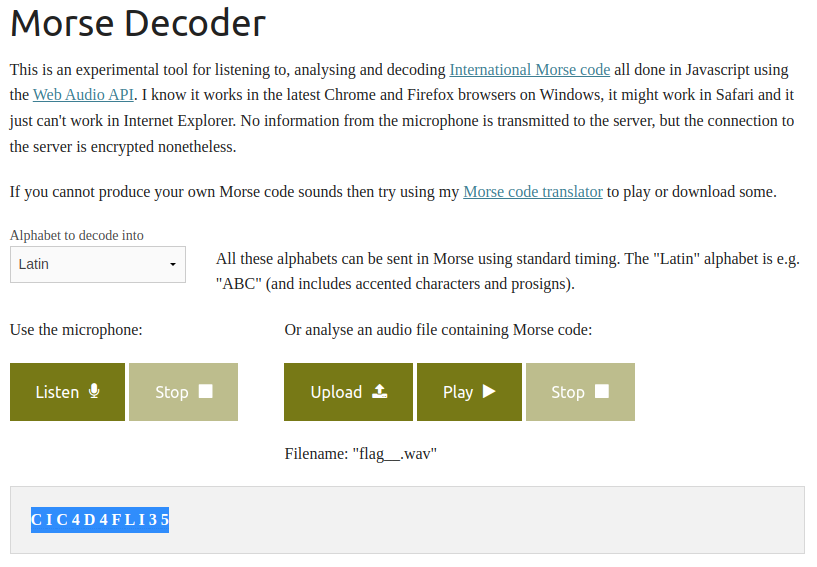

## Meaning of Life

Senpai, what is the meaning of life ?

misc.bbctf.fluxus.co.in:2002

Abrimos la página:



Vemos el código fuente:
```html
<!DOCTYPE html>
<html lang="en">
<head>
    <meta charset="UTF-8">
    <meta http-equiv="X-UA-Compatible" content="IE=edge">
    <meta name="viewport" content="width=device-width, initial-scale=1.0">
    <title>Document</title>
</head>
<body>
    <form action="/" method="POST">
        <input type="number" name="key_num" placeholder="Enter Number"/>
    </form>

    <p><b>Hash Value : </b>  </p>

</body>
</html>
```
Al parecer hay que ingresar un número y enter, probemos con 1:



Obtenmos el hash: aHR0cHM6Ly93d3cueW91dHViZS5jb20vd2F0Y2g/dj1kUXc0dzlXZ1hjUSZ0PTFz.

Probamos con [cybercheff](https://gchq.github.io/CyberChef/#recipe=From_Base64('A-Za-z0-9%2B/%3D',true,false)&input=YUhSMGNITTZMeTkzZDNjdWVXOTFkSFZpWlM1amIyMHZkMkYwWTJnL2RqMWtVWGMwZHpsWFoxaGpVU1owUFRGeg) se obtiene un link a youtube, sospecho que a Never Gonna Give You Up de Rick Astley.

https://www.youtube.com/watch?v=dQw4w9WgXcQ&t=1s

Era obvio, pensemos en el nombre del challenge, meaning of life, en Hitchhiker's Guide to the Galaxy la respuesta a todo es 42, veamos:


Probamos el nuevo hash: [cybercheff](https://gchq.github.io/CyberChef/#recipe=From_Base64('A-Za-z0-9%2B/%3D',true,false)&input=YUhSMGNITTZMeTkzZDNjdWVXOTFkSFZpWlM1amIyMHZkMkYwWTJnL2RqMUdTVlZpVWtwclMycHNSUT09) hay un link a youtube distinto: https://www.youtube.com/watch?v=FIUbRJkKjlE

Vamos por el buen camino, es un video, mas bien audio, del grupo que orgniza el ctf, con el título flag{} y la descripción: Looks like you have stumbled upon something.

El audio parece morse, bajemos el archivo, lo convertimos en .wav y usamos: https://morsecode.world/international/decoder/audio-decoder-adaptive.html.



Flag: flag{CIC4D4FLI35}
