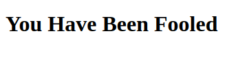

## Hash Browns

twist, lick, dunk and trail

web.bbctf.fluxus.co.in:1004

Si entramos a la URL solo vemos: 



El código fuente pareciera no tener nada que sirva:
```html
<!DOCTYPE html>
<html lang="en">
<head>
    <meta charset="UTF-8">
    <meta http-equiv="X-UA-Compatible" content="IE=edge">
    <meta name="viewport" content="width=device-width, initial-scale=1.0">
    <title>Document</title>
</head>
<body>
    <h1>You Have Been Fooled</h1>
</body>
</html>
```
Hay una cookie con:
```
garlic = cmztpaurxxnoqz3p2on73msbohg5sk74l2fxnxp27gky6cdjqzqq6nad
 ```
que parece ser un enlace .onion, abrimos tor y vamos a: http://cmztpaurxxnoqz3p2on73msbohg5sk74l2fxnxp27gky6cdjqzqq6nad.onion/

Casi no hay nada, veamos el fuente:
```html
<script>console.log("flag{Y0U_H4V3_B33N_W4RN3D}")</script>
<html>
<body>
Null Byte
</body>
</html>
```
Flag: flag{Y0U_H4V3_B33N_W4RN3D}