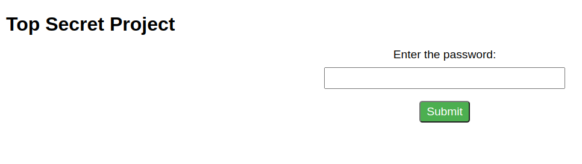
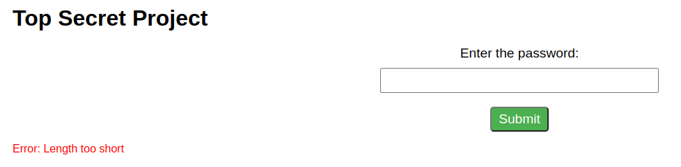
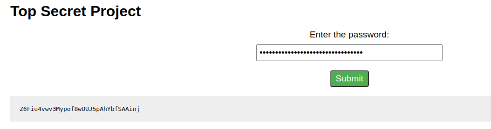
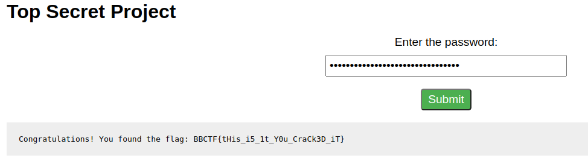

## Improper Error Handling

This website is giving errors. Can you figure it out ?

web.bbctf.fluxus.co.in:1001

Si vamos a la URL vemos:



Veamos parte del código fuente de la página:
```html
<body>
    <h1>Top Secret Project</h1>
    <form>
      <label for="input">Enter the password:</label>
      <input type="password" id="input">
      <button type="button" onclick="sendRequest()">Submit</button>
    </form>
    <p class="error" id="error-message"></p>
    <pre id="debug-message"></pre>
  </body>
  <script>
    function sendRequest() {
      let length = document.getElementById("input").value;
      fetch("/api/error?length=" + length)
        .then(response => response.text())
        .then(text => {
          if (text.startsWith("Error")) {
            document.getElementById("error-message").textContent = text;
            document.getElementById("error-message").style.display = "block";
            document.getElementById("debug-message").style.display = "none";
          } else {
            document.getElementById("debug-message").textContent = text;
            document.getElementById("debug-message").style.display = "block";
            document.getElementById("error-message").style.display = "none";
          }
        });
    }
  </script>
  ```
Pareciera que hay que ingresar una contraseña, probemos con nada para ver si pasa algo:


Nos da el error de que la contraseña es muy corta, probemos usar fuerza bruta con la longitud de la contraseña.

En caso de poner más de 32 caracteres se obtiene:


Si se ponen 32 caracteres random se otiene la flag:


Flag: BBCTF{tHis_i5_1t_Y0u_CraCk3D_iT}

La vulnerabilidad está en que chequea la longitud de la contraseña y esto se puede romper con fuerza bruta.