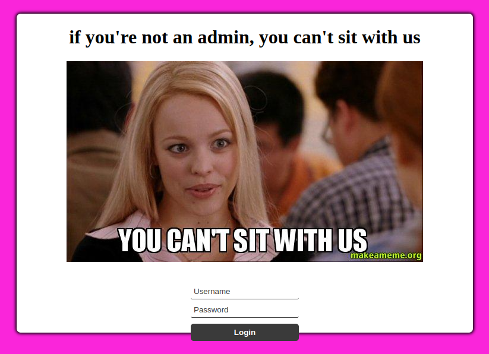
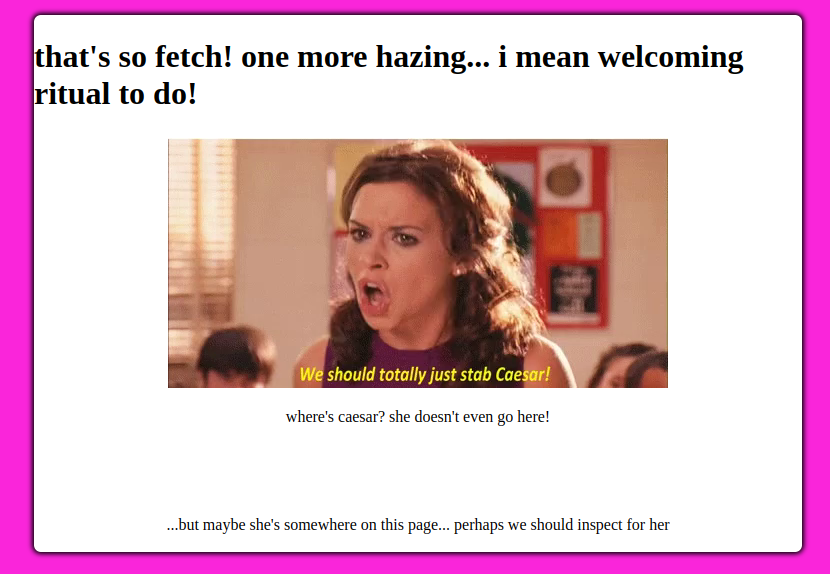
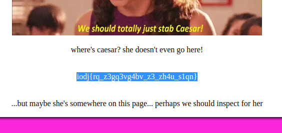
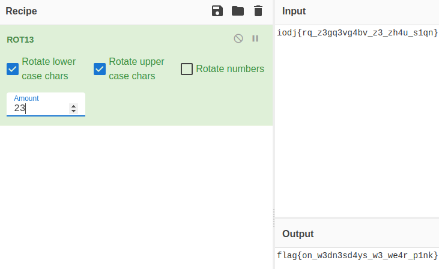

Mean Girls

Get in loser, we're going shopping. But only if you're fetch enough!

Author: Laura

Tags: intro

Entramos en la web:



Tenemos que romper un login... nos dan el usuario: admin, pero nos falta la password, vemos el fuente:

```html
<!DOCTYPE html>
<html lang="en">

<head>
  <meta charset="UTF-8">
  <meta name="viewport" content="width=device-width, initial-scale=1.0">
  <title>Login</title>
  <link rel="stylesheet" href="login-page.css">
  <script defer src="login-page.js"></script>
</head>

<body>
  <main id="main-holder">
    <h1 id="login-header">if you're not an admin, you can't sit with us</h1>
    
    <div id="login-error-msg-holder">
      <p id="login-error-msg">Invalid username <span id="error-msg-second-line">and/or password</span></p>
    </div>
    
    <form id="login-form">
      <input type="text" name="username" id="username-field" class="login-form-field" placeholder="Username">
      <input type="password" name="password" id="password-field" class="login-form-field" placeholder="Password">
      <input type="submit" value="Login" id="login-form-submit">
    </form>
  
  </main>
</body>

</html>
```
Veamos el contenido de login-page.js:

```javascript
const loginForm = document.getElementById("login-form");
const loginButton = document.getElementById("login-form-submit");
const loginErrorMsg = document.getElementById("login-error-msg");

loginButton.addEventListener("click", (e) => {
    e.preventDefault();
    const username = loginForm.username.value;
    const password = loginForm.password.value;

    if (username === "admin" && password === "cybersecure") {
        alert("You have successfully logged in.");
        location.href = 'flag.html';
    } else {
        loginErrorMsg.style.opacity = 1;
    }
})
```
Ahora tenemos el password: cybersecure

Probamos las credenciales para obtener la flag...



No hay nada, veamos el fuente de esta nueva página:

```html
<!DOCTYPE html>
<html lang="en">

<head>
  <meta charset="UTF-8">
  <meta name="viewport" content="width=device-width, initial-scale=1.0">
  <title>flag?</title>
  <link rel="stylesheet" href="login-page.css">
</head>

<body>
  <main id="main-holder">
    <h1 id="login-header">that's so fetch! one more hazing... i mean welcoming ritual to do!</h1>
    
    <p>where's caesar? she doesn't even go here! </p>
    <p id="flag">iodj{rq_z3gq3vg4bv_z3_zh4u_s1qn}</p>
    <p>...but maybe she's somewhere on this page... perhaps we should inspect for her</p>
  </main>
</body>

</html>
```
La flag no se veia, ya que tiene color blanco, igual que el color de background.


Vemos que nos habla de Caesar, vamos a [CyberChef](https://gchq.github.io/CyberChef/#recipe=ROT13(true,true,false,23)&input=aW9kantycV96M2dxM3ZnNGJ2X3ozX3poNHVfczFxbn0)



Flag: flag{on_w3dn3sd4ys_w3_we4r_p1nk}