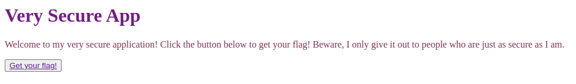
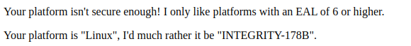

Secure Platform

Take a look at my super secure website. I only let people access the flag I hid there if they're just as secure as I am!

Author: Salma

Tags: intro

---

Entramos en la web:

Hacemos click en el botón: Get your flag!

Si vemos el request:

La única parte donde aparece Linux es en el header Sec-Ch-Ua-Platform, reemplazamos en dicho header a linux por: INTEGRITY-178B

Flag: flag{sh0uldv3_us3d_n4v1g4t0r}