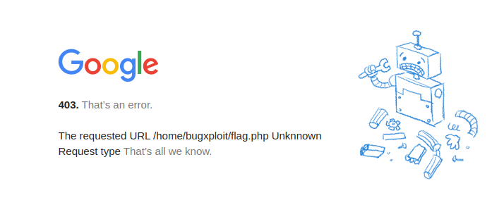
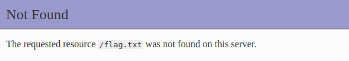
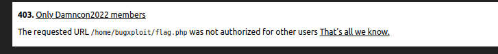
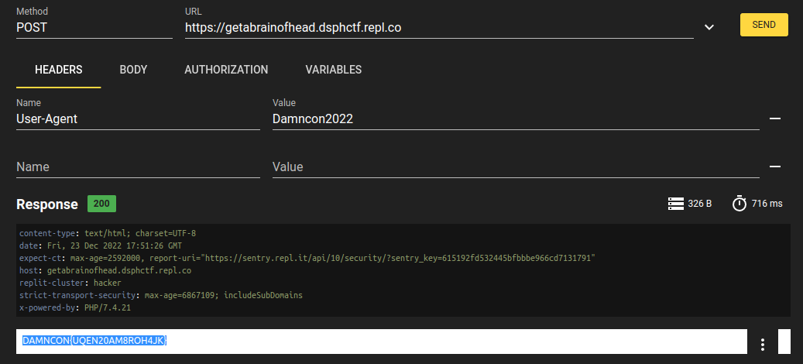

# Challenge Name : Trick Server
- Challenge owner : DAMNCON2022
- Release date : 2022-12-13 17:34:46
- Dificuilty : EASY
- Points : 100
- Resource : [Click to view resources](https://damncon.dsph.org/ctf/auth/app/click.php?id=NJBLRI)
- Description : Read Me Properly to Get Me

---

Si vamos a la URL: https://damncon.dsph.org/ctf/auth/app/click.php?id=NJBLRI
Obtenemos:

Que pareciera indicar que la pagina no anda, lo cual era posible dado los problemas de infra que hubo en el ctf, pero el error de google es raro, veamos que pasa si probamos con algo mas en la URL: 

Vemos que no hay un error en el servidor, la pagina intencionalmnte muestra ese "error", usemos lo que dice la descripción: "Read Me Properly to Get Me"
Probemos mandandole distintos verbos, todos retornan lo mismo excepto con post:

Con esa información intentamos obtener la flag, probemos mandando una variable user, users, member o members con Damncon2022

Después de varias pruebas probemos usar como User-Agent: Damncon2022

Flag: DAMNCON{UQEN20AM8ROH4JK}