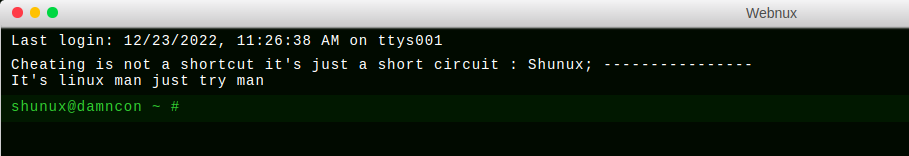
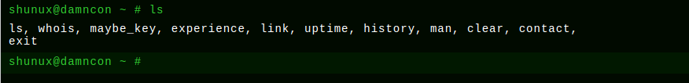

# Challenge Name : Webnux
- Challenge owner : DAMNCON2022
- Release date : 2022-12-04 12:22:20
- Dificuilty : EASY
- Points : 80
- Resource : [Click to view resources](https://webnix.dsphctf.repl.co)
- Description : It's linux man, just try man

---

Entramos a la URL: https://webnix.dsphctf.repl.co

Nos aparece:
 

Si hacemos lo que dice la web, probemos con man, nos lleva a este video: https://www.youtube.com/watch?v=GtL1huin9EE

Si hacemos ls nos muestra:

Si probamos todos los comandos, todos hacen algo, pero mejor mirar el fuente, hay un archivo .js:
https://webnix.dsphctf.repl.co/static/scripts.js

Si buscamos damncon{ nos aparece la flag como un comentario:

Flag: damncon{shunux_web_cracked}